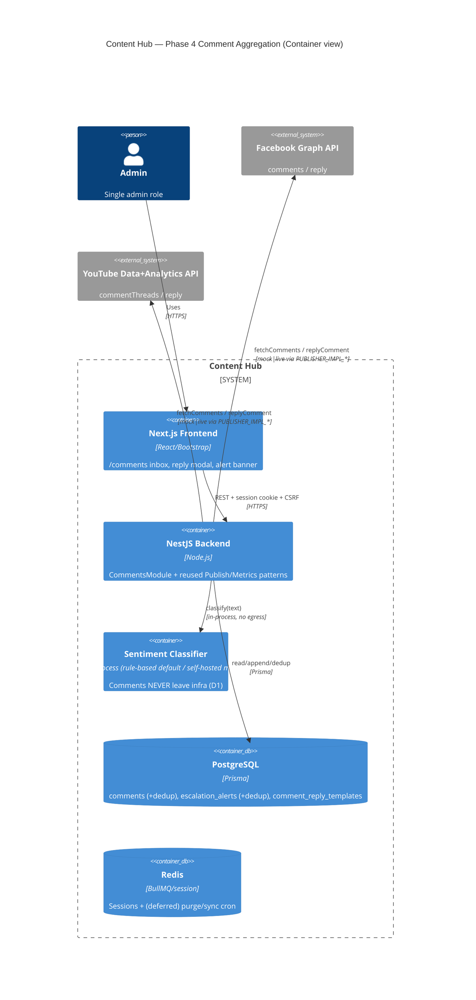
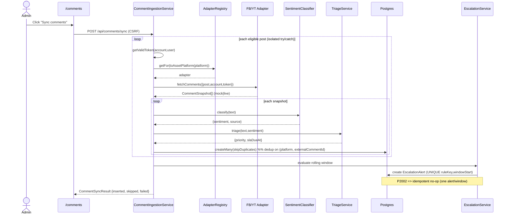
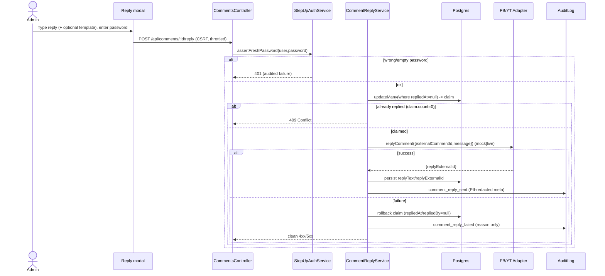
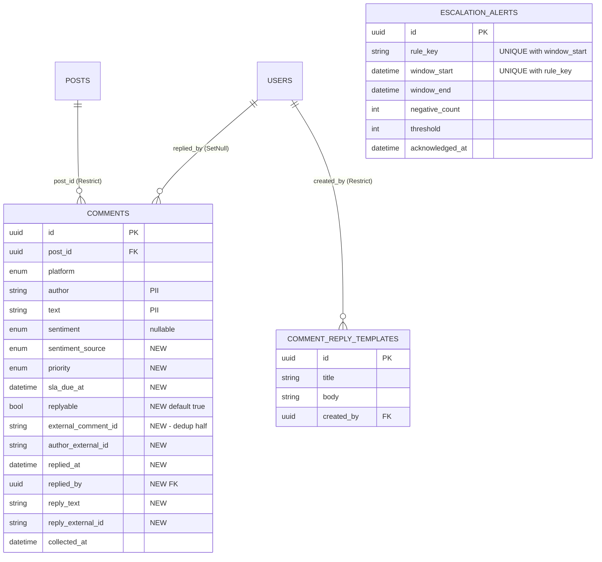

# Phase 4 — Comment Aggregation · Architecture Design Document

- **Author**: Senior App Designer (Loop Engineering, blueprint stage)
- **Date**: 2026-07-19
- **Input**: `docs/phase4-project-plan.md` (PM), `makedown.md` §5 Phase 4 / §9.7 Phase 3 / §10 Customer Engagement
- **Downstream**: System Analyst (PDPA / retention / security sign-off gate), then App Developer
- **Scope**: Phase 4.0 (schema + compliance gate) + 4A (backend) + 4B (frontend). 4C (real model) is a flagged tail, interface-only here.
- **Design stance**: every pattern is *mirrored from an existing, shipped module* — nothing invented where a Phase 2/3 precedent exists. Cross-references are cited inline so the Analyst and Developer can diff against the source of truth.

---

## 0. Design principles carried from Phase 2/3 (non-negotiable)

| Principle | Source of truth to mirror | Where it lands in Phase 4 |
|-----------|---------------------------|---------------------------|
| Additive-only schema (never rename/reorder enums) | `schema.prisma` header comment; Phase 1.5 gate | §1 — all new columns nullable/defaulted, new enums appended |
| Append-only ingestion + per-post failure isolation | `metrics/metric-ingestion.service.ts` | §3 `CommentIngestionService` |
| Mock/live gating via a faithful token check | `publish/adapters/base-platform.adapter.ts` (`isLiveMode`, `fetchMetrics`) | §2 sentiment classifier, §3 `fetchComments`, §4 `replyComment` |
| Read-model = pure aggregation, no writes | `dashboard/dashboard.service.ts` | §6 `CommentInboxService` |
| Step-up re-auth + CSRF + audit on every mutating authority action | `publish/step-up-auth.service.ts`, `posts.controller.ts` guard stack | §4 reply flow |
| DB-enforced dedup, not app-layer only | BUG-QA-001 partial unique index on `posts`; QA-OBS-1 lesson | §1 `(platform, externalCommentId)` UNIQUE + `EscalationAlert` UNIQUE |
| Central typed `AuditAction` union | `common/audit/audit-log.service.ts` | §1.4 union extension |
| Dual-enum bridge (`Platform` ↔ `AssetPlatform`) via one map | `common/utils/platform-map.util.ts` | §3/§4 adapter lookups use `toAssetPlatform` |
| Field-name redaction as defense-in-depth | `common/utils/redact.util.ts` | §7 `redactCommentMeta` (author/text never raw in meta) |

---

## 1. Phase 4.0 — Schema & Compliance Gate (blocking)

All changes are **additive** and reuse the existing `Comment` model + `Sentiment` enum. No existing column, enum value, or relation is renamed or removed (schema.prisma header rule).

### 1.1 New enums (appended)

```prisma
// Phase 4 additions — Comment Aggregation. Additive-only per the header rule.

// Rule-based triage class (separate concern from Sentiment). `general` is the
// safe default for anything the triage rules don't positively classify — the
// same "honest neutral default" reasoning as copyright_cleared=not_checked.
enum CommentPriority {
  complaint
  question
  spam
  general
}

// Which classifier produced Comment.sentiment. Mirrors MetricSource(api/manual)
// exactly so re-classification is auditable: a row tagged `rule_based` today can
// be re-tagged `model` later and the provenance is never lost.
enum SentimentSource {
  rule_based
  model
}
```

`Sentiment` (`positive`/`negative`/`neutral`) is **reused unchanged** on `Comment.sentiment`.

### 1.2 `Comment` model amendment (additive columns only)

```prisma
model Comment {
  id          String     @id @default(uuid()) @db.Uuid
  postId      String     @map("post_id") @db.Uuid
  platform    Platform
  author      String
  text        String
  sentiment   Sentiment?
  collectedAt DateTime   @map("collected_at")
  createdAt   DateTime   @default(now()) @map("created_at")

  // --- Phase 4 additions (all nullable/defaulted; legacy rows valid) ---
  // Platform-native comment id. Namespaced by `platform` in the dedup key so
  // FB/YT id-format differences can never collide (risk R8). Nullable so any
  // pre-Phase-4 seed row without one stays valid; Postgres treats NULL as
  // DISTINCT in a unique index, so multiple legacy nulls never conflict.
  externalCommentId String?          @map("external_comment_id")
  // Stable author id from the platform (FB user/psid, YT channelId). Used for
  // the audit author-reference hash (§7) so raw display names stay out of logs.
  authorExternalId  String?          @map("author_external_id")
  priority          CommentPriority? // set by the triage classifier at ingestion
  sentimentSource   SentimentSource? @map("sentiment_source")
  slaDueAt          DateTime?        @map("sla_due_at")
  // Per-comment reply capability (risk R3): FB/YT both have non-replyable
  // comment types. Captured at ingestion from the adapter; UI disables reply
  // when false. Defaults true so a legacy/manual row is assumed replyable.
  replyable         Boolean          @default(true)
  // Reply outcome (written only by the audited reply flow, §4).
  repliedAt         DateTime?        @map("replied_at")
  repliedBy         String?          @map("replied_by") @db.Uuid
  replyText         String?          @map("reply_text")
  replyExternalId   String?          @map("reply_external_id")

  post     Post  @relation(fields: [postId], references: [id], onDelete: Restrict)
  replier  User? @relation("CommentRepliedBy", fields: [repliedBy], references: [id], onDelete: SetNull)

  @@index([postId])
  // Read-model filter/sort support (inbox lists newest-first, filters by these).
  @@index([platform, sentiment, priority, slaDueAt])
  // DEDUP KEY — DB-enforced, not app-layer (BUG-QA-001 / QA-OBS-1 lesson).
  // See migration note 1.5: emitted as a PARTIAL unique index
  // WHERE external_comment_id IS NOT NULL.
  @@unique([platform, externalCommentId])
  @@map("comments")
}
```

`User` gains the back-relation `commentsReplied CommentReplyTemplate?`… — precisely: add `repliedComments Comment[] @relation("CommentRepliedBy")` and `commentTemplates CommentReplyTemplate[]` to `User`.

### 1.3 New models

```prisma
// Admin-owned canned reply templates (capability g). CRUD only; inserting a
// template into a reply still goes through the full step-up reply flow (§4).
model CommentReplyTemplate {
  id        String   @id @default(uuid()) @db.Uuid
  title     String
  body      String
  createdBy String   @map("created_by") @db.Uuid
  createdAt DateTime @default(now()) @map("created_at")
  updatedAt DateTime @updatedAt @map("updated_at")

  creator User @relation(fields: [createdBy], references: [id], onDelete: Restrict)

  @@map("comment_reply_templates")
}

// The alert-dedup ledger (capability f). ONE row per active spike window.
// The (ruleKey, windowStart) UNIQUE is the hard dedup control the System
// Analyst requires at the DB layer — an app-layer check alone is what QA-OBS-1
// warned against. Re-running escalation over the same window is an idempotent
// no-op (P2002 caught → skip), so a spike raises exactly one alert (exit #5).
model EscalationAlert {
  id            String   @id @default(uuid()) @db.Uuid
  // Identifies the rule + partition. Phase 4 default: "negative_spike" or
  // "negative_spike:<platform>" if we ever partition per platform. Stable string.
  ruleKey       String   @map("rule_key")
  windowStart   DateTime @map("window_start")
  windowEnd     DateTime @map("window_end")
  negativeCount Int      @map("negative_count")
  threshold     Int
  raisedAt      DateTime @default(now()) @map("raised_at")
  // Soft-acknowledge so the UI can dismiss a handled alert without deleting the
  // ledger row (deleting would let the same window re-fire — dedup must persist).
  acknowledgedAt DateTime? @map("acknowledged_at")
  createdAt      DateTime  @default(now()) @map("created_at")

  @@unique([ruleKey, windowStart]) // <-- DB-enforced alert dedup
  @@index([raisedAt])
  @@map("escalation_alerts")
}
```

### 1.4 `AuditAction` union extension (`audit-log.service.ts`)

Appended to the existing union (Phase 4 block):

```ts
  // Phase 4 — comment aggregation
  | 'comment_sync_run'
  | 'comment_reply_sent'
  | 'comment_reply_failed'
  | 'comment_escalation_raised'
  | 'comment_retention_purged'
  | 'comment_template_created'
  | 'comment_template_updated'
  | 'comment_template_deleted';
```

Every mutating path in §3–§8 maps to exactly one of these — same discipline as `metrics_sync_run` / `publish_attempt_started`.

### 1.5 Migration approach

- **One Prisma migration** `2026XXXX_phase4_comment_aggregation` for the additive columns, two new enums, two new tables, and the two new indexes on `comments`.
- **Hand-written DDL tail** in the same migration file for the dedup index as a **PARTIAL** unique index (Prisma `@@unique` can't express `WHERE`), matching the BUG-QA-001 precedent:
  ```sql
  CREATE UNIQUE INDEX comments_platform_external_key
    ON comments (platform, external_comment_id)
    WHERE external_comment_id IS NOT NULL;
  ```
  Keep the Prisma `@@unique` line as documentation, and note in the schema comment that the authoritative index is the partial one in the migration (identical convention to `posts_content_platform_active_key`). *(If the team prefers a pure Prisma `@@unique`, Postgres' default NULLS DISTINCT already prevents legacy-null collisions — the partial index is the belt-and-braces choice consistent with BUG-QA-001.)*
- **Enum additions** are pure `ALTER TYPE … ADD VALUE` equivalents Prisma generates — additive, non-destructive.
- **Verification (4.0 exit)**: `prisma migrate deploy` clean on real Postgres; a seed idempotency check (insert same `(platform, externalCommentId)` twice → second is skipped, zero duplicate rows).

### 1.6 Retention policy (locked at this gate — feeds §8)

- **TTL**: 12 months, measured on `collectedAt` (the platform timestamp), not `createdAt`.
- **"Delete" semantics**: **hard-delete** of `comments` rows (plan §8 decision 4; Analyst confirms). Escalation ledger + audit lines (counts only) are retained — they carry no comment PII.
- **`onDelete: Restrict`** on `Comment.post` is unaffected: it restricts deleting a *Post* that still has comments; deleting the comments themselves is the purge and is allowed.
- **Cadence**: manual endpoint this phase; BullMQ repeatable job deferred to the Phase 3.5 cron bundle (shared `getValidToken` system-context fix). Design in §8.

---

## 2. Sentiment classifier — pluggable, mock/live gated (capability b)

Mirrors the `PUBLISHER_IMPL_*` adapter pattern one-for-one. The classifier is **in-process/in-container** — comments never leave infra (decision D1), which is precisely what sidesteps the third-party-DPA gate.

### 2.1 Config flag (new `sentiment` block in `configuration.ts`)

```ts
sentiment: {
  // 'rule_based' (default, offline, deterministic) | 'model' (self-hosted, flagged)
  impl: 'rule_based' | 'model';
},
```
Env: `SENTIMENT_IMPL` (default `rule_based`). Same shape as `publisher.facebookImpl`. CI + demo never set it, so the rule-based path is the only one exercised by tests (plan §2.2).

### 2.2 Interface + provider

```ts
export interface SentimentClassification {
  sentiment: Sentiment;          // positive | negative | neutral
  source: SentimentSource;       // rule_based | model
}

export interface SentimentClassifier {
  classify(text: string): Promise<SentimentClassification>;
}
```

- `RuleBasedThaiSentimentClassifier` (default): a Thai lexicon/keyword scorer (positive-term set, negative-term set, negation flip, EN fallthrough). Deterministic, offline, sets `source: 'rule_based'`. Lexicon lives in `sentiment/sentiment.constants.ts`.
- `ModelSentimentClassifier` (4C, flagged): calls the self-hosted model **inside the container** (no egress). Sets `source: 'model'`. Ships disabled.
- **Provider/factory** `sentiment-classifier.provider.ts` chooses the impl from `sentiment.impl` at DI time — the exact analogue of `PlatformAdapterRegistry` selecting mock vs live. A NestJS custom provider binds the `SENTIMENT_CLASSIFIER` token to the right instance.

Sentiment is **advisory only** — it never triggers an automatic action (risk R2). It is applied during ingestion (§3) and feeds escalation counting (§5).

---

## 3. Comment ingestion (capability a) — mirrors `MetricIngestionService`

### 3.1 Adapter contract additions (`platform-adapter.interface.ts`)

The current stubs (`fetchComments(post): Promise<never>`, `replyComment(...): Promise<never>`) are replaced with real, mock/live-gated methods. Shapes mirror `FetchMetricsArgs` / `MetricSnapshot`.

```ts
export interface FetchCommentsArgs {
  post: Post;
  account: ConnectedAccount;
  accessToken: string | null;      // null => adapter rejects with PublisherTokenError (mock too)
  sincePageToken?: string;         // incremental fetch where the API supports it (risk R4)
}

// One platform-native comment as returned by an adapter.
export interface CommentSnapshot {
  externalCommentId: string;       // stable, platform-native (dedup key half)
  author: string;                  // display name (PII — redacted before any log)
  authorExternalId: string | null; // stable id for the audit author-reference hash
  text: string;                    // PII — redacted before any log
  createdAt: Date;                 // platform timestamp -> Comment.collectedAt
  replyable: boolean;              // per-comment reply capability (risk R3)
}

export interface ReplyCommentArgs {
  post: Post;
  account: ConnectedAccount;
  accessToken: string | null;
  externalCommentId: string;
  message: string;
}
export interface CommentReplyResult {
  replyExternalId: string;         // id of the created reply on the platform
}

export interface PlatformAdapter {
  readonly platform: AssetPlatform;
  publish(args: PublishArgs): Promise<PublishResult>;
  fetchMetrics(args: FetchMetricsArgs): Promise<MetricSnapshot>;
  fetchComments(args: FetchCommentsArgs): Promise<CommentSnapshot[]>;
  replyComment(args: ReplyCommentArgs): Promise<CommentReplyResult>;
}
```

`BasePlatformAdapter` gains `fetchComments`/`replyComment` implementations that mirror `fetchMetrics` exactly: **faithful token check first (mock included)** → `isLiveMode()` ? live call : deterministic mock. The `PlatformCapabilityNotImplementedError` throwing default is kept **only** for capabilities a subclass has not overridden — so a future TikTok/LINE adapter (Phase 5) still throws, and the contract spec asserts FB/YT no longer throw while the not-yet-built platforms do (plan 4A.1).

- **Mock `fetchComments`**: deterministic synthetic thread seeded from `post.id` (same `hashString` seed idea as `mockSnapshot`) — e.g. 2–4 comments, a stable mix of Thai positive/negative/neutral text so escalation and filters are demoable offline. Stable `externalCommentId` = `mock-<platform>-<postId>-<n>` so re-sync dedups.
- **Live `fetchComments`**: FB Graph `/{external_post_id}/comments`; YouTube `commentThreads.list` (filters video by `externalPostId`). Only reached when `PUBLISHER_IMPL_* != 'mock'`.
- **Mock `replyComment`**: token check, then deterministic `replyExternalId = dry-run-reply-<platform>-<externalCommentId>` (analogue of `buildDryRunExternalId`), no network I/O, honors `mockFailureRate` so clean-fail is testable.

### 3.2 `CommentIngestionService.syncComments(userId)`

Structurally identical to `MetricIngestionService.syncApiMetrics` — copy the loop, swap the payload:

- Load eligible posts: `status ∈ {posted, posted_unconfirmed}` (reuse `METRIC_ELIGIBLE_STATUSES` semantics via a comments constant) `AND platform ∈ {facebook, youtube}` (`API_CAPABLE_PLATFORMS`).
- Per post, isolated in try/catch (one stale token ⇒ that post `skipped`/`failed`, batch continues):
  1. `findConnectedAccount(post, userId)` → skip `no_connected_account`.
  2. `accessToken = connectedAccounts.getValidToken(account.id, userId)` (the only sanctioned decryption path).
  3. `adapter = adapterRegistry.getFor(toAssetPlatform(post.platform))`.
  4. `snapshots = adapter.fetchComments({ post, account, accessToken })`.
  5. For each snapshot: classify sentiment (`SentimentClassifier`), triage (`CommentTriageService`, §5), then **dedup-insert**:
     ```ts
     await prisma.comment.createMany({
       data: [{ postId, platform, externalCommentId, author, authorExternalId,
                text, sentiment, sentimentSource, priority, slaDueAt,
                replyable, collectedAt: snapshot.createdAt }],
       skipDuplicates: true,   // the (platform, externalCommentId) unique makes re-sync idempotent
     });
     ```
     `skipDuplicates` leans on the DB unique index — re-sync inserts **zero** duplicates (exit #1). Append-only: existing rows are never updated.
- After the loop: audit `comment_sync_run` with **counts only** (`eligible/inserted/skipped/failed`), and run escalation (§5) once over the fresh negative set.
- Returns a `CommentSyncResultDto` shaped like `SyncResultDto` (`ranAt, eligible, inserted, skipped, failed, items[]`).

### 3.3 Endpoint

`POST /api/comments/sync` — admin + CSRF, `HttpCode(OK)` — mirrors `POST /api/metrics/sync` exactly.

---

## 4. Reply flow (capability d) — mirrors publish authority, never automatic

Reply is the one **write to the platform**, so it carries the full publish-grade authority stack. This directly reuses `StepUpAuthService`, `CsrfGuard`, `AdminGuard`, `ThrottlerGuard`, and the audit discipline.

### 4.1 `CommentReplyService.reply(commentId, dto, userId, ip)`

1. `stepUpAuth.assertFreshPassword(userId, dto.password, ip)` — same primitive as publish; wrong/empty password ⇒ 401 (behavioral test required, risk R6). *(Note for Developer: `assertFreshPassword` currently records the failure under action `publish_attempt_started`; for reply we want it attributable — see §4.4.)*
2. Load comment (+ post + account). 404 if missing.
3. **Capability guard**: `if (!comment.replyable)` ⇒ 409 (`This comment type does not accept replies`). UI also disables it, but the server is authoritative (risk R3).
4. **Idempotency guard (no double-reply)** — race-proof via a conditional update, the analogue of the publish optimistic-concurrency `version` guard:
   ```ts
   const claimed = await prisma.comment.updateMany({
     where: { id: commentId, repliedAt: null },
     data: { repliedAt: new Date(), repliedBy: userId }, // claim first
   });
   if (claimed.count === 0) throw new ConflictException('This comment has already been replied to');
   ```
   Only the winner proceeds to dispatch; a duplicate submit gets 409. If dispatch then fails, the claim is rolled back (`repliedAt/repliedBy → null`) so a legitimate retry is possible — mirrors how a failed publish frees its `(content, platform)` pair.
5. Resolve account + `getValidToken`, `adapter.replyComment({ post, account, accessToken, externalCommentId, message })`.
6. On success: persist `replyText`, `replyExternalId` (the claim already set `repliedAt/repliedBy`); audit `comment_reply_sent` with **PII-redacted meta** (§7).
7. On failure: roll back the claim, audit `comment_reply_failed` (redacted, reason only), rethrow as a clean 4xx/5xx (mirror publish clean-fail — no silent failures, risk R3).

**Never automatic**: one comment, one explicit admin action, one password. No bulk/auto path exists (plan §2.2, Publish Authority rule).

### 4.2 Endpoint + guard stack (mirror `posts.controller.ts`)

```
POST /api/comments/:id/reply
  @UseGuards(SessionAuthGuard, AdminGuard)   // controller-level
  @UseGuards(CsrfGuard, ThrottlerGuard)      // route-level
  @Throttle(STEP_UP_RATE_LIMIT)              // 5 / 15min — password-oracle protection, same as publish
  body: { password: string; message: string }
```
`STEP_UP_RATE_LIMIT` is the same constant shape publish uses (a password-carrying route must never be an unthrottled oracle).

### 4.3 DTO

`ReplyCommentDto { @IsString @IsNotEmpty password; @IsString @MaxLength(N) @IsNotEmpty message; }` with `forbidNonWhitelisted` (reject smuggled fields), exactly like `CreatePostDto`.

### 4.4 Note for System Analyst / Developer
`StepUpAuthService.assertFreshPassword` hard-codes `action: 'publish_attempt_started'` on failure. For reply auditability, either (a) parameterize the failure action, or (b) have `CommentReplyService` catch the 401 and additionally record `comment_reply_failed{reason:'step_up_reauth_failed'}`. **Recommend (a)** — smallest change, keeps one step-up primitive. Flag for the Analyst since it touches an existing security service.

---

## 5. Priority, SLA (capability e) + escalation with dedup (capability f)

### 5.1 Triage classifier → priority + SLA (`CommentTriageService`)

Rule-based and transparent (never a black box), applied at ingestion after sentiment:

- **Priority rules** (first match wins): spam heuristics (link/keyword/repetition) ⇒ `spam`; interrogative markers (Thai/EN question words, `?`) ⇒ `question`; negative sentiment + complaint lexicon ⇒ `complaint`; else `general`.
- **SLA table** (`comments.constants.ts`, provisional defaults — admin confirms at UAT, PROVISIONAL pattern):

  | priority | SLA |
  |----------|-----|
  | complaint | 4h |
  | question | 24h |
  | spam | none (`slaDueAt = null`) |
  | general | 48h |

  `slaDueAt = collectedAt + slaHours[priority]`. A comment is **SLA-breached** when `slaDueAt < now AND repliedAt IS NULL` — computed in the read-model, not stored (so it stays correct as time passes, like the dashboard's live "current").

### 5.2 Escalation over a rolling window + **DB-enforced dedup** (`EscalationService`)

Runs at the end of each `syncComments` (and is safe to run standalone).

- **Trigger**: count negative-sentiment comments whose `collectedAt` falls in the rolling window `[now - WINDOW, now]`. If `count >= THRESHOLD`, a spike is active. Defaults `WINDOW = 60min`, `THRESHOLD = 5` (provisional — Analyst + admin tune, plan §8.3).
- **Window key**: `windowStart` = the floored bucket boundary (e.g. truncate to the hour) so the same active window maps to one stable `(ruleKey, windowStart)`.
- **Dedup write** — the whole point:
  ```ts
  try {
    await prisma.escalationAlert.create({
      data: { ruleKey: 'negative_spike', windowStart, windowEnd, negativeCount, threshold },
    });
    auditLog.record({ action: 'comment_escalation_raised', result:'success',
                      meta: { windowStart, negativeCount, threshold } }); // counts only
  } catch (e) {
    if (e instanceof Prisma.PrismaClientKnownRequestError && e.code === 'P2002') {
      // Window already alerted — idempotent no-op. This is the dedup, DB-enforced.
      return;
    }
    throw e;
  }
  ```
  The `(ruleKey, windowStart)` UNIQUE guarantees **exactly one alert per active window** even under concurrent syncs — an app-layer "have I alerted?" check is *not* trusted alone (QA-OBS-1). Synthetic spike ⇒ one alert; re-run ⇒ no duplicate (exit #5, risk R5).

### 5.3 Alert surface endpoint
`GET /api/comments/escalations?active=true` (admin, read-only) → recent/unacknowledged alerts for the inbox banner (§6). Optional `POST /api/comments/escalations/:id/ack` (admin+CSRF) sets `acknowledgedAt` — dismiss without deleting (deleting would let the window re-fire).

---

## 6. Inbox read-model (capability c) — mirrors `DashboardService`

### 6.1 `CommentInboxService.list(query)` — pure read, no writes

`GET /api/comments` with combinable filters + pagination:

| Param | Effect |
|-------|--------|
| `platform` | `Platform` filter (`facebook`/`youtube`/…) |
| `sentiment` | `positive`/`negative`/`neutral` |
| `priority` | `complaint`/`question`/`spam`/`general` |
| `slaBreach` | `true` ⇒ `slaDueAt < now AND repliedAt IS NULL` |
| `replied` | `true`/`false` ⇒ `repliedAt` not-null / null |
| `page`, `pageSize` | stable pagination, `orderBy: [{ slaDueAt: asc nulls last }, { collectedAt: desc }]` |

Returns `{ items: CommentResponseDto[], page, pageSize, total }`. Filters combine as ANDed `where` clauses (Prisma), computed `slaBreach` handled with a `slaDueAt < now` + `repliedAt: null` clause. `spam` is **tag + filter only, no auto-hide** (plan §8.5, no-auto-action boundary) — it simply isn't shown when the default view excludes it, but is one filter click away.

### 6.2 `CommentResponseDto`
`id, postId, platform, author, text, sentiment, sentimentSource, priority, slaDueAt, slaBreach (computed), replyable, repliedAt, replyText, collectedAt`. **The read API returns `author`/`text` for on-screen display** (the admin is authorized to read them) — the redaction rule (§7) applies to **audit logs**, not to the authenticated inbox response. This distinction is called out explicitly for the Analyst.

---

## 7. PII / audit redaction + retention (compliance controls)

### 7.1 Audit redaction — author/text never raw in `meta`

`redactSensitive` (field-name based) does **not** catch `author`/`text` (not sensitive-looking names). Two defense layers:

1. **Never pass raw author/text into `meta`.** Call sites build meta from a `redactCommentMeta(comment)` helper that emits **references, not values**:
   ```ts
   redactCommentMeta(c) => ({
     commentId: c.id,
     platform: c.platform,
     authorRef: sha256(c.authorExternalId ?? c.author).slice(0, 12), // stable, non-reversible
     textLength: c.text.length,          // shape, not content
     sentiment: c.sentiment,
     priority: c.priority,
   })
   ```
2. **Belt-and-braces**: add `'author'`, `'text'`, `'authorexternalid'`, `'replytext'` (and `'message'`) to `SENSITIVE_FIELD_PATTERNS` in `redact.util.ts` so even an accidental raw field is masked by the central redactor before any log line is written. Unit test (plan 4.0.5) asserts raw author/text never appear in an emitted audit line.

Applies to `comment_reply_sent` / `_failed` (redacted meta, no message body), `comment_escalation_raised` (counts only), `comment_retention_purged` (counts only).

### 7.2 Retention purge (`CommentRetentionService`, capability/exit #7)

- `purgeExpired(now)` → `prisma.comment.deleteMany({ where: { collectedAt: { lt: subMonths(now, 12) } } })`.
- Append-only history is otherwise preserved (only the aged-out rows go). Audit `comment_retention_purged` with `{ deletedCount, cutoff }` — **no author/text**.
- Endpoint `POST /api/comments/retention/purge` (admin + CSRF) for manual/UAT runs. BullMQ repeatable job deferred to the Phase 3.5 cron bundle (design-ready: the same `@nestjs/bullmq` repeatable-job wiring publish uses; no `userId`/token context needed since purge is system-local, so it can actually ship in 3.5 without the `getValidToken` fix).
- Unit-tested against seeded old rows (old purged, newer untouched).

---

## 8. Module layout, endpoints, DTOs

### 8.1 New NestJS modules

```
backend/src/modules/comments/
├── comments.module.ts
├── comments.controller.ts            # /api/comments, /sync, /:id/reply, /escalations, /retention/purge
├── comment-templates.controller.ts   # /api/comment-templates CRUD
├── comment-ingestion.service.ts      # syncComments — mirrors MetricIngestionService
├── comment-inbox.service.ts          # list() read-model — mirrors DashboardService
├── comment-reply.service.ts          # step-up + CSRF + audit + idempotency
├── comment-triage.service.ts         # priority + SLA
├── escalation.service.ts             # rolling-window spike + DB dedup ledger
├── comment-retention.service.ts      # 12-month purge
├── comment-templates.service.ts      # templates CRUD
├── comments.constants.ts             # API_CAPABLE/eligible statuses, SLA table, escalation window/threshold
├── sentiment/
│   ├── sentiment-classifier.interface.ts
│   ├── rule-based-thai-sentiment.classifier.ts
│   ├── model-sentiment.classifier.ts        # 4C, flagged
│   ├── sentiment-classifier.provider.ts     # factory gated by config.sentiment.impl
│   └── sentiment.constants.ts               # Thai lexicon
└── dto/
    ├── comment-response.dto.ts
    ├── list-comments-query.dto.ts
    ├── reply-comment.dto.ts
    ├── comment-sync-result.dto.ts
    ├── escalation-alert.dto.ts
    └── comment-template.dto.ts (create/update)
```

Wiring: `CommentsModule` imports `PublishModule` (to reuse the exported `PlatformAdapterRegistry` + `StepUpAuthService`), `ConnectedAccountsModule` (`getValidToken`), `AuditLogModule`, `PrismaModule` — the exact import set `MetricsModule` uses, plus step-up. Adapter/classifier changes touch `publish/adapters/*` and add the `sentiment/` provider.

### 8.2 Endpoint summary

| Method | Path | Guards | Purpose |
|--------|------|--------|---------|
| POST | `/api/comments/sync` | Session, Admin, CSRF | Pull FB+YT comments, classify, triage, escalate |
| GET | `/api/comments` | Session, Admin | Inbox list + filters + pagination |
| POST | `/api/comments/:id/reply` | Session, Admin, CSRF, Throttle | Step-up reply (never automatic) |
| GET | `/api/comments/escalations` | Session, Admin | Active alert surface |
| POST | `/api/comments/escalations/:id/ack` | Session, Admin, CSRF | Dismiss (soft) an alert |
| POST | `/api/comments/retention/purge` | Session, Admin, CSRF | Manual 12-month purge |
| GET | `/api/comment-templates` | Session, Admin | List templates |
| POST | `/api/comment-templates` | Session, Admin, CSRF | Create template |
| PATCH | `/api/comment-templates/:id` | Session, Admin, CSRF | Update template |
| DELETE | `/api/comment-templates/:id` | Session, Admin, CSRF | Delete template |

Controller-level `@UseGuards(SessionAuthGuard, AdminGuard)`; mutations add `CsrfGuard`; the reply route adds `ThrottlerGuard + @Throttle(STEP_UP_RATE_LIMIT)`. Identical layering to `PostsController` / `MetricsController`.

---

## 9. Diagrams

### 9.1 C4 Container (Phase 4 additions in context)



### 9.2 Ingestion sequence (append-only + per-post isolation + dedup)



### 9.3 Reply sequence (step-up + idempotency, never automatic)



### 9.4 ERD (Phase 4 delta)



---

## 10. Frontend `/comments` inbox (Phase 4B) — Bootstrap 5, mirrors existing pages

Client component (`'use client'`), same scaffolding as `dashboard/page.tsx`: `apiClient.me()` + `getCsrfToken()` on mount, 401 ⇒ `/login`, `AppHeader`, loading/error/empty states.

### 10.1 Screen spec

```
┌ AppHeader (nav: … Dashboard | Comments) ──────────────────────────────┐
│ Comments Inbox                                   [ Sync comments ]     │
│ ── Escalation banner (alert-danger) when active ──────────────────────│
│  ⚠ Negative-sentiment spike: 7 negative comments in the last hour.    │
│    Raised 14:05 · [Review negative] [Dismiss]                          │
│ ── Filter bar (row g-2) ──────────────────────────────────────────────│
│  [Platform ▾][Sentiment ▾][Priority ▾][☐ SLA overdue][☐ Unreplied]    │
│ ── Table (table table-hover align-middle) ────────────────────────────│
│  Platform | Author | Comment (truncated) | Sentiment | Priority | SLA │
│           |        |                     |  badge    |  badge   | due  │  [Reply]
│  …paginated…                                                           │
└───────────────────────────────────────────────────────────────────────┘
```

- **Filters**: controlled selects/checkboxes → rebuild `ListCommentsQuery` → `apiClient.listComments(query)` (only whitelisted params, like `buildContentQuery`). Combine as AND.
- **Badges** (colour + text, never colour alone — WCAG, matches existing `*_BADGE` convention):
  - Sentiment: positive `bg-success`, negative `bg-danger`, neutral `bg-secondary`.
  - Priority: complaint `bg-danger`, question `bg-info text-dark`, spam `bg-dark`, general `bg-secondary`.
  - SLA: overdue ⇒ `bg-warning text-dark` "Overdue"; else muted due time; replied ⇒ `bg-success` "Replied".
- **Reply button**: disabled when `replyable === false` (tooltip "This comment can't be replied to") or already replied. On repliable rows opens the reply modal.
- **Sync comments** button: mirrors dashboard's `handleSync` — calls `apiClient.syncComments(csrf)`, shows an `alert-info` result summary (`inserted / skipped / failed`), reloads the list.

### 10.2 Reply modal (mirrors `PublishConfirmModal` step-up UX)

- Read-only original comment (author + text).
- **Canned-template picker** (`<select>` of `apiClient.listCommentTemplates()`) — selecting inserts `template.body` into the reply `<textarea>` (editable after insert).
- Reply `<textarea>` (required, maxlength shown).
- **Step-up password field** (required) — identical to publish confirm.
- Submit ⇒ `apiClient.replyComment(id, { password, message }, csrf)`; 401 ⇒ "password incorrect", 409 ⇒ "already replied", disabled while pending. No auto-send.

### 10.3 `api-client.ts` additions + `content-labels.ts`

- Types: `CommentSentiment`, `CommentPriority`, `SentimentSource`, `Comment`, `ListCommentsQuery`, `CommentSyncResult`, `CommentTemplate`, `EscalationAlert`.
- Methods: `listComments`, `syncComments(csrf)`, `replyComment(id, body, csrf)`, `listEscalations`, `ackEscalation(id, csrf)`, `listCommentTemplates`, `create/update/deleteCommentTemplate`, `purgeComments(csrf)`.
- Labels: `sentiment()/sentimentBadgeClass()`, `priority()/priorityBadgeClass()`, `slaBadge()` added to `labels` (same `Record<enum,string>` pattern), plus `COMMENT_PRIORITIES`/`SENTIMENTS` arrays for filter dropdowns.
- Nav: add **Comments** link (in `AppHeader`), next to Dashboard.

### 10.4 Client-logic unit tests (jest, plan 4B.4)
- Filter-query builder (params in ⇒ query string out, whitelist only).
- Reply-enable logic (`replyable && !repliedAt`).
- SLA-breach display predicate (`slaDueAt < now && !repliedAt`).

---

## 11. ADRs (key decisions)

- **ADR-P4-1 — DB-enforced dedup for comments *and* alerts.** App-layer "does it exist?" checks are advisory only; the authoritative dedup is `comments (platform, external_comment_id)` partial UNIQUE and `escalation_alerts (rule_key, window_start)` UNIQUE. Rationale: BUG-QA-001 / QA-OBS-1 — an app check has a TOCTOU window; the DB does not. *Consequence*: re-sync and concurrent syncs are idempotent by construction.
- **ADR-P4-2 — Reply reuses the publish authority stack verbatim.** Step-up password-per-action (no freshness window), CSRF, admin guard, throttle, audit. Rationale: reply is a platform write with the same blast radius as publish; a second, weaker path would be a bypass surface (risk R6). *Consequence*: `StepUpAuthService` failure-action needs parameterizing (§4.4) — flagged to Analyst.
- **ADR-P4-3 — Per-comment reply capability, not per-platform.** `Comment.replyable` captured at ingestion. Rationale: FB/YT both have non-replyable comment types (risk R3); per-platform would wrongly enable/disable whole platforms.
- **ADR-P4-4 — Sentiment classifier mirrors the adapter mock/live registry, in-process.** Rule-based default is the only CI/demo path; model behind `SENTIMENT_IMPL`. Rationale: D1 (no egress ⇒ no DPA) + D2 (offline tests). *Consequence*: `sentimentSource` stored so re-classification is auditable.
- **ADR-P4-5 — Audit stores references, not comment content.** `authorRef` (hash) + `textLength`, plus author/text added to the central redactor's pattern list. Rationale: PDPA — comment text/author is personal data even self-hosted (risk R1). *Consequence*: the inbox *read* API still returns author/text for the authorized admin; redaction is a **logging** control only.
- **ADR-P4-6 — Hard-delete retention at 12 months on `collectedAt`.** Manual endpoint now, cron in the Phase 3.5 bundle. Rationale: plan §8.4 + Analyst condition; purge is system-local so it needs no token/user context and can ship in 3.5 independently of the `getValidToken` fix.

---

## 12. Handoff checklist for System Analyst (sign-off gate)

The Analyst must sign off (exit #9) on the four compliance controls, all designed above:
1. **Dedup UNIQUE** — comments `(platform, external_comment_id)` partial index (§1.2/§1.5) + escalation `(rule_key, window_start)` UNIQUE (§1.3/§5.2). DB-enforced.
2. **PII redaction** — `redactCommentMeta` + central redactor pattern additions; raw author/text never in audit lines; read API distinction documented (§7.1, §6.2).
3. **Retention** — 12-month hard-delete on `collectedAt`, audited counts-only, purge job design (§7.2, §1.6).
4. **Step-up on reply** — full publish-grade stack; note the `StepUpAuthService` failure-action parameterization (§4.4).
Open items requiring Analyst input: escalation window/threshold defaults (§5.2), retention delete semantics confirmation (§1.6), SLA hours (§5.1).
