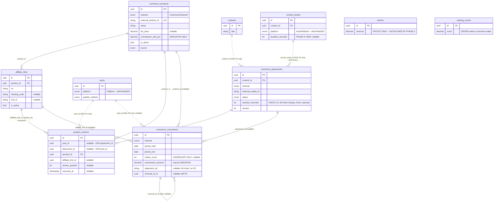
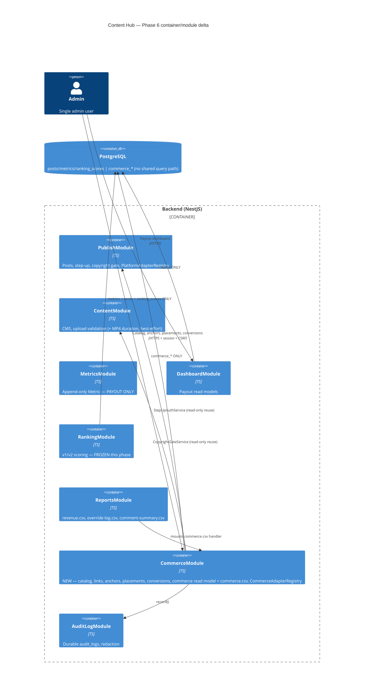
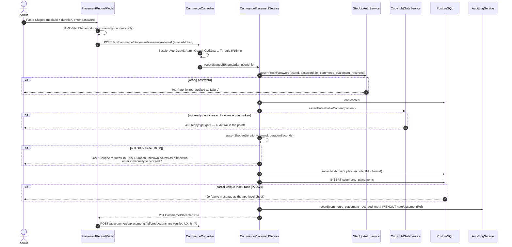
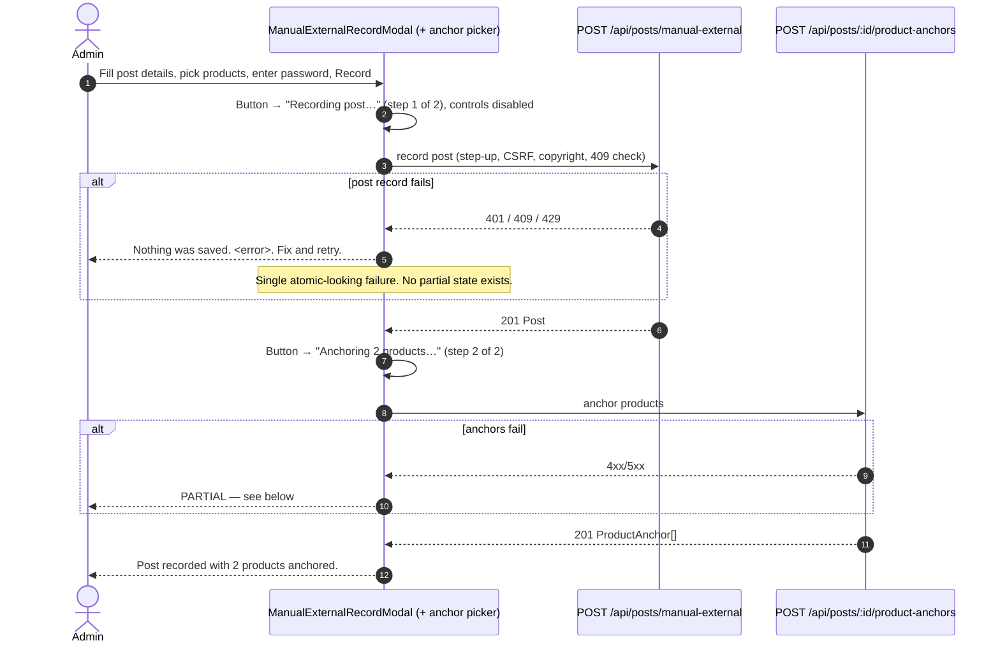

# Phase 6 — Commerce / Affiliate · Architecture & UX Design

- **Author**: Senior App Designer (Loop Engineering position #2)
- **Date**: 2026-07-20
- **Input**: `docs/phase6-project-plan.md` (PM, 2026-07-20) — all of §2 Decisions, §3.3 Exit criteria and the Scope traps list are treated as **binding**, not advisory. `bussiness_rule.md` §"Commerce / Affiliate" (2026-07-20).
- **Output to**: System Analyst — the two sign-off items are **PDPA / no-buyer-data** and **commerce ⇄ payout separation** (§7).
- **Baseline read for this design**: `backend/prisma/schema.prisma` (570 lines, end to end), `modules/publish/` (`posts.controller.ts`, `publish-orchestrator.service.ts`, `adapters/platform-adapter.{interface,registry}.ts`, `dto/record-manual-external.dto.ts`), `modules/content/upload-validation.service.ts`, `modules/metrics/metrics.controller.ts`, `modules/dashboard/`, `modules/reports/` + `common/utils/csv.util.ts`, `common/audit/audit-log.service.ts`, `config/configuration.ts` + `main.ts` boot guard, `.eslintrc.cjs`, and the frontend `app/dashboard`, `components/publish/`, `components/reports/ExportCsvButton.tsx`, `lib/content-labels.ts`, `components/AppHeader.tsx`.

---

## 0. Design principles for this phase (non-negotiable, carried from the plan)

| # | Principle | Where it is enforced in this design |
|---|-----------|-------------------------------------|
| P1 | Commerce revenue and platform payout are **two streams that are never summed**. | §2 — separate tables, no Prisma relation edges into commerce, ESLint import zone, distinct DTO vocabulary, two exports, two totals. |
| P2 | Commission records are their **own append-only table**, never a discriminator on `metrics`. | §1.3 `commerce_conversions`; §2.4 byte-identity proof. |
| P3 | `Platform` / `AssetPlatform` are **untouched**. Shopee is a `CommerceChannel`. | §1.1, §1.7 enum-freeze test. |
| P4 | Nothing under `modules/ranking/` may read a commerce table. | §2.2 (lint zone), §2.3 (static test), §2.4 (score byte-identity). |
| P5 | **Zero buyer/order PII** — there must be no column *capable* of holding it. | §1.4 column ban + §1.5 the free-text residual risk, escalated to the Analyst as SA-1. |
| P6 | No live HTTP clients. Mock adapters + manual record only. | §3.5 `CommerceAdapterRegistry`; live impls are rejecting stubs. |
| P7 | Duration: capture **best-effort at upload, never blocking**; enforce `[10,60]` **fail-closed** at the Shopee placement boundary, where **null is a rejection**. | §3.6 (three layers) + §1.3 `commerce_placements` CHECK, incl. the SQL NULL trap. |
| P8 | Reuse the existing guard stack and conventions exactly; invent nothing parallel that already exists. | §3.3 guard table — every row maps to an existing guard/service. |

---

## 1. Data model

### 1.1 New enums (appended; `Platform` and `AssetPlatform` are NOT touched)

```prisma
// --- Phase 6 additions (Commerce / Affiliate) ---------------------------
// Additive-only per the schema header rule (System Analyst decision #9).
//
// DELIBERATELY NOT a value on `Platform` or `AssetPlatform`. `AssetPlatform`
// is the RANKING DOMAIN: ranking-v2.constants.ts sets
//   RANKED_PLATFORMS_V2 = PLATFORM_TIE_BREAK_ORDER  (readonly AssetPlatform[])
// so appending `shopee` there would enrol commerce into v2 scoring on the
// spot — silently breaching the locked decision that ranking stays
// payout + engagement + override only. Enum additions are irreversible
// (header rule), so this mistake would be permanent. `CommerceChannel` is
// the same move `AssetPlatform` itself made relative to `Platform` in
// Phase 1.5: a parallel enum so two concerns don't get conflated.
enum CommerceChannel {
  shopee
  tiktok_shop
}

// Provenance, mirroring MetricSource(api|manual). Every commerce table
// carries it so that if API access is ever granted, API-sourced rows are
// distinguishable from hand-entered ones without a migration.
enum CommerceSource {
  manual
  api
}

// Lifecycle of a Shopee video placement. Deliberately two values only:
// this phase records placements that already exist natively. Upload-state
// values (`uploading`, `processing`) belong to the live path, which is not
// built (Decision 5) — appending them later is additive and safe.
enum CommercePlacementStatus {
  recorded
  removed
}
```

**Why a separate `CommerceSource` rather than reusing `MetricSource`:** reusing `MetricSource` would put a `metrics`-namespaced type on commerce rows and create exactly the conceptual bridge P1/P2 exist to prevent. It is also the enum a future reader would follow when asking "is commerce part of the metric stream?". Two two-value enums cost nothing; a shared one costs the boundary.

### 1.2 Existing tables touched — the complete list

| Table | Change | Why it is safe |
|-------|--------|----------------|
| `content_assets` | **`duration_seconds Int?`** added (nullable, additive) | Duration is a genuine property of any video asset, not a Shopee hack. Every legacy row stays valid; no backfill. Nothing reads it except the placement pre-fill and the (future) asset UI. |
| — | **Nothing else.** | `posts`, `contents`, `metrics`, `ranking_scores`, `comments`, `audit_logs` are **byte-for-byte unchanged** in the migration. |

**Notably NOT touched, and the proof for each:**

| Claim | How it is proven, mechanically |
|-------|--------------------------------|
| `Platform` unchanged | Enum-freeze test (§1.7) asserts `Object.values(Platform)` deep-equals `['facebook','youtube','tiktok','line']`. |
| `AssetPlatform` unchanged | Same test asserts `['facebook','youtube','tiktok','line_oa']`. |
| `metrics` unchanged | Migration diff contains no `ALTER TABLE metrics`; a test asserts the `Metric` Prisma model's key set is exactly the Phase 3 set. |
| `posts` / `contents` gain no commerce columns **and no Prisma relation fields** | §2.1 — this is the load-bearing structural choice, not a convention. |

### 1.3 New tables — full schema

Prisma model definitions below. **Read §2.1 first for why none of these declare a Prisma relation to `Post` or `Content`** — the FKs exist in Postgres, declared in hand-written migration DDL (the same technique this repo already uses for `posts_content_platform_active_key` and the `comments_platform_external_key` partial unique indexes).

#### `commerce_products`

```prisma
model CommerceProduct {
  id                String          @id @default(uuid()) @db.Uuid
  channel           CommerceChannel
  externalProductId String          @map("external_product_id")            // Shopee item_id / TikTok Shop product id
  name              String
  sku               String?
  productUrl        String?         @map("product_url")
  listPrice         Decimal?        @map("list_price") @db.Decimal(12, 2)
  currency          String          @default("THB") @db.Char(3)
  commissionRatePct Decimal?        @map("commission_rate_pct") @db.Decimal(5, 2)
  isActive          Boolean         @default(true) @map("is_active")
  retiredAt         DateTime?       @map("retired_at")
  source            CommerceSource  @default(manual)
  createdBy         String          @map("created_by") @db.Uuid            // FK → users, SQL-level only
  createdAt         DateTime        @default(now()) @map("created_at")
  updatedAt         DateTime        @updatedAt @map("updated_at")

  links   AffiliateLink[]
  anchors ProductAnchor[]

  @@unique([channel, externalProductId])
  @@index([channel, isActive, name])
  @@map("commerce_products")
}
```

| Field | Type / null | Source in v1 | Notes |
|-------|-------------|--------------|-------|
| `id` | uuid, NOT NULL | server | |
| `channel` | `CommerceChannel`, NOT NULL | **manual** | |
| `external_product_id` | text, NOT NULL | **manual** (API-sourced later via Shopee Affiliate Open API / TikTok Affiliate Creator API) | `UNIQUE(channel, external_product_id)` — without it the same product entered twice fragments attribution and inflates nothing visibly. |
| `name` | text, NOT NULL | **manual** (API later) | |
| `sku` | text, NULL | **manual** (API later) | |
| `product_url` | text, NULL | **manual** | Max length 2048, mirroring `EXTERNAL_POST_URL_MAX_LENGTH`. |
| `list_price` | `Decimal(12,2)`, NULL | **manual** | Nullable on purpose — price drifts, and a stale price is worse than no price. |
| `currency` | char(3), NOT NULL default `THB` | **manual** | See open question OQ-4. |
| `commission_rate_pct` | `Decimal(5,2)`, NULL | **manual** | **INDICATIVE ONLY.** Never multiplied by sales anywhere in the codebase (R9). Labelled as such in the UI (§4.1). |
| `is_active` / `retired_at` | bool NOT NULL / ts NULL | server | Soft-retire; never hard-delete (audit). `retired_at` added beyond the plan so "when was this retired" is answerable without reading `audit_logs`. |
| `source` | `CommerceSource`, NOT NULL default `manual` | server | |
| `created_by` | uuid, NOT NULL | server | SQL FK → `users(id)` ON DELETE RESTRICT. No Prisma relation (§2.1). |

#### `affiliate_links`

```prisma
model AffiliateLink {
  id           String         @id @default(uuid()) @db.Uuid
  productId    String         @map("product_id") @db.Uuid
  url          String
  trackingCode String?        @map("tracking_code")
  subId        String?        @map("sub_id")
  isActive     Boolean        @default(true) @map("is_active")
  retiredAt    DateTime?      @map("retired_at")
  source       CommerceSource @default(manual)
  createdBy    String         @map("created_by") @db.Uuid
  createdAt    DateTime       @default(now()) @map("created_at")
  updatedAt    DateTime       @updatedAt @map("updated_at")

  product CommerceProduct @relation(fields: [productId], references: [id], onDelete: Restrict)
  anchors ProductAnchor[]

  @@unique([id, productId])                  // composite target for the anchor FK — see product_anchors
  @@unique([productId, url])
  @@index([productId, isActive])
  @@map("affiliate_links")
}
```

**Refinement vs the plan: `channel` is REMOVED from `AffiliateLink`.** The plan lists `productId, channel, url, ...`. A `channel` here is denormalised from the product and can drift (a `shopee` product carrying a `tiktok_shop` link is meaningless but insertable). Channel is a property of the product; the link inherits it. If a genuine cross-channel link case appears, the correct model is a second product row per channel — which the `UNIQUE(channel, external_product_id)` already anticipates. **Every field is manual in v1.**

`UNIQUE(product_id, url)` prevents the same link being added twice; `UNIQUE(id, product_id)` is not a business rule — it exists purely as the target for the composite FK below.

#### `product_anchors`

```prisma
model ProductAnchor {
  id              String         @id @default(uuid()) @db.Uuid
  postId          String?        @map("post_id") @db.Uuid        // SQL FK → posts, NO Prisma relation
  placementId     String?        @map("placement_id") @db.Uuid
  productId       String         @map("product_id") @db.Uuid
  affiliateLinkId String?        @map("affiliate_link_id") @db.Uuid
  anchorPosition  Int?           @map("anchor_position")
  anchoredAt      DateTime       @default(now()) @map("anchored_at")
  removedAt       DateTime?      @map("removed_at")
  source          CommerceSource @default(manual)
  recordedBy      String         @map("recorded_by") @db.Uuid
  createdAt       DateTime       @default(now()) @map("created_at")

  product       CommerceProduct    @relation(fields: [productId], references: [id], onDelete: Restrict)
  affiliateLink AffiliateLink?     @relation(fields: [affiliateLinkId], references: [id], onDelete: Restrict)
  placement     CommercePlacement? @relation(fields: [placementId], references: [id], onDelete: Restrict)

  @@index([postId])
  @@index([placementId])
  @@index([productId])
  @@map("product_anchors")
}
```

Hand-written DDL that Prisma cannot express (migration file, same convention as BUG-QA-001):

```sql
-- Exactly one anchor target. num_nonnulls is NULL-safe; a plain
-- (post_id IS NULL) != (placement_id IS NULL) form is equivalent but reads worse.
ALTER TABLE product_anchors
  ADD CONSTRAINT product_anchors_one_target_chk
  CHECK (num_nonnulls(post_id, placement_id) = 1);

-- FK to posts WITHOUT a Prisma relation field (see §2.1). Postgres still
-- enforces referential integrity; the Prisma client type graph does not
-- gain an edge from Post into commerce.
ALTER TABLE product_anchors
  ADD CONSTRAINT product_anchors_post_id_fkey
  FOREIGN KEY (post_id) REFERENCES posts(id) ON DELETE RESTRICT;

ALTER TABLE product_anchors
  ADD CONSTRAINT product_anchors_recorded_by_fkey
  FOREIGN KEY (recorded_by) REFERENCES users(id) ON DELETE RESTRICT;

-- A link may only be attached to an anchor for ITS OWN product. Composite FK
-- against affiliate_links(id, product_id); MATCH SIMPLE means a NULL
-- affiliate_link_id skips the check, which is the intended "no link" case.
ALTER TABLE product_anchors
  ADD CONSTRAINT product_anchors_link_belongs_to_product_fkey
  FOREIGN KEY (affiliate_link_id, product_id)
  REFERENCES affiliate_links(id, product_id) ON DELETE RESTRICT;

-- "One live anchor per (target, product)". PARTIAL so a removed anchor can be
-- re-added — identical shape and reasoning to posts_content_platform_active_key.
CREATE UNIQUE INDEX product_anchors_post_product_active_key
  ON product_anchors (post_id, product_id) WHERE removed_at IS NULL AND post_id IS NOT NULL;
CREATE UNIQUE INDEX product_anchors_placement_product_active_key
  ON product_anchors (placement_id, product_id) WHERE removed_at IS NULL AND placement_id IS NOT NULL;
```

**Two refinements vs the plan.** (a) The plan says `UNIQUE(postId, productId)` flat; that makes an un-anchor→re-anchor cycle impossible without deleting audit history. Making it **partial on `removed_at IS NULL`** matches the existing active-row idempotency pattern and keeps anchors append-ish (`DELETE /product-anchors/:id` sets `removed_at`, it does not delete the row). (b) The composite link FK closes a real data-integrity hole the plan leaves to app code. All fields manual in v1; `source` future-API.

#### `commerce_placements`

```prisma
model CommercePlacement {
  id              String                  @id @default(uuid()) @db.Uuid
  contentId       String                  @map("content_id") @db.Uuid   // SQL FK → contents, NO Prisma relation
  channel         CommerceChannel
  externalMediaId String                  @map("external_media_id")
  externalUrl     String?                 @map("external_url")
  status          CommercePlacementStatus @default(recorded)
  publishMethod   PublishMethod           @default(manual_external) @map("publish_method")
  sourceAssetId   String?                 @map("source_asset_id") @db.Uuid  // SQL FK → content_assets
  mediaUrl        String?                 @map("media_url")
  durationSeconds Int?                    @map("duration_seconds")
  note            String?
  version         Int                     @default(0)
  source          CommerceSource          @default(manual)
  recordedBy      String                  @map("recorded_by") @db.Uuid
  placedAt        DateTime                @default(now()) @map("placed_at")
  removedAt       DateTime?               @map("removed_at")
  createdAt       DateTime                @default(now()) @map("created_at")
  updatedAt       DateTime                @updatedAt @map("updated_at")

  anchors ProductAnchor[]

  @@index([contentId, status])
  @@index([channel, placedAt])
  @@map("commerce_placements")
}
```

Hand-written DDL:

```sql
ALTER TABLE commerce_placements
  ADD CONSTRAINT commerce_placements_content_id_fkey
  FOREIGN KEY (content_id) REFERENCES contents(id) ON DELETE RESTRICT;
ALTER TABLE commerce_placements
  ADD CONSTRAINT commerce_placements_source_asset_id_fkey
  FOREIGN KEY (source_asset_id) REFERENCES content_assets(id) ON DELETE SET NULL;
ALTER TABLE commerce_placements
  ADD CONSTRAINT commerce_placements_recorded_by_fkey
  FOREIGN KEY (recorded_by) REFERENCES users(id) ON DELETE RESTRICT;

-- One ACTIVE placement per (content, channel). Mirrors
-- posts_content_platform_active_key exactly, including the reason: the
-- app-level check is the friendly path, this index is the race-proof backstop.
CREATE UNIQUE INDEX commerce_placements_content_channel_active_key
  ON commerce_placements (content_id, channel) WHERE status <> 'removed';

-- Shopee 10–60s, enforced in the DATABASE as well as the service.
--
-- READ THE NULL HANDLING CAREFULLY. The naive form
--   CHECK (channel <> 'shopee' OR duration_seconds BETWEEN 10 AND 60)
-- SILENTLY PASSES a NULL duration: for a shopee row that evaluates to
-- FALSE OR NULL = NULL, and Postgres CHECK accepts NULL as "not violated".
-- That is the exact opposite of the locked rule that null is a rejection.
-- The IS NOT NULL conjunct is therefore mandatory, not defensive styling.
ALTER TABLE commerce_placements
  ADD CONSTRAINT commerce_placements_shopee_duration_chk
  CHECK (
    channel <> 'shopee'
    OR (duration_seconds IS NOT NULL AND duration_seconds BETWEEN 10 AND 60)
  );
```

| Field | Null | Source in v1 | Notes |
|-------|------|--------------|-------|
| `content_id` | NOT NULL | server (from the picked content) | |
| `channel` | NOT NULL | **manual** | |
| `external_media_id` | NOT NULL | **manual** (API-sourced on the live path) | The Shopee video id the admin pastes. Max 255, mirroring posts. |
| `external_url` | NULL | **manual** | Not every placement has a public permalink — same reasoning as `Post.externalPostUrl`. |
| `status` | NOT NULL | server | |
| `publish_method` | NOT NULL default `manual_external` | server | Reuses the **existing** `PublishMethod` enum unchanged — no new enum, and `adapter` becomes meaningful the day a live upload path exists. |
| `source_asset_id` | NULL | **manual** (admin picks an asset) | Pre-fills `media_url` + `duration_seconds`. `ON DELETE SET NULL` because it is an informational back-reference, exactly like `Post.rankingScoreId`. |
| `duration_seconds` | NULL **at the column**, but not for `shopee` (CHECK) | **manual**, pre-filled from the asset's best-effort parse | Nullable at column level so a future `tiktok_shop` placement without a duration stays representable; the CHECK makes it effectively NOT NULL for `shopee`. |
| `note` | NULL | **manual** | ⚠ free text — see §1.5 / SA-1. |
| `version` | NOT NULL default 0 | server | Optimistic-concurrency guard, same as `Post.version`. |

#### `commerce_conversions` (append-only)

```prisma
model CommerceConversion {
  id               String          @id @default(uuid()) @db.Uuid
  channel          CommerceChannel
  periodStart      DateTime        @map("period_start") @db.Date
  periodEnd        DateTime        @map("period_end") @db.Date
  ordersCount      Int?            @map("orders_count")
  itemsSold        Int?            @map("items_sold")
  grossSalesAmount Decimal?        @map("gross_sales_amount") @db.Decimal(12, 2)
  commissionAmount Decimal         @map("commission_amount") @db.Decimal(12, 2)
  currency         String          @default("THB") @db.Char(3)
  postId           String?         @map("post_id") @db.Uuid       // SQL FK, NO Prisma relation
  placementId      String?         @map("placement_id") @db.Uuid
  productId        String?         @map("product_id") @db.Uuid
  affiliateLinkId  String?         @map("affiliate_link_id") @db.Uuid
  statementRef     String?         @map("statement_ref")
  reversalOfId     String?         @map("reversal_of_id") @db.Uuid
  source           CommerceSource  @default(manual)
  recordedBy       String          @map("recorded_by") @db.Uuid
  createdAt        DateTime        @default(now()) @map("created_at")

  @@index([channel, periodStart, periodEnd])
  @@index([productId, periodStart])
  @@index([placementId])
  @@index([createdAt])
  @@map("commerce_conversions")
}
```

```sql
ALTER TABLE commerce_conversions
  ADD CONSTRAINT commerce_conversions_period_chk CHECK (period_end >= period_start);
ALTER TABLE commerce_conversions
  ADD CONSTRAINT commerce_conversions_counts_chk
  CHECK ((orders_count IS NULL OR orders_count >= 0) AND (items_sold IS NULL OR items_sold >= 0));
-- FKs to posts / placements / products / links / users, all ON DELETE RESTRICT,
-- all SQL-level only (no Prisma relation into posts).
```

| Field | Null | Source in v1 | Notes |
|-------|------|--------------|-------|
| `channel` | NOT NULL | **manual** | |
| `period_start` / `period_end` | NOT NULL, `DATE` | **manual** | The statement's coverage window. `DATE` not `TIMESTAMP`: statements are day-grained, and a timestamp invites a timezone bug in overlap detection. |
| `orders_count`, `items_sold` | NULL | **manual** | **Aggregate counts only.** Nullable because many statement lines carry commission without a count. |
| `gross_sales_amount` | NULL | **manual** | |
| `commission_amount` | **NOT NULL** | **manual** | `Decimal(12,2)`. **May be negative** — refunds/reversals are new rows, never edits. This is the documented divergence from `Metric`, which has no reversal concept. |
| `currency` | NOT NULL default THB | **manual** | |
| `post_id` / `placement_id` / `product_id` / `affiliate_link_id` | **all NULL** | **manual** | Unattributed statement lines are a normal, expected case — "commission, week 29" with no post. |
| `statement_ref` | NULL | **manual** | ⚠ free text, max length 64, **the single highest-residual-PII field in the schema** — see §1.5 / SA-1. |
| `reversal_of_id` | NULL | **manual** | *Added beyond the plan.* Self-FK: a reversal row may name the row it reverses. Without it, "which correction cancels which line" is only recoverable by reading `statement_ref` by eye, which pushes the admin toward pasting an order id into that field to disambiguate — i.e. the absence of this column actively creates PDPA pressure. Optional; unattributed reversals stay legal. |
| `orders_count` … | | | **There is no `buyer_*`, `order_id`, `address`, `phone`, or `email` column, and none is reachable by any DTO.** |

**Append-only, structurally:** no `updatedAt` column, no PATCH/DELETE route (§3.3), and a route-absence test (`GET /api/commerce/conversions/:id` with `PATCH`/`DELETE` → 404/405) mirroring the metrics discipline.

### 1.4 The PDPA column ban, restated as a testable property

The plan's rule is "there must be no column capable of holding buyer data". Made mechanical:

1. **Column-name allow-list test.** A test reads the introspected column list for the five commerce tables and asserts it equals a frozen literal array. Any new column fails the test until someone updates the array — which is the review moment the rule needs. This is stronger than a deny-list of `%buyer%`/`%order_id%` patterns, because it catches `customer_ref`, `recipient`, `contact` and everything else nobody thought to ban.
2. **DTO whitelist.** The global `ValidationPipe` already runs `whitelist: true, forbidNonWhitelisted: true` (see `main.ts`), so a client cannot smuggle an unmapped field into a commerce write. This is the same mechanism that protects `RecordManualExternalDto` from override-fact injection.
3. **Export byte test.** The commerce CSV test asserts the header row equals a frozen literal and that no emitted cell matches an email/phone/Thai-national-id shaped regex.

### 1.5 The residual: free-text fields are the only way buyer data can still get in

Two columns accept arbitrary admin-typed text: `commerce_conversions.statement_ref` and `commerce_placements.note`. Neither has a schema-level defence, because "no column capable of holding it" cannot literally be true of a text column. This design's position:

- `statement_ref` is capped at **64 characters** and labelled in the UI as *"Statement reference (e.g. `SHP-2026-W29`) — do not enter buyer or order details"*, with the hint rendered as persistent helper text, not a placeholder that disappears on focus.
- `note` is capped at **500 characters** with the same warning.
- **Neither field is ever written into `audit_logs.meta`**, and neither appears in the commerce CSV export. So even if an admin pastes something they shouldn't, the blast radius is one DB column, not the audit trail and not an exported file.
- This is escalated as **SA-1** (§7) because it is a policy control, not a structural one, and the Analyst should decide whether it is acceptable or whether `statement_ref` should be format-constrained (e.g. `^[A-Za-z0-9._\-\/]{1,64}$`, which would block a pasted name or address outright). **This design's recommendation: apply the regex.** It costs one `@Matches` decorator and converts the last policy control into a structural one.

### 1.6 ERD — Phase 6 delta

Dashed edges are **SQL-level FKs with no Prisma relation field** (§2.1): Postgres enforces them, the Prisma client type graph does not expose them.



**Absent from this ERD, deliberately:** any edge between `commerce_conversions` and `metrics`, and any edge from `ranking_scores` into commerce. There is no FK, no Prisma relation, and no query path.

### 1.7 Migration + freeze tests (6.0 deliverables)

```
prisma/migrations/20260721000000_phase6_commerce/migration.sql
```

Migration header comment (mandated by the plan, WBS 6.0.1) states, verbatim in the file: *Shopee is NOT added to `Platform`/`AssetPlatform` because `AssetPlatform` is the ranking domain (`RANKED_PLATFORMS_V2 = PLATFORM_TIE_BREAK_ORDER`); enum additions are irreversible per the schema header rule; see phase6-project-plan.md Decision 2.* The same comment is repeated **on the `AssetPlatform` enum block itself** in `schema.prisma`, because that is where the next person will be standing when they consider adding a value (risk R4).

```ts
// backend/test/schema-freeze.spec.ts  (6.0.1 — exit criterion #1)
import { AssetPlatform, Platform } from '@prisma/client';

it('Platform is frozen at the Phase 1 set', () => {
  expect(Object.values(Platform)).toEqual(['facebook', 'youtube', 'tiktok', 'line']);
});

it('AssetPlatform is frozen — adding a value here enrols it into RANKED_PLATFORMS_V2', () => {
  expect(Object.values(AssetPlatform)).toEqual(['facebook', 'youtube', 'tiktok', 'line_oa']);
});
```

---

## 2. The separation architecture (the highest-risk deliverable)

The question is not "will the developer remember not to sum them" — it is "what makes summing them fail to compile, fail to lint, or fail a test". Five independent layers, ordered from hardest to softest. Any one of them can be defeated by a determined change; all five cannot be defeated by an *accidental* one, which is the actual threat model (R1: a well-meaning "add a total revenue card").

### 2.1 Layer 1 — the Prisma client type graph has no edge into commerce

**This is the load-bearing mechanism.** Prisma requires a back-relation field on both sides of a declared relation. If `ProductAnchor` declares `post Post @relation(...)`, Prisma *forces* `Post` to gain `productAnchors ProductAnchor[]` — and from that moment,

```ts
// modules/dashboard/dashboard.service.ts — would COMPILE
this.prisma.post.findMany({ include: { productAnchors: { include: { product: true } } } });
```

is a legal, type-checked call inside the payout module. The separation would then rest entirely on nobody writing it.

**Therefore: commerce models declare no Prisma relation to `Post`, `Content`, `ContentAsset`, or `User`.** The columns are plain `String @db.Uuid`; the foreign keys are added as hand-written `ALTER TABLE` DDL in the migration (§1.3). Postgres enforces referential integrity exactly as it would otherwise. What changes is that `Post`, `Content` and `Metric` gain **no fields at all**, so there is no `include` that reaches commerce from the payout side. The traversal is not forbidden — it is **unspellable**.

This is not a new technique in this repo: `posts_content_platform_active_key` and `comments_platform_external_key` are already DB objects Prisma cannot express, declared in hand-written migration SQL and documented in the schema comment. This extends the same practice one step.

**Honest costs, stated so the Analyst and QC can weigh them:**

| Cost | Mitigation |
|------|------------|
| No `prisma.commercePlacement.findMany({ include: { content: true } })` — commerce must fetch content in a second query. | Commerce reads are small (tens of products, one placement at a time). `CommerceReadService` does an explicit two-step `findMany` + `in`-list join in memory. |
| Prisma will not detect a broken FK at generate-time. | Postgres will, at insert time. Services validate existence explicitly first (`assertPostExists`) so the user sees a 404, not a 500 — the same pattern `loadContentOrThrow` already uses. |
| `prisma migrate dev` may want to "fix" the drift between schema and DB. | The FK/CHECK/partial-index DDL lives in the migration file only; the schema comment documents each object and names the migration, exactly as the two existing partial indexes do. QC checklist item: `prisma migrate diff` output is reviewed, not auto-applied. |

Relations *within* the commerce namespace (product → links → anchors → placements) are declared normally. The boundary is only at the edge of the namespace.

### 2.2 Layer 2 — ESLint import zones (fails `npm run lint`, which is already zero-warning-gated)

Added to `backend/.eslintrc.cjs` as an `overrides` entry, alongside the existing `no-restricted-syntax` raw-SQL ban:

```js
overrides: [
  {
    // The PAYOUT + RANKING side of the boundary. Phase 6 locked decision C-C:
    // ranking stays payout + engagement + override feedback only. A commerce
    // import here is not a style issue — it is a breach of a business rule
    // that the ranking engine would then learn from silently.
    files: [
      'src/modules/ranking/**/*.ts',
      'src/modules/metrics/**/*.ts',
      'src/modules/dashboard/**/*.ts',
      'src/modules/reports/report-export.service.ts',
    ],
    rules: {
      'no-restricted-imports': ['error', {
        patterns: [{
          group: ['**/commerce/**', '**/modules/commerce'],
          message:
            'Commerce is a structurally separate stream (phase6-project-plan.md C-A/C-B/C-C). ' +
            'Payout and ranking modules must never read a commerce table. If you believe you ' +
            'need this, it is a new admin decision, not a refactor.',
        }],
      }],
    },
  },
  {
    // The COMMERCE side. Symmetric: commerce must not read the metric stream
    // either, or a future "blend in payout for context" makes the separation
    // one-directional and the byte-identity test still passes.
    files: ['src/modules/commerce/**/*.ts'],
    rules: {
      'no-restricted-imports': ['error', {
        patterns: [
          { group: ['**/modules/metrics/**', '**/modules/ranking/**', '**/modules/dashboard/**'],
            message: 'Commerce must not read the payout/ranking stream. Two streams, two totals.' },
        ],
      }],
    },
  },
],
```

Note `reports/report-export.service.ts` is named at file granularity, not the whole `reports/` directory: the commerce CSV (6A.9) lives in `modules/commerce/` and is *mounted* by `ReportsController`, so the controller file must stay able to import it. Restricting the whole directory would force the commerce export into the payout service — the exact wrong outcome.

### 2.3 Layer 3 — the static boundary test (WBS 6.0.7, written failing first)

ESLint checks imports. It does not check a raw table name in a `$queryRaw` tagged template, a string literal `'commerce_conversions'`, or a `prisma.commerceConversion` call reached through an injected `PrismaService` (which is imported legitimately). The static test closes that:

```ts
// backend/test/commerce-boundary.spec.ts
const PAYOUT_AND_RANKING_DIRS = [
  'src/modules/ranking',
  'src/modules/metrics',
  'src/modules/dashboard',
  'src/modules/reports',
];

// Both the Prisma client accessor spelling AND the physical table name.
const COMMERCE_TOKENS = [
  'commerceProduct', 'affiliateLink', 'productAnchor', 'commercePlacement', 'commerceConversion',
  'commerce_products', 'affiliate_links', 'product_anchors', 'commerce_placements', 'commerce_conversions',
  'CommerceChannel', 'CommerceModule', 'CommerceSource',
];

it('no payout or ranking source file references any commerce table or symbol', () => {
  const offenders: string[] = [];
  for (const dir of PAYOUT_AND_RANKING_DIRS) {
    for (const file of walkTsFiles(dir)) {                 // excludes *.spec.ts fixtures
      const text = readFileSync(file, 'utf8');
      for (const token of COMMERCE_TOKENS) {
        if (text.includes(token)) offenders.push(`${file} → ${token}`);
      }
    }
  }
  expect(offenders).toEqual([]);   // the message prints every offender, not just the first
});
```

Two design notes. It scans **text, not the AST**, deliberately: an AST walk would miss a table name inside a template literal, which is precisely the sneaky case. And it excludes `*.spec.ts` under those directories — a payout regression test legitimately *seeds* commerce rows (§2.4) and must be allowed to name them; the separation claim is about production code paths. The exclusion is narrow and stated in the test's docblock so QC does not have to guess whether it is a hole.

**QC also gets a `modules/commerce` → payout reverse check** in the same test file, from the symmetric token list (`prisma.metric`, `prisma.rankingScore`, `metrics`, `ranking_scores`).

### 2.4 Layer 4 — the byte-identity fixture (exit criterion #6; the phase's definition of done)

This is the test that makes the separation a *proof* rather than an assertion. Shape:

```ts
// backend/test/payout-unaffected-by-commerce.e2e-spec.ts
describe('exit #6 — payout and ranking are byte-identical with commerce data present', () => {
  let baseline: Baseline;

  beforeAll(async () => {
    await seedPayoutFixture();          // deterministic: fixed uuids, fixed collectedAt, fixed revenue
    await rankAllContent();             // persists ranking_scores rows under RANKING_ENGINE=v2
    baseline = await captureBaseline();
  });

  it('captures, then seeds commerce, then re-captures identically', async () => {
    await seedCommerceFixture();        // products, links, anchors on the SAME posts,
                                        // placements on the SAME contents, conversions
                                        // with large POSITIVE and NEGATIVE commissionAmounts
    await rankAllContent();             // re-rank AFTER commerce exists — the real risk case

    const after = await captureBaseline();

    expect(after.overviewBytes).toEqual(baseline.overviewBytes);
    expect(after.revenueBytes).toEqual(baseline.revenueBytes);
    expect(after.contentRevenueBytes).toEqual(baseline.contentRevenueBytes);
    expect(Buffer.compare(after.revenueCsv, baseline.revenueCsv)).toBe(0);
    expect(after.scores).toEqual(baseline.scores);
  });
});
```

`captureBaseline()` must be byte-honest, not object-shallow:

| Artefact | Captured as | Why that exact form |
|----------|-------------|---------------------|
| `GET /api/dashboard/overview` | `Buffer.from(rawResponseText)` with `generatedAt` **stripped by a documented normaliser** | `generatedAt: new Date()` differs on every call. Normalising exactly one named field, in one helper, keeps the rest genuinely byte-compared. Normalising by deep-equal instead would hide a formatting/precision change — which is one of the ways a summing bug would actually surface. |
| `GET /api/dashboard/revenue`, `/revenue/:contentId` | same | Same. |
| `GET /api/reports/revenue.csv` | raw `Buffer` of the response body, **unnormalised** | The CSV has no timestamp column; a true byte compare is available and should be used. This is the artefact most likely to grow a "commission" column by accident. |
| `ranking_scores` | `SELECT id, content_id, platform, score::text, engine_version FROM ranking_scores ORDER BY id` | `score::text` not `Number(score)` — a `Decimal(10,4)` compared as a JS number would silently tolerate a precision change. `reasoning` JSON is compared too, since a factor's `input` changing while its `contribution` rounds to the same value is exactly the invisible contamination C-C fears. |

The commerce fixture must be **adversarial, not decorative**: conversions attributed to the same `post_id`s the payout fixture uses, commission amounts an order of magnitude larger than the payout revenue (so any accidental sum is unmissable), at least one negative reversal row, and at least one placement on a content that also has a `posts` row. A fixture of commerce data that touches nothing the payout side reads would pass trivially and prove nothing.

**Run it in CI as its own job**, so a failure reads as "separation broken", not as one red dot among 490.

### 2.5 Layer 5 — vocabulary separation (catches the UI/DTO layer, which layers 1–4 do not)

Layers 1–4 protect the database and the backend read paths. They do **not** stop a frontend developer writing `overview.totals.revenue + commerce.totalCommission` in a JSX expression. Two conventions close that:

1. **Disjoint field vocabulary.** No commerce DTO or API response ever uses the word `revenue`. Commerce totals are `commissionAmount`, `grossSalesAmount`, `ordersCount`. No payout DTO ever uses `commission`. A lint-adjacent test asserts the frozen key sets of `CommerceSummaryDto` and `DashboardOverviewDto` are disjoint on those tokens. The practical effect: `totals.revenue + summary.commissionAmount` reads as obviously wrong to a reviewer in a way `revenue + revenue` never would.
2. **No shared container type.** There is no `FinancialSummary` interface, no shared `MoneyTotal`, no component that accepts either. `CommerceSummaryCard` and the payout KPI cards share **no props type and no component** — deliberately duplicating a little Bootstrap markup so that no single component can ever be handed both and asked to total them.
3. **The frontend test** (WBS 6B.5): render `/dashboard` with both datasets loaded, then assert that no rendered numeric text node equals `payoutTotal + commerceTotal`. Blunt, but it fails on the exact bug and needs no knowledge of which component introduced it.

### 2.6 Module boundary — C4 Container view (Phase 6 delta)



`CommerceModule` imports `ContentModule` (for `CopyrightGateService`, already exported) and `PublishModule` (for `StepUpAuthService` — which must be **added to `PublishModule`'s `exports`**, a one-line change; note it for QC as a real, if trivial, edit to an existing module). It imports **neither** `MetricsModule`, `DashboardModule`, nor `RankingModule`, and the arrows above are one-directional by construction.

---

## 3. Module & API design

### 3.1 File layout

```
backend/src/modules/commerce/
  commerce.module.ts
  adapters/
    commerce-adapter.interface.ts          # uploadVideo / getUploadStatus / fetchProducts / fetchConversions
    commerce-adapter.registry.ts           # parallel to PlatformAdapterRegistry — NOT an extension
    commerce-adapter.contract.spec.ts      # mirrors platform-adapter.contract.spec.ts
    mock-shopee.adapter.ts
    mock-tiktok-shop.adapter.ts
    shopee.adapter.ts                      # 6D: rejecting stub, no HTTP client
    tiktok-shop.adapter.ts                 # 6D: rejecting stub, no HTTP client
    commerce.errors.ts
  commerce-catalog.service.ts              # products + affiliate links
  commerce-anchor.service.ts               # product anchors (both targets)
  commerce-placement.service.ts            # Shopee placement, step-up + copyright + duration + 409
  commerce-conversion.service.ts           # append-only conversions
  commerce-read.service.ts                 # /summary read model (commerce tables only)
  commerce-export.service.ts               # commerce.csv (reuses common/utils/csv.util)
  commerce-duration.ts                     # pure helper: assertShopeeDuration()
  commerce.controller.ts                   # /api/commerce/*
  post-anchors.controller.ts               # /api/posts/:id/product-anchors  (lives HERE, not in publish/)
  dto/…
```

`post-anchors.controller.ts` deliberately lives in `modules/commerce/` even though its route prefix is `/api/posts`. Nest maps routes by decorator, not by directory, so this costs nothing — and it keeps `modules/publish/` free of any commerce symbol, which the §2.3 boundary test would otherwise have to grant an exception for.

### 3.2 Endpoints

| Method | Path | Purpose | Body / Query DTO | Response |
|--------|------|---------|------------------|----------|
| `GET` | `/api/commerce/products` | Catalog list | `ListProductsQueryDto {channel?, isActive?, q?}` | `CommerceProductDto[]` |
| `POST` | `/api/commerce/products` | Create product | `CreateProductDto` | `CommerceProductDto` (201) |
| `PATCH` | `/api/commerce/products/:id` | Edit product | `UpdateProductDto` | `CommerceProductDto` |
| `POST` | `/api/commerce/products/:id/retire` | Soft-retire | `{}` | `CommerceProductDto` |
| `GET` | `/api/commerce/products/:id/links` | Links for a product | — | `AffiliateLinkDto[]` |
| `POST` | `/api/commerce/products/:id/links` | Add link | `CreateAffiliateLinkDto` | `AffiliateLinkDto` (201) |
| `POST` | `/api/commerce/links/:id/retire` | Soft-retire link | `{}` | `AffiliateLinkDto` |
| `POST` | `/api/posts/:id/product-anchors` | Anchor products to a TikTok post | `RecordProductAnchorsDto` | `ProductAnchorDto[]` (201) |
| `DELETE` | `/api/posts/:id/product-anchors/:anchorId` | Un-anchor (sets `removed_at`) | — | 204 |
| `GET` | `/api/posts/:id/product-anchors` | Anchors on a post | — | `ProductAnchorDto[]` |
| `POST` | `/api/commerce/placements/manual-external` | **Record a Shopee placement** | `RecordCommercePlacementDto` | `CommercePlacementDto` (201) |
| `GET` | `/api/commerce/placements` | Placement list | `ListPlacementsQueryDto` | `CommercePlacementDto[]` |
| `POST` | `/api/commerce/placements/:id/product-anchors` | Anchor to a placement | `RecordProductAnchorsDto` | `ProductAnchorDto[]` (201) |
| `DELETE` | `/api/commerce/placements/:id/product-anchors/:anchorId` | Un-anchor | — | 204 |
| `POST` | `/api/commerce/conversions` | **Append** a commission record | `CreateConversionDto` | `CommerceConversionDto` (201) |
| `GET` | `/api/commerce/conversions` | History (append-only, newest first) | `ListConversionsQueryDto` | `CommerceConversionDto[]` |
| `GET` | `/api/commerce/conversions/overlap-check` | Warn-only overlap probe for the entry form | `{channel, periodStart, periodEnd}` | `{overlaps: CommerceConversionDto[]}` |
| `GET` | `/api/commerce/summary` | Commerce read model | `CommerceSummaryQueryDto` | `CommerceSummaryDto` |
| `GET` | `/api/commerce/summary/:contentId` | Per-content commerce | — | `ContentCommerceSummaryDto` |
| `GET` | `/api/reports/commerce.csv` | **Separate** commerce export | `ReportQueryDto` | `text/csv` |

**No `PATCH`/`DELETE` exists for `/api/commerce/conversions`** — the route-absence test asserts it, mirroring the metrics discipline. Anchors *do* have a `DELETE`, because un-anchoring is a real, reversible operational act and the row is soft-removed (`removed_at`), not destroyed.

`GET /api/reports/commerce.csv` is registered on the existing `ReportsController` (so the export audit convention and `Content-Disposition` headers stay in one place) but delegates to `CommerceExportService`. It emits a **new audit action** `commerce_report_exported` — a distinct action from `report_exported` so that "who pulled commerce data" is queryable without parsing meta.

### 3.3 Guard stack per endpoint

Every route sits under `@UseGuards(SessionAuthGuard, AdminGuard)` at the controller level — the existing convention in `PostsController`, `MetricsController`, `DashboardController`, `ReportsController`. The table below adds the per-route stack on top.

| Endpoint | CSRF | Step-up (password) | Throttle | Copyright gate | Duration gate | Audit action |
|----------|:----:|:------------------:|:--------:|:--------------:|:-------------:|--------------|
| `GET /commerce/products` | — | — | — | — | — | — |
| `POST /commerce/products` | ✅ | — | — | — | — | `commerce_product_created` |
| `PATCH /commerce/products/:id` | ✅ | — | — | — | — | `commerce_product_updated` |
| `POST /commerce/products/:id/retire` | ✅ | — | — | — | — | `commerce_product_retired` |
| `POST /commerce/products/:id/links` | ✅ | — | — | — | — | `affiliate_link_created` |
| `POST /commerce/links/:id/retire` | ✅ | — | — | — | — | `affiliate_link_retired` |
| `POST /posts/:id/product-anchors` | ✅ | **—** | — | — | — | `product_anchor_recorded` |
| `DELETE /posts/:id/product-anchors/:anchorId` | ✅ | — | — | — | — | `product_anchor_removed` |
| `POST /commerce/placements/manual-external` | ✅ | **✅** | **✅ 5 / 15 min** | **✅** | **✅ 422** | `commerce_placement_recorded` |
| `POST /commerce/placements/:id/product-anchors` | ✅ | — | — | — | — | `product_anchor_recorded` |
| `POST /commerce/conversions` | ✅ | — | — | — | — | `commerce_conversion_added` |
| `GET /commerce/conversions`, `/summary`, `/summary/:contentId`, `/overlap-check` | — | — | — | — | — | — |
| `GET /reports/commerce.csv` | — | — | — | — | — | `commerce_report_exported` |

**Why anchoring has no step-up** (confirming the plan's recommendation, flagged to the Analyst as SA-3): step-up exists to gate acts that (a) push something live to a platform, or (b) write an override fact the ranking engine later learns from. Anchoring does neither — it records, after the fact, which products the admin already pinned natively. Requiring a password for a bookkeeping entry trains the admin to type their password reflexively, which measurably weakens step-up where it *does* matter. CSRF + AdminGuard + audit is the correct stack.

**Why the placement endpoint carries the full stack**: it is a 1:1 mirror of `POST /api/posts/manual-external`, including the `STEP_UP_RATE_LIMIT = {limit: 5, ttl: 15*60*1000}` constant — because it carries a password and would otherwise be an unthrottled password oracle bypassing the login lockout. The copyright gate is mandatory for the reason `bussiness_rule.md` gives for the Phase 5 path: without it, "post natively, record later" is the universal gate bypass. It cannot block an already-live video; its value is the audit trail, which since Phase 5D is durable.

### 3.4 Key DTOs

```ts
/**
 * Body of POST /api/commerce/placements/manual-external.
 *
 * Mirrors RecordManualExternalDto 1:1, including what it deliberately OMITS:
 * `status`, `publishMethod`, `source`, `recordedBy`, `version` are set
 * server-side. The global ValidationPipe (whitelist + forbidNonWhitelisted)
 * rejects any attempt to smuggle them in.
 *
 * PDPA: there is no field here for buyer or order information, and `note` is
 * length-capped and never written to audit meta.
 */
export class RecordCommercePlacementDto {
  @IsUUID() contentId!: string;

  @IsEnum(CommerceChannel) channel!: CommerceChannel;

  @IsString() @IsNotEmpty() @MaxLength(255) externalMediaId!: string;

  @IsOptional() @IsUrl({ require_protocol: true, protocols: ['http', 'https'] })
  @MaxLength(2048) externalUrl?: string;

  /**
   * REQUIRED for channel=shopee and validated fail-closed in the service
   * (null/absent → 422). Optional at the DTO layer only so that the service
   * — not class-validator — owns the "null is a rejection" message, which
   * must name the 10–60s rule and tell the admin they may enter it by hand.
   */
  @IsOptional() @IsInt() @Min(1) @Max(86_400) durationSeconds?: number;

  /** Pre-fills mediaUrl/durationSeconds when the admin picks an existing asset. */
  @IsOptional() @IsUUID() sourceAssetId?: string;

  /** Step-up re-auth: the admin's own password, verified per request. */
  @IsString() @IsNotEmpty() password!: string;

  @IsOptional() @IsString() @MaxLength(500) note?: string;
}

/** Body of POST /api/posts/:id/product-anchors and the placement equivalent. */
export class RecordProductAnchorsDto {
  @IsArray() @ArrayNotEmpty() @ArrayMaxSize(50) @IsUUID('4', { each: true })
  productIds!: string[];

  /** Optional, index-aligned with productIds; `null` entries mean "no link". */
  @IsOptional() @IsArray() @ArrayMaxSize(50)
  @IsUUID('4', { each: true, always: false })
  affiliateLinkIds?: (string | null)[];
}

/** Body of POST /api/commerce/conversions — append-only, reversals are new rows. */
export class CreateConversionDto {
  @IsEnum(CommerceChannel) channel!: CommerceChannel;
  @IsDateString() periodStart!: string;
  @IsDateString() periodEnd!: string;

  @IsOptional() @IsInt() @Min(0) ordersCount?: number;
  @IsOptional() @IsInt() @Min(0) itemsSold?: number;
  @IsOptional() @IsNumber({ maxDecimalPlaces: 2 }) grossSalesAmount?: number;

  /** NEGATIVE IS LEGAL — a refund/reversal is a new row, never an edit. */
  @IsNumber({ maxDecimalPlaces: 2 }) @Min(-99_999_999.99) @Max(99_999_999.99)
  commissionAmount!: number;

  @IsOptional() @IsUUID() postId?: string;
  @IsOptional() @IsUUID() placementId?: string;
  @IsOptional() @IsUUID() productId?: string;
  @IsOptional() @IsUUID() affiliateLinkId?: string;
  @IsOptional() @IsUUID() reversalOfId?: string;

  /**
   * Payout-statement reference for human reconciliation.
   * PDPA: business reference only. The @Matches pattern makes "no buyer or
   * order details" a validation rule rather than a hint nobody reads —
   * see phase6-architecture-design.md §1.5 / SA-1 (Analyst decision pending).
   */
  @IsOptional() @IsString() @MaxLength(64)
  @Matches(/^[A-Za-z0-9._\-\/ ]+$/, {
    message: 'statementRef accepts letters, digits and . _ - / only — never buyer or order details.',
  })
  statementRef?: string;
}
```

**Response DTO vocabulary (§2.5):** `CommerceSummaryDto { generatedAt, totals: { commissionAmount, grossSalesAmount, ordersCount, itemsSold, conversionRecords }, byChannel[], byProduct[], byPeriod[] }`. **No key named `revenue` appears anywhere under `modules/commerce/`** — asserted by a test.

### 3.5 `CommerceAdapterRegistry` and the mock adapters

```ts
// modules/commerce/adapters/commerce-adapter.interface.ts

export interface UploadVideoArgs {
  placementDraft: { contentId: string; mediaUrl: string; durationSeconds: number };
  credentials: CommerceCredentials | null;   // null ⇒ reject, faithful to live
}
export interface UploadVideoResult { externalMediaId: string; uploadJobId: string }

export interface GetUploadStatusArgs { uploadJobId: string; credentials: CommerceCredentials | null }
export type UploadState = 'pending' | 'transcoding' | 'ready' | 'failed';
export interface GetUploadStatusResult { state: UploadState; externalMediaId: string | null }

export interface FetchProductsArgs { credentials: CommerceCredentials | null; cursor?: string }
/** Catalog rows as the channel reports them. Zero buyer fields, by construction. */
export interface ProductSnapshot {
  externalProductId: string;
  name: string;
  sku: string | null;
  productUrl: string | null;
  listPrice: number | null;
  currency: string;
  commissionRatePct: number | null;
}

export interface FetchConversionsArgs {
  credentials: CommerceCredentials | null;
  periodStart: Date;
  periodEnd: Date;
}
/**
 * AGGREGATE ONLY. This shape is a PDPA control in its own right: there is no
 * field for buyer name, order id, address, phone or email, so a future live
 * adapter physically cannot hand order-level data to the ingestion path
 * without changing this interface — which is a reviewed change, not a drift.
 */
export interface ConversionSnapshot {
  externalProductId: string | null;
  periodStart: Date;
  periodEnd: Date;
  ordersCount: number | null;
  itemsSold: number | null;
  grossSalesAmount: number | null;
  commissionAmount: number;
  currency: string;
  statementRef: string | null;
}

/**
 * Contract every commerce adapter implements. DELIBERATELY NOT an extension
 * of PlatformAdapter: that interface's four methods are publish/fetchMetrics/
 * fetchComments/replyComment, and Shopee has no comment inbox to reply into
 * and produces no monetization payout metric — two of four would throw
 * NotImplemented on every commerce adapter, and a contract full of
 * NotImplemented is one that gets "fixed" later by relaxing the spec.
 *
 * Mock mode (the mandatory default outside production) performs NO network
 * I/O and returns deterministic values, exactly like the mock publishers.
 */
export interface CommerceAdapter {
  readonly channel: CommerceChannel;
  uploadVideo(args: UploadVideoArgs): Promise<UploadVideoResult>;
  getUploadStatus(args: GetUploadStatusArgs): Promise<GetUploadStatusResult>;
  fetchProducts(args: FetchProductsArgs): Promise<ProductSnapshot[]>;
  fetchConversions(args: FetchConversionsArgs): Promise<ConversionSnapshot[]>;
}

export const MOCK_COMMERCE_ID_PREFIX = 'mock-commerce';
export function buildMockMediaId(channel: CommerceChannel, contentId: string): string {
  return `${MOCK_COMMERCE_ID_PREFIX}-${channel}-${contentId}`;
}
```

`CommerceAdapterRegistry` is a direct structural copy of `PlatformAdapterRegistry`: a `ReadonlyMap<CommerceChannel, CommerceAdapter>` built in the constructor, `supports()`, and a `getFor()` that throws `BadRequestException` for an unregistered channel — the guard that makes "a new enum value with no adapter" loud instead of an undefined deref.

**Mock adapters** (`MockShopeeAdapter`, `MockTikTokShopAdapter`): deterministic, no I/O; `uploadVideo` returns `buildMockMediaId(...)`; `getUploadStatus` returns `ready`; `fetchProducts`/`fetchConversions` return a small fixed fixture. Like the existing mocks, they **still reject `credentials: null`** so a rehearsal is faithful to the live path.

**Live stubs** (6D): `ShopeeAdapter` / `TikTokShopAdapter` contain no HTTP client. Every method throws `CommerceIntegrationUnavailableError` with an actionable message ("Shopee Open API requires managed-seller status and an assigned KAM; no partner_id/partner_key is configured — see docs/phase6-live-integration-spec.md"), and the throw is audited.

**Env gating**, mirroring `PUBLISHER_IMPL_*` exactly:

```
COMMERCE_IMPL_SHOPEE=mock       # mock | shopee
COMMERCE_IMPL_TIKTOK_SHOP=mock  # mock | tiktok_shop
```

Joi-validated in `env.validation.ts` with `mock` as the default, documented in `.env.docker.example` **and** `docker-compose.yml` (closing the recurring discoverability papercut for these two flags at least), and added to the existing `assertPublisherFlagsAreSafe()` in `main.ts` — extended to `assertAdapterFlagsAreSafe()` covering both families, so the boot refusal outside `NODE_ENV=production` is one function, not two that can drift.

### 3.6 Duration — the three layers, and exactly where each fails

```
Layer 1  UPLOAD (ContentModule)          best-effort, NEVER blocks
         UploadValidationService.validate() unchanged in signature and behaviour;
         a new `parseMp4DurationSeconds(buffer): number | null` runs AFTER the
         existing sniff+size checks and its result is stored on the asset.
         Any parse failure → null. No throw. No new rejection path.
                    │
Layer 2  PLACEMENT BOUNDARY (CommerceModule)     FAIL CLOSED, 422
         assertShopeeDuration(channel, durationSeconds)
           channel !== shopee            → pass
           durationSeconds == null       → 422  ("null is a rejection")
           durationSeconds < 10 || > 60  → 422
         PLUS the DB CHECK (§1.3) as the backstop, with the IS NOT NULL conjunct.
                    │
Layer 3  BROWSER (6B.3)                   courtesy only, never authority
         HTMLVideoElement.duration warns inline before submit. The server
         re-validates unconditionally — same rule as wasOverride being
         recomputed server-side rather than trusted from the client.
```

The MP4 parser is a **pure-TS `mvhd`-atom reader** in `modules/content/mp4-duration.ts` — same spirit and same neighbourhood as the existing hand-rolled magic-byte sniffer, and no `ffprobe`/`ffmpeg` binary in the container (the reasoning that chose `pdfkit` over headless Chromium in Phase 5). Sketch:

```ts
/**
 * Best-effort MP4 duration from the `mvhd` atom (moov → mvhd; timescale +
 * duration, v0 32-bit or v1 64-bit). Returns null for ANY failure — truncated
 * buffer, fragmented MP4 with duration 0, absent moov, unexpected version.
 *
 * NEVER THROWS. Uploads for Facebook/YouTube/TikTok/LINE must not start
 * failing because of a Shopee rule: that would regress four working platforms
 * to serve one with no API access (risk R7). The regression guard is explicit:
 * the ENTIRE existing upload-validation suite must pass unchanged (WBS 6A.6).
 */
export function parseMp4DurationSeconds(buffer: Buffer): number | null;
```

Acceptance for 6A.6 is stated as a property, not a count: *`upload-validation.service.spec.ts` passes with zero edits.* If that file needs changing, the design is wrong.

### 3.7 Sequence — Shopee placement record (the full guard stack)



---

## 4. Screens & UX

**Design system**: unchanged — Bootstrap 5 utility classes, the existing `AppHeader` nav, `formatTHB` / `formatCount` from `content-labels.ts`, modal pattern from `PublishConfirmModal` / `ManualExternalRecordModal`, `ExportCsvButton` reused as-is.

**Nav**: one new top-level item, `Commerce`, inserted between `Posts` and `Dashboard` in `NAV_LINKS`. `/commerce` is a tabbed shell — Products · Placements · Conversions — rather than three top-level nav items, because the nav is already six items wide and breaks to two rows below ~560px.

**New labels** in `content-labels.ts`:

```ts
export const COMMERCE_CHANNELS: CommerceChannel[] = ['shopee', 'tiktok_shop'];
const CHANNEL_LABELS: Record<CommerceChannel, string> = {
  shopee: 'Shopee',
  tiktok_shop: 'TikTok Shop',
};
const CHANNEL_BADGE: Record<CommerceChannel, string> = {  // colour PAIRED with text, never alone
  shopee: 'bg-warning text-dark',
  tiktok_shop: 'bg-dark',
};
```

### 4.1 `/commerce/products` — catalog (6B.1)

```
┌────────────────────────────────────────────────────────────────────────────┐
│ Content Hub   Content  Scheduler  Posts  Commerce  Dashboard  Comments  ⋯  │
├────────────────────────────────────────────────────────────────────────────┤
│ Commerce                                       [ + Add product ]           │
│ ┌──────────┬────────────┬─────────────┐                                    │
│ │ Products │ Placements │ Conversions │   ← tabs (role=tablist)            │
│ └──────────┴────────────┴─────────────┘                                    │
│                                                                            │
│ Channel [ All ▾ ]   Status [ Active ▾ ]   Search [ name or product id   ]  │
│                                                                            │
│ ┌────────────────────────────────────────────────────────────────────────┐ │
│ │ Product              Channel   Product ID   List price  Rate*  Links   │ │
│ ├────────────────────────────────────────────────────────────────────────┤ │
│ │ Hydrating Serum 30ml [Shopee]  1234567890   ฿ 390.00    8.00%   2  ⋯   │ │
│ │   Active                                                                │ │
│ ├────────────────────────────────────────────────────────────────────────┤ │
│ │ Cotton Tote Bag      [TikTok Shop] TT-88231  ฿ 250.00   12.00%  1  ⋯   │ │
│ │   Active                                                                │ │
│ ├────────────────────────────────────────────────────────────────────────┤ │
│ │ Winter Scarf (2025)  [Shopee]  9988776655   ฿ 590.00     6.00%  0  ⋯   │ │
│ │   Retired · 2026-06-02          ← text status, not a greyed row alone  │ │
│ └────────────────────────────────────────────────────────────────────────┘ │
│                                                                            │
│ * Commission rate is INDICATIVE ONLY — taken from the channel listing at   │
│   entry time. Actual earnings are always the commission amounts you enter  │
│   from the payout statement, never rate × sales.                           │
└────────────────────────────────────────────────────────────────────────────┘
```

The footnote is **permanent page copy, not a tooltip** (R9). A tooltip is invisible on touch and to a screen-reader user who is not hovering, and the misreading it prevents — treating `rate × sales` as earned income — is a money error.

Row overflow `⋯` menu: Edit · Manage links · Retire. **Retire** opens a confirm with copy: *"Retire 'Hydrating Serum 30ml'? It stays on existing anchors and conversion records — retiring only removes it from the picker for new anchors."* No delete affordance exists anywhere.

Status is rendered as the **word** `Active` / `Retired · <date>` next to the row, never as row colour alone. Assumed catalog size: tens (OQ-5) — client-side filter, no pagination in v1, with an explicit `TODO` marker so the decision is visible rather than assumed forever.

### 4.2 Affiliate links — a panel on the product, not a page

```
┌ Manage links · Hydrating Serum 30ml ───────────────────────────── [ × ] ┐
│ Links belong to this product on Shopee.                                 │
│ ┌─────────────────────────────────────────────────────────────────────┐ │
│ │ URL                                    Tracking   Sub-id    Status  │ │
│ ├─────────────────────────────────────────────────────────────────────┤ │
│ │ https://s.shopee.co.th/abc123          aff-2026   tiktok    Active  │ │
│ │ https://s.shopee.co.th/xyz789          aff-2025   —         Retired │ │
│ └─────────────────────────────────────────────────────────────────────┘ │
│ + Add link                                                              │
│   URL*        [ https://…                                            ]  │
│   Tracking    [ aff-2026        ]   Sub-id  [ tiktok   ]                │
│                                              [ Cancel ] [ Add link ]    │
└─────────────────────────────────────────────────────────────────────────┘
```

No channel selector — the link inherits the product's channel (§1.3). Duplicate URL → 409 with *"This link is already on this product."*

### 4.3 Anchor picker — one component, two hosts

Used in three places (post detail, placement detail, and inline in both record modals). Deliberately one component so the ปักตะกร้า mental model is identical everywhere.

```
┌ Products anchored (ปักตะกร้า) ──────────────────────────────────────────┐
│ Search [ serum                                    ]  Channel [ Shopee ▾]│
│ ┌─────────────────────────────────────────────────────────────────────┐ │
│ │ ☑ Hydrating Serum 30ml   ฿390.00   Link [ aff-2026 (…/abc123) ▾ ]  │ │
│ │ ☑ Cotton Tote Bag        ฿250.00   Link [ — no link —          ▾ ]  │ │
│ │ ☐ Winter Scarf (2025)              Retired — cannot be anchored     │ │
│ └─────────────────────────────────────────────────────────────────────┘ │
│ Order in basket: drag to reorder, or use ↑ / ↓ (keyboard-reachable)     │
│   1. Hydrating Serum 30ml        [ ↑ ] [ ↓ ]                            │
│   2. Cotton Tote Bag             [ ↑ ] [ ↓ ]                            │
│                                                                         │
│ 2 products selected. This records what you pinned on the platform —     │
│ it does not pin anything for you.                                       │
└─────────────────────────────────────────────────────────────────────────┘
```

Three deliberate choices. Retired products are **shown, disabled, with the reason in text** rather than filtered out — a silently missing product reads as a bug and sends the admin to re-create a duplicate. Drag-reorder always has a keyboard equivalent (`↑`/`↓` buttons with `aria-label="Move Hydrating Serum up"`), since drag-only ordering is inaccessible. And the closing sentence sets the expectation that this is a *record*, not an action — the single most likely misunderstanding of the entire feature.

### 4.4 Shopee placement record modal (6B.3)

```
┌ Record Shopee placement ──────────────────────────────────────── [ × ] ┐
│ You publish on Shopee Seller Centre yourself. This records it here so   │
│ it can be tracked. Nothing is uploaded to Shopee by this action.        │
│                                                                        │
│ Content        Summer Skincare Routine  (ready · copyright cleared ✓)   │
│ Channel        (•) Shopee    ( ) TikTok Shop                            │
│ Source asset   [ 9:16 · summer-routine-vertical.mp4  ▾ ]  (optional)    │
│ Shopee video id*  [ 1122334455                                      ]   │
│ Video URL         [ https://shopee.co.th/video/…                    ]   │
│                                                                        │
│ Duration*      [ 42 ] seconds                                          │
│   ⓘ Shopee requires 10–60 seconds. Pre-filled from the selected asset  │
│     where we could read it; check it against the video and correct it   │
│     if needed. If the duration is unknown, this cannot be recorded.     │
│   ✓ 42s is within the 10–60s range.        ← live, text + icon         │
│                                                                        │
│ Note           [                                                    ]   │
│   Do not enter buyer or order details.                                 │
│                                                                        │
│ ── Products anchored (ปักตะกร้า) ─────────────────────────────────────  │
│   [ anchor picker, §4.3 ]                                              │
│                                                                        │
│ Confirm with your password*  [ ••••••••                             ]   │
│   Recording a placement is audited, so it re-checks who you are.        │
│                                              [ Cancel ] [ Record ]      │
└────────────────────────────────────────────────────────────────────────┘
```

Error mapping — every code gets a distinct, actionable message (`describeError` in the existing modals is the precedent, extended):

| Code | Message | Recovery |
|------|---------|----------|
| 401 | "Password incorrect — check it and try again." | Clear **password only**, keep every other field. |
| 429 | "Too many attempts. This endpoint allows 5 password attempts per 15 minutes." | Terminal for now; modal stays open with values intact. |
| 409 duplicate | "An active Shopee placement already exists for this content (recorded 2026-07-14). Remove it first, or record against different content." | Deep link to the existing placement. |
| 409 copyright | "Blocked: this content is not copyright-cleared. Clear it in Content, then record the placement." | Deep link to the content's copyright panel. |
| **422 duration null** | **"Shopee requires a 10–60 second video. We could not read the duration from the file, and an unknown duration counts as a rejection. Enter the duration manually to continue."** | Focus moves to the duration field. |
| 422 duration range | "Shopee requires 10–60 seconds. This video is 8 seconds." | Focus moves to the duration field. |

The null-duration message is written carefully: it states the rule, states that unknown ≠ allowed, and gives the way forward in one breath. A bare "Invalid duration" here would produce a support question every time the parser fails on a valid file.

### 4.5 Conversion / commission entry (6B.4)

```
┌ Add commission record ─────────────────────────────────────────── [ × ] ┐
│ Enter figures from your Shopee Affiliate / TikTok Shop payout statement. │
│ Records are append-only: to correct one, add a new row with a negative   │
│ amount. Nothing here is ever edited or deleted.                          │
│                                                                         │
│ Channel*      (•) Shopee   ( ) TikTok Shop                              │
│ Period*       From [ 2026-07-13 ]  to [ 2026-07-19 ]                    │
│   ⚠ You already recorded Shopee commission for 2026-07-13 – 2026-07-19  │
│     (฿4,120.00, added 2026-07-20). Recording again may double-count.    │
│     [ View that record ]        ← WARNING, not a block                  │
│                                                                         │
│ Commission amount*  [ 4120.00 ] THB                                     │
│   Negative amounts are allowed and mean a reversal or refund.           │
│ Gross sales         [ 51500.00 ] THB      (optional)                    │
│ Orders              [ 137 ]  Items sold [ 152 ]   (optional, aggregate) │
│                                                                         │
│ Attribute to (all optional)                                             │
│   Post        [ — none —                                          ▾ ]   │
│   Placement   [ Summer Skincare Routine · Shopee · 2026-07-14     ▾ ]   │
│   Product     [ Hydrating Serum 30ml                              ▾ ]   │
│   Link        [ aff-2026                                          ▾ ]   │
│   Reverses    [ — none —                                          ▾ ]   │
│     Pick the record this one cancels, if it is a correction.            │
│                                                                         │
│ Statement ref [ SHP-2026-W29 ]                                          │
│   Business reference only — never buyer names, order ids, or contacts.  │
│                                              [ Cancel ] [ Add record ]  │
└─────────────────────────────────────────────────────────────────────────┘
```

The overlap warning comes from `GET /api/commerce/conversions/overlap-check`, debounced on date change. **Warn, never block** (plan OQ-2): a legitimately overlapping statement exists in the real world, and refusing it forces the admin to falsify a date to get their number in — which is strictly worse than a warning plus a visible append-only history.

History view below the tab:

```
│ Commission history — Shopee                    [ Export commerce CSV ]  │
│ Period                 Amount        Orders  Statement   Recorded       │
│ 2026-07-13 – 07-19     ฿  4,120.00     137   SHP-W29     2026-07-20     │
│ 2026-07-06 – 07-12     ฿  3,880.00     121   SHP-W28     2026-07-13     │
│ 2026-07-06 – 07-12     −฿   240.00       —   SHP-W28R    2026-07-15     │
│    Reversal · reverses SHP-W28   ← word "Reversal", plus the minus sign │
│ 2026-06-29 – 07-05     ฿  4,410.00     144   SHP-W27     2026-07-06     │
```

Negative rows carry the **word** "Reversal" and a leading minus, not red text alone (colour is never the sole channel). There is no edit or delete control on any row — the append-only rule is enforced by the absence of the affordance, matching the backend's absence of the route.

### 4.6 Commerce dashboard section (6B.5) — the separation surface

This is the screen R1 is about. The design goal is that a person glancing at the page for two seconds cannot come away thinking the two numbers belong together.

```
┌────────────────────────────────────────────────────────────────────────────┐
│ Dashboard                                    [ Sync metrics ]              │
│                                                                            │
│ ══ PLATFORM PAYOUT REVENUE ════════════════════════════════════════════    │
│ Monetization payout from Facebook, YouTube, TikTok and LINE OA.            │
│ This is the figure the ranking engine uses.                                │
│                                                                            │
│ ┌──────────┐ ┌────────────┐ ┌──────────────┐ ┌─────────────────┐          │
│ │ Reach    │ │ Engagement │ │ Payout       │ │ Posts w/ metrics│          │
│ │ 1,284,03…│ │   96,412   │ │ ฿ 128,400.00 │ │       42        │          │
│ └──────────┘ └────────────┘ └──────────────┘ └─────────────────┘          │
│ [ platform breakdown table ]   [ trend chart ]   [ Export revenue CSV ]    │
│                                                                            │
│                                                                            │
│ ╔══════════════════════════════════════════════════════════════════════╗   │
│ ║  COMMERCE / AFFILIATE — TRACKED SEPARATELY                           ║   │
│ ║  ┌────────────────────────────────────────────────────────────────┐  ║   │
│ ║  │ ⓘ Not included in platform payout revenue above.               │  ║   │
│ ║  │   These two figures measure different things and are never     │  ║   │
│ ║  │   added together anywhere in Content Hub.                      │  ║   │
│ ║  └────────────────────────────────────────────────────────────────┘  ║   │
│ ║                                                                      ║   │
│ ║  ┌───────────────────┐ ┌──────────────┐ ┌────────┐ ┌──────────────┐ ║   │
│ ║  │ Commission (net)  │ │ Gross sales  │ │ Orders │ │ Records      │ ║   │
│ ║  │ ฿ 12,290.00       │ │ ฿ 154,500.00 │ │   402  │ │  9 (1 rev.)  │ ║   │
│ ║  └───────────────────┘ └──────────────┘ └────────┘ └──────────────┘ ║   │
│ ║  Net of 1 reversal. Entered by hand from payout statements —         ║   │
│ ║  not measured by Content Hub.                                        ║   │
│ ║                                                                      ║   │
│ ║  By channel       Shopee  ฿ 9,410.00 · TikTok Shop ฿ 2,880.00        ║   │
│ ║  Top products     Hydrating Serum ฿5,120 · Cotton Tote ฿3,010 · …    ║   │
│ ║                                                                      ║   │
│ ║                                   [ Export commerce CSV ]            ║   │
│ ╚══════════════════════════════════════════════════════════════════════╝   │
└────────────────────────────────────────────────────────────────────────────┘
```

Separation is carried by **six independent signals**, so that no single CSS or copy change collapses it:

1. **A bordered, inset container** (`border border-2 rounded-3 p-4 bg-body-tertiary`) around the whole commerce block — the only such container on the page.
2. **Explicit copy in an alert, always visible**: *"Not included in platform payout revenue above."* Never a tooltip, never collapsed.
3. **Reciprocal copy on the payout side**: *"This is the figure the ranking engine uses."* Separation stated from both directions, so an admin reading either section learns the boundary.
4. **Disjoint vocabulary** — "Payout" vs "Commission". Neither section uses the other's word; the payout card is labelled `Payout`, not `Revenue`, precisely so that no card on the page is named the thing a reader might want to total.
5. **Two export buttons in two places**, never a shared toolbar.
6. **Vertical stacking with a large gap, never side-by-side columns.** Side-by-side reads as comparable-and-summable at every width; stacked-with-a-frame does not. This survives the responsive collapse, whereas a two-column layout that stacks on mobile would look *more* summable on the narrow width, where it is least reviewed.

**A combined total is not rendered anywhere, is not computed anywhere, and no component accepts both datasets** (§2.5). The 6B.5 UI test asserts no rendered numeric text equals `payoutTotal + commerceTotal`.

Empty state (the likely first-run condition): *"No commission records yet. Add them from Commerce → Conversions after your first payout statement."* — with a link, and **without** a `฿ 0.00` card, since a zero next to a payout figure invites exactly the mental arithmetic this section exists to prevent.

### 4.7 The unified TikTok anchor flow — two API calls, one action, honest failure

The plan requires the admin to experience one action while the API stays two endpoints. The failure mode this must not produce (R12): post recorded, anchors failed, success toast shown.



The partial-failure state, rendered **inside the modal** (which stays open) rather than as a toast:

```
┌ Record post ───────────────────────────────────────────────────── [ × ] ┐
│ ┌───────────────────────────────────────────────────────────────────┐   │
│ │ ⚠ Partly saved — one step still to do                             │   │
│ │                                                                   │   │
│ │ ✓ Post recorded    TikTok · 7412…  [ View post ]                  │   │
│ │ ✗ Products not anchored   2 products · "Product is retired"       │   │
│ │                                                                   │   │
│ │ The post is saved. Your password is not needed again — anchoring   │   │
│ │ is a separate, unaudited-as-publish step.                         │   │
│ │                          [ Retry anchoring ]  [ Leave for now ]   │   │
│ └───────────────────────────────────────────────────────────────────┘   │
└─────────────────────────────────────────────────────────────────────────┘
```

Design rules for this state:

- **The success toast is not shown.** The modal never reports "done" when one of two steps failed.
- **Retry re-issues only the anchor call**, against the already-created post id. It does not re-issue the post record (which would 409 anyway) and does not ask for the password again — anchoring never needed one.
- **"Leave for now" is a legitimate exit**, not a hidden failure: it closes the modal and the post list row shows a **"No products anchored"** chip with an inline "Anchor products" action. The unfinished work stays visible on the page it belongs to, so it cannot be lost by dismissing a toast.
- **The parent list refreshes on the post-recorded success regardless of the anchor outcome**, so the recorded post appears immediately. Deferring the refresh to full success would make a partial failure look like nothing happened.

The same two-step pattern, same states, is used by the Shopee placement modal (`placement → anchors`).

### 4.8 Accessibility

| Requirement | How |
|-------------|-----|
| Status never by colour alone | Every state carries a word: `Active` / `Retired · <date>`, `Reversal`, `Within 10–60s` / `Too short`, `Anchored (2)` / `No products anchored`. Bootstrap badges pair a class with visible text — the existing `CLEARANCE_BADGE` convention. |
| Contrast | `bg-warning` (Shopee) is paired with `text-dark`; no colour pairing below 4.5:1 for body text or 3:1 for the ≥18px card figures (WCAG 2.2 AA). |
| Keyboard | Anchor ordering has `↑`/`↓` buttons alongside drag. Modals trap focus, return focus to the invoking control on close, `Esc` closes — the `PublishConfirmModal` behaviour, reused not reimplemented. |
| Screen reader | The commerce block is `<section aria-labelledby="commerce-heading">`; the "not included in payout revenue" alert is `role="note"` **inside** that region, so it is announced when a reader enters the section rather than being a visual-only aside. Step 1/2 progress uses `aria-live="polite"`; the partial-failure alert uses `role="alert"`. |
| Forms | Every input has a real `<label>` (not a placeholder). The duration hint and the statement-ref PDPA warning are persistent helper text bound via `aria-describedby`, so they survive focus and are read out. |
| Disabled controls | Disabled = real `<button disabled>` (announced), never a dead anchor — the rule `ExportCsvButton` already documents. |

### 4.9 The three widths the 6C.3 visual QA pass checks

Matching the browser-tool presets used in the Phase 5D pass:

| Width | Preset | What must specifically hold |
|-------|--------|-----------------------------|
| **375 × 812** (mobile) | `mobile` | Nav wraps without overlapping. The commerce dashboard block keeps its border and its "not included in payout" alert **above the fold of its own section** — i.e. the alert is never scrolled past before the numbers appear. Catalog table collapses to stacked cards, not a horizontal scroll. Modals are full-height scrollable with the primary action reachable without zoom. |
| **768 × 1024** (tablet) | `tablet` | Commerce KPI cards go 2×2, not 4-across-squeezed. Payout and commerce sections remain **vertically stacked** — this is the width where a naive grid is most likely to float them side by side. |
| **1280 × 800** (desktop) | `desktop` | Full layout. Commerce block visibly inset from the payout block. Console clean. |

Per exit criterion #10 and the Phase 5 lesson: if browser tooling is unavailable, this criterion is reported **BLOCKED**, never "met by other means".

---

## 5. Sequencing

Aligned to the plan's WBS. **The gate order is the design**: the separation tests exist and fail before any commerce code lands, which is what makes exit #6 a proof rather than an assertion.

### 6.0 — Schema & Separation Gate (blocking)

| Order | Work | Design artefact it consumes |
|-------|------|-----------------------------|
| 1 | `CommerceChannel`, `CommerceSource`, `CommercePlacementStatus` enums + migration note + the comment on the `AssetPlatform` block | §1.1, §1.7 |
| 2 | Five tables + hand-written DDL (CHECKs, partial uniques, SQL-only FKs) | §1.3 |
| 3 | `content_assets.duration_seconds Int?` | §1.2 |
| 4 | `AuditAction` union extension (10 new actions) | §3.3 |
| 5 | `COMMERCE_IMPL_*` flags, Joi validation, `assertAdapterFlagsAreSafe`, `.env.docker.example` + compose | §3.5 |
| 6 | **PDPA + separation policy doc**, signed by the System Analyst — including the SA-1 `statementRef` decision | §1.4, §1.5, §7 |
| 7 | **Separation tests written failing**: enum freeze, column allow-list, static boundary, byte-identity fixture, ESLint zones | §1.7, §2.2, §2.3, §2.4 |

**Gate**: migration clean on real Postgres; enum-freeze test green; every other separation test present and **failing for the right reason**; Analyst signed.

### 6A — Backend (after 6.0 sign-off)

```
6A.6 duration parser  ──────────────┐   (independent — START FIRST; the
   (prove upload suite unchanged)   │    "existing suite passes unchanged"
                                    │    property must be proven before it
6A.1 registry + mock adapters       │    can pressure the schedule)
        │                           │
        ├─ 6A.2 products ──┬─ 6A.3 links                     │
        │                  └─ 6A.4 anchors (needs 6A.2)      │
        │                                                    │
        ├─ 6A.5 placements (needs 6.0.2 + 6A.6) ◀────────────┘
        │
        └─ 6A.7 conversions ── 6A.8 read model ── 6A.9 commerce.csv
                                       │
                                       ▼
                     6A.10 MAKE THE SEPARATION TESTS PASS  ◀── gates the phase
```

**Contract freeze after 6A.10, not after 6A.9.** If the byte-identity test forces a DTO or read-model change, the frontend must not already be built against the old shape.

### 6B — Frontend (after contract freeze)

| Order | Work | Why this order |
|-------|------|----------------|
| 1 | 6B.6 labels, `api-client` methods, nav — plus the anchor-picker component | Everything else depends on it. |
| 2 | 6B.1 catalog + links | Nothing can be anchored before products exist; also the simplest CRUD, so it shakes out the api-client shape early. |
| 3 | 6B.3 placements + record modal | Needs the anchor picker and the full error mapping. |
| 4 | 6B.2 unified anchor UX in the post record modal + post/placement detail | Needs both hosts to exist so the shared component is proven shared. |
| 5 | 6B.4 conversion entry + history | Independent of the above; can run parallel with 3–4. |
| 6 | **6B.5 commerce dashboard section** | **Last, deliberately.** It is the R1 surface; building it against finished, real data (not stubs) is the only way the "visually unmistakable" judgement is honest. |

### 6C / 6D

Unchanged from the plan. 6C.3's visual pass uses the three widths in §4.9. 6D is spec + rejecting stubs; **no live HTTP client**.

---

## 6. ADRs

| ID | Decision | Alternatives rejected | Consequence |
|----|----------|----------------------|-------------|
| **ADR-6.1** | Commerce models declare **no Prisma relation** to `Post`/`Content`/`ContentAsset`/`User`; FKs are hand-written migration DDL. | (a) Normal Prisma relations + a code-review convention — rejected, it makes `post.include({productAnchors})` compile inside the dashboard. (b) A second Prisma schema/client — rejected as disproportionate, and it would break the single-`PrismaService` convention. | Separation becomes unspellable rather than merely forbidden. Costs: manual joins, explicit existence validation, `migrate diff` reviewed by hand. |
| **ADR-6.2** | `CommerceChannel` is a new enum; `Platform`/`AssetPlatform` untouched. | Adding `shopee` to either — rejected: `AssetPlatform` **is** the ranking domain (`RANKED_PLATFORMS_V2 = PLATFORM_TIE_BREAK_ORDER`), and enum additions are irreversible. | Two registries, some duplicated dispatch. Ranking stays uncontaminated. |
| **ADR-6.3** | `commerce_conversions` is its own append-only table, not a discriminator on `metrics`. | `metric.stream` — rejected: six existing readers (incl. `RankingFactorsV2Service`) become silently wrong from the first commerce row. | Two read models, two exports; rollback is a table drop. |
| **ADR-6.4** | Duration is captured best-effort at upload and enforced fail-closed at the Shopee boundary, with a DB CHECK that explicitly handles NULL. | (a) Enforce at upload — rejected: regresses four working platforms for one with no API. (b) Service-only enforcement — rejected: a direct DB write or a future second write path would bypass it. | Legacy assets stay valid; unknown duration is a rejection at exactly one boundary. |
| **ADR-6.5** | `CommerceAdapter` is a new interface, not an extension of `PlatformAdapter`. | Extending it — rejected: `fetchComments`/`replyComment` are meaningless for Shopee; a contract that is half `NotImplemented` gets relaxed later. | Two registries; each contract stays fully meaningful. |
| **ADR-6.6** | `AffiliateLink` has **no** `channel` column; it inherits the product's. | Keeping `channel` (as the plan sketched) — rejected: denormalised, driftable, and meaningless when it disagrees with the product. | Cross-channel promotion of the same physical product = two product rows, which `UNIQUE(channel, external_product_id)` already supports. |
| **ADR-6.7** | Anchors are soft-removed (`removed_at`) with **partial** unique indexes, not hard-deleted with flat uniques. | Flat `UNIQUE(post_id, product_id)` — rejected: makes un-anchor→re-anchor impossible without destroying history. | Matches the existing active-row idempotency pattern. |
| **ADR-6.8** | Commerce and payout share **no component and no DTO field vocabulary**; some Bootstrap markup is duplicated on purpose. | A shared `FinancialSummaryCard` — rejected: a component that can render either can be handed both and asked to total them. | Slight duplication. No single component can produce a combined total. |

---

## 7. Flags for the System Analyst

Concrete items to sign off, each stated so the answer is yes/no rather than a discussion.

### The two mandated sign-offs

**SA-A — PDPA / no-buyer-data design.** The claim: *no column in the five commerce tables is capable of holding buyer or order data.* Evidence offered: the full column list in §1.3; the column allow-list test (§1.4.1); the `ValidationPipe` whitelist (§1.4.2); the export byte test (§1.4.3); and the `ConversionSnapshot` adapter interface (§3.5), which has no buyer field — so even a future live adapter cannot hand order-level data to the ingestion path without a reviewed interface change.
→ **Please sign, or reject with the specific column at issue.**

**SA-B — commerce ⇄ payout separation.** The claim: *summing them is prevented structurally at five independent layers* (§2.1 type graph / §2.2 lint zones / §2.3 static boundary test / §2.4 byte-identity fixture / §2.5 vocabulary + no shared component).
→ **Please sign, or name the layer you consider insufficient.** Specific point worth challenging: §2.3's exclusion of `*.spec.ts` from the boundary scan — a deliberate hole, since the payout regression fixture must legitimately seed commerce rows. If you want it closed, the alternative is a dedicated fixtures directory outside the scanned dirs.

### Findings this design surfaced that need a decision

**SA-1 — `statement_ref` and `note` are free text: the last non-structural PDPA control. (Recommend: close it.)**
"No column capable of holding it" cannot be literally true of a text column. §1.5 proposes capping length (64 / 500), never writing either into `audit_logs.meta`, never exporting either in the CSV, and adding `@Matches(/^[A-Za-z0-9._\-\/ ]+$/)` to `statementRef`. The regex is what converts this from a policy to a control — a pasted name, address, phone or email fails validation. **Decision needed: apply the regex (recommended), or accept the residual risk in writing.**

**SA-2 — `reversal_of_id` is a PDPA control, not a convenience.** Without a way to say "this row cancels that row", the admin's only tool for disambiguating a correction is free-text `statement_ref` — which pushes them toward pasting an order id. The self-FK removes that pressure. **Confirm it is in scope for 6.0.2.**

**SA-3 — anchoring requires no step-up.** Confirming the plan's recommendation with the reasoning stated: anchoring pushes nothing live and writes no override fact, so step-up would be ceremony. Ceremony has a cost — password fatigue weakens step-up where it does matter (publish, placement). Stack is CSRF + AdminGuard + audit. **Confirm.**

**SA-4 — audit meta scope for commerce actions.** All ten new actions record ids, channel, counts and amounts. They **never** record `note`, `statementRef`, product `name`, or affiliate `url`. Rationale: amounts and ids are business facts; free text and URLs are the fields most likely to accumulate something unintended, and the audit trail has a 90-day anonymize-after retention that was designed for a different data shape. **Confirm the exclusion list.**

**SA-5 — the copyright gate on the placement path cannot block, only record.** Identical to the Phase 5 manual-external position: the Shopee video is already live when it is recorded, so the gate's entire value is the audit trail. This is defensible *now* because Phase 5D made `audit_logs` durable — it would not have been before. **Confirm the reasoning still holds for a third record surface.**

**SA-6 — new step-up surface, new rate-limit surface.** `POST /api/commerce/placements/manual-external` is the **third** password-carrying endpoint. It reuses `STEP_UP_RATE_LIMIT` (5 / 15 min). Note the limits are **per route**, so total password attempts across the system are now 15 per 15 minutes against the same credential. That may be acceptable; it should be a decision rather than an emergent property. **Please rule.**

**SA-7 — `COMMERCE_IMPL_*` and the boot guard.** The existing `assertPublisherFlagsAreSafe()` is extended to cover the two new flags rather than duplicated, so the two families cannot drift. **Confirm the extension (rather than a parallel function) is the right shape.**

**SA-8 — commerce CSV is a distinct audit action.** `commerce_report_exported` rather than reusing `report_exported` with a meta discriminator — so "who pulled commerce data out" is answerable by an action-indexed query, which is what `audit_logs` is indexed for (`@@index([action, createdAt])`). **Confirm.**

**SA-9 — currency is stored as received, never converted (OQ-4).** `currency Char(3)` defaults to THB on every money column. Nothing in this design converts between currencies, and the commerce summary **must not sum across currencies** — if a non-THB row appears, the summary groups by currency rather than producing one wrong number. **Confirm, and confirm with the admin whether non-THB statements are expected at all.** This must be settled before 6.0.2 — retrofitting currency is expensive.

**SA-10 — carry-forward, worth noting here.** `auth.login.failure` still stores an email in `actor` (Phase 5D open item). No commerce action introduces PII, so this phase does not worsen it — but the third step-up endpoint means one more route that can generate those rows.

---

## Handoff summary (System Analyst)

- **The separation is five structural layers, and the first one is the load-bearing one:** commerce models declare **no Prisma relation** to `Post`/`Content`/`User` — the FKs are hand-written migration DDL, so Postgres enforces integrity while the Prisma client type graph gains no edge, and `post.include({ productAnchors })` is not merely forbidden inside the dashboard, it does not typecheck. On top of that: ESLint import zones (both directions), a text-level static boundary test naming `modules/ranking/` explicitly, the byte-identity fixture, and a disjoint DTO/component vocabulary so no component can be handed both totals. **Sign-off item SA-B.**
- **Zero buyer-PII is provable except for two free-text fields, and that gap is closable today.** The five tables have no buyer/order column; the adapter's `ConversionSnapshot` has none either, so a future live path cannot smuggle one in without a reviewed interface change. The residual is `commerce_conversions.statement_ref` and `commerce_placements.note`. **SA-1 recommends a `@Matches` regex on `statementRef`**, which converts the last policy control into a structural one. Neither field is ever written to `audit_logs.meta` or exported. **Sign-off item SA-A.**
- **Schema delta is five new tables, three new enums, and exactly one column on an existing table** (`content_assets.duration_seconds Int?`). `Platform` and `AssetPlatform` are proven untouched by an enum-freeze test that deep-equals both value arrays against frozen literals — not by inspection. Refinements to the plan's sketch: `AffiliateLink` loses its `channel` (inherits from product), anchors are soft-removed with partial unique indexes, a composite FK stops a link being anchored under the wrong product, and `commerce_conversions` gains `reversal_of_id`. The Shopee duration CHECK is written with an explicit `IS NOT NULL` conjunct because the naive form **silently passes NULL** — the precise opposite of "null is a rejection".
- **API and UX follow existing conventions with no new mechanisms.** `POST /api/commerce/placements/manual-external` mirrors `POST /api/posts/manual-external` 1:1 (AdminGuard + CSRF + step-up + 5/15min throttle + copyright gate + duplicate 409 + duration 422); anchoring is CSRF + audit with **no step-up** (SA-3) because it pushes nothing live and writes no override fact; conversions are append-only with no PATCH/DELETE route. The TikTok flow is two calls behind one modal with an explicit **partial-failure state** — post saved, anchors failed, retry offered, no success toast, and a persistent "No products anchored" chip on the list so unfinished work cannot be lost by dismissing a notification.
- **Sequence and the one thing that gates everything:** 6.0 writes the separation tests **failing** first → 6A backend with 6A.10 (make them pass) as the gate, not a checkbox → freeze the contract → 6B frontend, with the commerce dashboard section built **last** against real data → 6C QC/QA + visual pass at 375/768/1280 → 6D spec + rejecting stubs, no live HTTP client. Nine further items are flagged for your ruling in §7 (SA-1 … SA-10); the two most consequential are **SA-1** (free-text regex) and **SA-9** (currency must be settled before the migration lands — retrofitting it is expensive).

---

**Prepared by:** Senior App Designer, Loop Engineering position #2
**Date:** 2026-07-20
**Next agent:** System Analyst — sign SA-A (PDPA / no-buyer-data) and SA-B (commerce ⇄ payout separation) at the 6.0 gate, and rule on SA-1 … SA-10.
