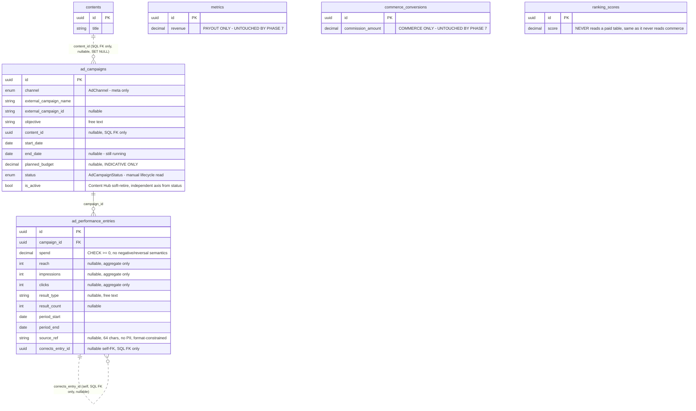
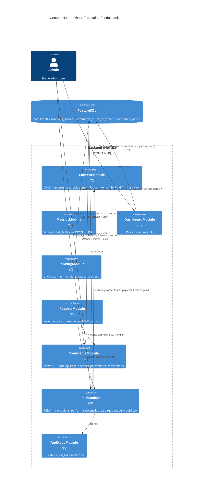
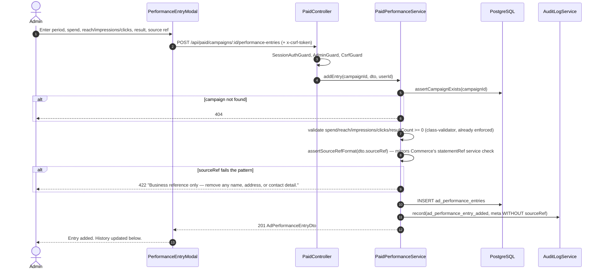

# Phase 7 — Paid/Ads Visibility Module · Architecture & UX Design

- **Author**: Senior App Designer (Loop Engineering position #2)
- **Date**: 2026-07-21
- **Input**: `docs/phase7-project-plan.md` (PM, 2026-07-21) — all of §2 Decisions, §3.3 Exit criteria and the "Scope traps" list are treated as **binding**, not advisory.
- **Output to**: System Analyst — the two sign-off items are **PDPA / no-audience-data** and **paid ⇄ payout ⇄ commerce separation** (§7), by direct analogy to Phase 6.
- **Baseline read for this design**: `docs/phase6-architecture-design.md` (full — this is the direct template, referenced throughout as "Phase 6 §x"), `global_config.md`, `backend/prisma/schema.prisma` (`Content`, `CommerceProduct`, `CommerceConversion` models), `frontend/.eslintrc.js`, `backend/.eslintrc.cjs`, `frontend/src/components/commerce/CommerceDashboardSection.tsx`, `frontend/src/app/dashboard/page.tsx`, `frontend/src/app/commerce/products/page.tsx`, `frontend/src/app/commerce/conversions/page.tsx`, `frontend/src/app/posts/page.tsx` (the "Anchored (n)" chip), `frontend/src/lib/content-labels.ts`, `backend/src/common/audit/audit-log.service.ts`, `backend/src/testing/separation/*` (the five existing freeze/boundary tests) and `backend/src/testing/e2e/*` (the byte-identity fixture machinery).

---

## 0. Design principles for this phase (non-negotiable, carried from the plan)

| # | Principle | Where it is enforced in this design |
|---|-----------|--------------------------------------|
| P1 | Paid spend/results, platform payout, and commerce commission are **three streams that are never summed**, pairwise or all three. | §2 — separate tables, no Prisma relation edges into paid, ESLint import zones (now three-way), disjoint DTO vocabulary, three exports, three totals. |
| P2 | Ad performance entries are their **own append-only table**, never a discriminator on `metrics` or `commerce_conversions`. | §1.3 `ad_performance_entries`; §2.4 byte-identity proof extended to a third stream. |
| P3 | `Platform` / `AssetPlatform` / `CommerceChannel` are **untouched**. Meta ads is an `AdChannel`. | §1.1, §1.7 enum-freeze test extension. |
| P4 | Nothing under `modules/ranking/` may read a paid table. Ranking stays frozen a second time (Decision 6). | §2.2 (lint zone), §2.3 (static test), §2.4 (score byte-identity, now proven against paid data too). |
| P5 | **Zero audience-targeting or individual-recipient data** — no column *capable* of holding it. Smaller surface than Commerce's, per Decision 5. | §1.4 column ban + §1.5 the free-text residual, escalated to the Analyst as SA-P1. |
| P6 | No live HTTP clients, no MCP coupling at the code level, ever, this phase. Manual entry only. | Decision 2/P-C; §1.1 `AdSource` anticipates 7D without building it; grep guard (7A.6) is the developer's, not designed here. |
| P7 | Reuse the existing guard stack and conventions exactly; invent nothing parallel that already exists. | §3.3 guard table — every row maps to an existing guard/service, mostly by direct copy from Commerce's conversions/anchors endpoints (lowest-ceremony precedent, since paid campaigns are metadata about something happening entirely outside Content Hub). |
| P8 | This is a **smaller** phase than Commerce (2 entities vs. 5) — do not import scaffolding (tabs, multi-target attribution, anchor baskets) that Commerce needed and Paid does not. | §3.1 file layout, §4.1 (no tab shell), ADR-7.6. |

---

## 1. Data model

Presented conceptually — field, type, nullability, and rationale — not as literal Prisma syntax. The developer owns the exact schema file; this section is the contract it must satisfy.

### 1.1 New enums (appended; `Platform`, `AssetPlatform`, `CommerceChannel` are NOT touched)

| Enum | Values | Why a new enum, not reuse |
|------|--------|---------------------------|
| `AdChannel` | `meta` (one value) | Decision 3: Meta-only this phase, honestly. Not a value on `Platform`/`AssetPlatform` — `AssetPlatform` is the ranking domain (`RANKED_PLATFORMS_V2 = PLATFORM_TIE_BREAK_ORDER`); appending here is irreversible (P-F) and would silently enrol paid data into v2 scoring. Not a value on `CommerceChannel` either — Meta ads is not a commerce/affiliate channel, and conflating the two enums would blur exactly the boundary §2 exists to keep sharp. Same move `CommerceChannel` made relative to `AssetPlatform` in Phase 6, applied a third time. |
| `AdCampaignStatus` | `active`, `paused`, `ended` | The admin's manual read of the **real** Meta campaign's lifecycle stage (nothing here is live-synced). Deliberately distinct from the record's own soft-retire state (`isActive`/`retiredAt`, §1.2) — a campaign can be `ended` in Meta Ads Manager for months before the admin gets around to retiring the Content Hub record, and conversely a record could be retired from the picker while still showing `active` for historical accuracy. Two independent axes, not one. |
| `AdSource` | `manual`, `api` | Provenance, mirroring `CommerceSource`/`MetricSource`. **Not** a reuse of `CommerceSource`: reusing it would put a commerce-namespaced type on paid rows, creating exactly the conceptual bridge P1 exists to prevent (Phase 6 §1.1 made the identical argument for why `CommerceSource` isn't `MetricSource`). Every paid table carries it so that if the 7D live path is ever built, API-sourced rows are distinguishable from hand-entered ones without a migration. |

**Why not fold `AdCampaignStatus` into `isActive`/`retiredAt` and call it done, the way `CommerceProduct` does with a single boolean?** Because the plan's Decision 4 explicitly lists both `status` and soft-retire as separate campaign attributes ("...date range, planned budget, status) and an append-only ad performance entry... Structural guards... soft-retire fields (mirror `CommerceProduct.isActive`/`retiredAt`)"). Commerce products don't need a third lifecycle state because a Shopee product genuinely only has "listed" or "not listed" as far as Content Hub cares. A Meta campaign visibly moves through `active → paused → ended` in the real world regardless of anything Content Hub does, and the admin logging that state is itself useful signal (e.g. filtering "which campaigns are still spending" without touching the retire affordance).

### 1.2 New tables — full field specification

#### `AdCampaign` (table: `ad_campaigns`)

| Field | Type | Null | Source | Why |
|-------|------|------|--------|-----|
| `id` | uuid PK | NOT NULL | server | |
| `channel` | `AdChannel` | NOT NULL | manual | Always `meta` this phase; kept as a real column (not hardcoded) so a second channel is an honest additive migration later, per Decision 3. |
| `externalCampaignName` | text, max 255 | NOT NULL | manual | The name the admin copies verbatim from Meta Ads Manager. Primary human-readable identifier — always available, unlike the numeric id. |
| `externalCampaignId` | text, max 255 | NULL | manual | Meta's internal campaign id, if the admin has it handy. Nullable because requiring it would block entry on days the admin is working from a screenshot rather than the Ads Manager UI itself. |
| `objective` | text, max 100 | NOT NULL | manual | **Free text, not an enum** — mirrors the plan's recommendation for `resultType` (§9 OQ-3) and for the identical reason: Meta's own objective taxonomy has changed shape before (the 2023 ODAX consolidation) and is not this program's to model. An enum here would need its own irreversible-migration argument for every taxonomy change Meta makes; free text needs none. |
| `contentId` | uuid | NULL | manual (admin picks) | **SQL FK only, NO Prisma relation** to `Content` (§2.1) — `ON DELETE SET NULL`. Nullable and single-valued by design (see the boxed discussion below). |
| `startDate` | date | NOT NULL | manual | |
| `endDate` | date | NULL | manual | Null means "still running" — a real, common state for an active campaign; there is no honest non-null placeholder for "no end date yet." `CHECK (end_date IS NULL OR end_date >= start_date)`. |
| `plannedBudget` | `Decimal(12,2)` | NULL | manual | **INDICATIVE ONLY**, exactly like `CommerceProduct.commissionRatePct`. Never summed with, or reconciled against, `AdPerformanceEntry.spend` anywhere in the codebase — actual cost is always the entered spend figures. Labelled as such in the UI (§4.2), mirroring the Commerce footnote convention. |
| `currency` | char(3), default `THB` | NOT NULL | manual | Mirrors `CommerceProduct.currency`. Not enforced to match the currency on any given performance entry — see §1.2 `AdPerformanceEntry.currency` for why that independence is deliberate, following Commerce's own SA-9 precedent. |
| `status` | `AdCampaignStatus`, default `active` | NOT NULL | manual | The admin's manual read of Meta's real lifecycle state (§1.1). Never derived, never synced. |
| `isActive` / `retiredAt` | bool default `true` / timestamp | NOT NULL / NULL | server | Soft-retire in Content Hub's own picker — never hard-delete. Direct mirror of `CommerceProduct.isActive`/`retiredAt`. |
| `source` | `AdSource`, default `manual` | NOT NULL | server | |
| `createdBy` | uuid | NOT NULL | server | SQL FK → `users(id)` `ON DELETE RESTRICT`. No Prisma relation (§2.1) — mirrors every commerce creator column. |
| `createdAt` / `updatedAt` | timestamp | NOT NULL | server | |

**Why a single nullable `Content` FK, not `Post`, not many-to-many (the concrete case the plan asks this design to resolve):** a Meta campaign in practice promotes a pillar's worth of content, a bundle of posts, or sometimes nothing trackable to one content row at all (a general brand-awareness campaign). Modelling that faithfully with a join table (`AdCampaignContent` many-to-many, mirroring `ProductAnchor`) would buy precision Phase 7 has no evidence it needs, at the cost this program has consistently avoided paying speculatively (Decision 3's own words: "designing a generic ads platform abstraction for two channels nobody has evidence for yet would be speculative generality"). The concrete failure mode when a campaign promotes several pieces of content: **the admin links the single piece that matters most for attribution purposes, or leaves it unlinked.** Both are honest, reversible, low-cost choices — an unlinked campaign still tracks perfectly well as a freestanding spend/results record, exactly the way `CommerceConversion`'s four attribution columns are already all-nullable for the identical "unattributed statement line" reason (Phase 6 §1.3). If real usage later shows campaigns routinely need multi-content attribution, that is a reviewed schema change with its own migration — not something to speculatively build now. `Post` was rejected in favour of `Content` because a Meta ad campaign is fundamentally a promotion of subject matter, not of one specific platform-native publish event; `CommercePlacement` made the opposite choice (content-level, not post-level) for Shopee video for the same underlying reason, and ad campaigns are structurally closer to that case than to TikTok anchor-at-post-grain.

#### `AdPerformanceEntry` (table: `ad_performance_entries`, append-only)

| Field | Type | Null | Source | Why |
|-------|------|------|--------|-----|
| `id` | uuid PK | NOT NULL | server | |
| `campaignId` | uuid | NOT NULL | server (from context) | **Normal Prisma relation** to `AdCampaign` (`campaign AdCampaign @relation(...)`, `onDelete: Restrict`) — this is a within-paid-namespace relation, not a boundary crossing, so it is safe and useful (mirrors `AffiliateLink.product CommerceProduct @relation(...)` in Commerce). |
| `spend` | `Decimal(12,2)` | NOT NULL | manual | `CHECK (spend >= 0)`. See the boxed discussion below on why this is **not** allowed to go negative the way `CommerceConversion.commissionAmount` is. |
| `reach` | int | NULL | manual | `CHECK (reach IS NULL OR reach >= 0)`. Aggregate only. |
| `impressions` | int | NULL | manual | Same null-safe non-negative CHECK. |
| `clicks` | int | NULL | manual | Same null-safe non-negative CHECK. |
| `resultType` | text, max 50 | NULL | manual | **Free-text label**, per the plan's recommended resolution to §9 OQ-3 ("leads, purchases, video views, link clicks, reach-only awareness" — too varied, too Meta-taxonomy-dependent, to enum today). |
| `resultCount` | int | NULL | manual | Paired with `resultType`; meaningless alone, so both are nullable together (no CHECK linking them — an admin logging spend with no result yet, e.g. a just-started campaign, is a legitimate state). `CHECK (result_count IS NULL OR result_count >= 0)`. |
| `currency` | char(3), default `THB` | NOT NULL | manual | Independent of `AdCampaign.currency` (see below). |
| `periodStart` / `periodEnd` | date / date | NOT NULL | manual | Mirrors `CommerceConversion.periodStart/periodEnd` exactly, including the reasoning: `DATE` not `TIMESTAMP` (statements/summary screens are day-grained; a timestamp invites a timezone bug in overlap detection). `CHECK (period_end >= period_start)`. |
| `sourceRef` | text, max 64 | NULL | manual | Mirrors `CommerceConversion.statementRef` (risk R7) — "which Ads Manager screen this came from," not a payout-statement reference (no such artefact exists for ad spend, per Decision 5's own observation that paid has no vendor-statement analogue). Format-constrained (§1.4). |
| `correctsEntryId` | uuid | NULL | manual | Self-FK, **SQL-level only, no Prisma relation** (mirrors `CommerceConversion.reversalOfId`'s treatment). See the boxed discussion below — this is the append-only correction mechanic, and it is deliberately **not** modelled as a reversal/negative-amount pattern. |
| `source` | `AdSource`, default `manual` | NOT NULL | server | |
| `recordedBy` | uuid | NOT NULL | server | SQL FK → `users(id)` `ON DELETE RESTRICT`. No Prisma relation. |
| `createdAt` | timestamp | NOT NULL | server | **No `updatedAt`.** Append-only, structurally: no PATCH/DELETE route exists (exit criterion #3), proven by a route-absence test mirroring the metrics/commerce discipline. |

**Why `AdPerformanceEntry` has no `channel` column:** inherited from its campaign, exactly the reasoning `AffiliateLink` uses for omitting `channel` relative to `CommerceProduct` (ADR-6.6) — a denormalised copy here could disagree with the campaign's own channel and would be meaningless, not just redundant.

**Why `currency` is stored independently on the entry rather than inherited from the campaign:** a performance entry is the actual transactional record — "this many THB were spent in this period" — and must be self-consistent for CSV export and summary math on its own terms, independent of what the campaign's *planned*-budget currency happens to say. This is the identical posture Commerce already committed to (`CommerceProduct.currency` for list price vs. `CommerceConversion.currency` for the actual commission, never reconciled against each other; SA-9 confirmed the summary must group by currency rather than convert). Two independently-stored currency columns, not one inherited, is not an oversight — it is the proven pattern.

> #### Boxed discussion: why ad-performance corrections are a plain append-only pointer, not a reversal/negative-amount mechanic
>
> The plan explicitly asks this design to make a call here (§ "Performance entry" bullet), rather than default-copying Commerce's shape. The two mechanics look superficially similar (`CommerceConversion.reversalOfId` + an allowed-negative `commissionAmount`) but they exist for different real-world reasons, and ad spend does not share the reason Commerce needed the negative-amount half:
>
> - **Commerce's negative amount models a real accounting event.** A refund or a cancelled order is money that was recorded as earned and is now being taken back — the negative row is not a correction of a data-entry mistake, it is itself a genuine, separate transaction that happened *after* the original one and must be visible as such (an admin reconciling a payout statement needs to see both the original commission and the refund that later reversed part of it, as two real facts).
> - **Ad spend has no equivalent transaction.** Meta does not refund ad spend in a way that produces a second real-world event the admin needs to log as its own line. What actually happens when an ad-performance entry needs fixing is: the admin mistyped a number transcribing it from an Ads Manager screen. That is a data-entry correction, not a second business event — and a "negative spend" or "negative reach" has no honest real-world referent the way a negative commission does. Modelling it as a reversal would invite a nonsensical row ("−1,204 impressions") purely to satisfy a mechanic borrowed from a different domain.
>
> **Design chosen: `correctsEntryId`, a plain nullable self-FK, with every numeric field CHECK'd non-negative.** A correction is simply a new row with the right numbers, optionally naming the row it supersedes. This gives the traceability the plan asks for ("corrections as new rows") and the exact PDPA benefit `reversalOfId` was added for in Commerce (§1.3: "without it, the admin's only tool for disambiguating a correction is free-text — which pushes them toward pasting extra identifying detail there") — without importing a negative-amount concept that has no meaning in this domain. The UI (§4.3) labels a row with `correctsEntryId` set as **"Correction"**, mirroring Commerce's **"Reversal"** label pattern (a word, never colour alone — global_config §2.4), but a distinct word, because it is a distinct concept and the vocabulary should say so.

### 1.3 Existing tables touched

| Table | Change |
|-------|--------|
| — | **None.** `contents`, `posts`, `metrics`, `ranking_scores`, `commerce_products`, `commerce_conversions`, `audit_logs` are byte-for-byte unchanged in the migration. `Content` gains no column and no Prisma relation field — the FK from `AdCampaign.contentId` exists in Postgres only (§2.1). |

**Notably NOT touched, and the proof for each:**

| Claim | How it is proven, mechanically |
|-------|--------------------------------|
| `Platform` unchanged | Existing enum-freeze test, unmodified. |
| `AssetPlatform` unchanged | Existing enum-freeze test, unmodified. |
| `CommerceChannel` unchanged | Existing enum-freeze test, unmodified — a new `AdChannel` block is added to the same file, it does not touch the commerce block. |
| `metrics` / `commerce_conversions` unchanged | Migration diff contains no `ALTER TABLE metrics` or `ALTER TABLE commerce_conversions`. |
| `contents` gains no paid column and no Prisma relation field | §2.1 — the load-bearing structural choice, restated a third time in this program's history. |

### 1.4 The PDPA column ban, restated as a testable property (Decision 5)

Identical mechanism to Commerce, extended to the two new tables:

1. **Column-name allow-list test**, extending the existing schema-freeze test with a frozen literal column list for `ad_campaigns` and `ad_performance_entries`. Any new column fails until the array is updated — the review moment the rule needs.
2. **DTO whitelist** — the global `ValidationPipe` (`whitelist: true, forbidNonWhitelisted: true`) already protects every write path in the system; nothing paid-specific needed.
3. **Export byte test** — the paid CSV header is frozen literal; no emitted cell matches an email/phone/Thai-national-id-shaped regex, mirroring the commerce CSV test.

**Why this is a smaller PDPA surface than Commerce's, concretely:** Commerce at least has "the vendor's statement mentions an order" as a residual free-text pressure point (`statementRef`). Nothing is ingested from a vendor file this phase for paid — the admin types numbers they already see on an Ads Manager summary screen, and the schema has **no column that could hold audience-targeting configuration, a custom-audience/lookalike identifier, or an individual click/impression record** — only campaign-level aggregate figures (spend, reach, impressions, clicks, a result count). This is Decision 5's hard rule, made structural rather than a policy reminder.

### 1.5 The residual: two free-text fields

`AdCampaign.objective` and `AdPerformanceEntry.sourceRef` are the only columns that accept arbitrary admin-typed text.

- **`sourceRef`** is capped at 64 characters and, following Commerce's shipped resolution of its own equivalent finding (SA-1: the regex was applied, not just recommended), is format-constrained in the **service layer** — `^[A-Za-z0-9._\-\/ ]+$` — so a pasted name, address, or contact detail fails validation outright rather than merely being discouraged by a hint. Never written to `audit_logs.meta`, never exported (§7 SA-P1).
- **`objective`** is capped at 100 characters. Lower residual risk than `sourceRef` — it is a short categorical label ("Traffic," "Conversions," "Video views"), not a business-reconciliation reference an admin might pad with extra identifying detail — so this design does **not** recommend a format regex for it, only the length cap. Whether it may appear in `audit_logs.meta` is flagged as SA-P4 (§7) rather than assumed either way, since Commerce's own precedent (excluding `commerce_products.name` "for consistency" despite it not being PII) shows this is a judgment call, not a mechanical one.

### 1.6 ERD — Phase 7 delta

Dashed edges are **SQL-level FKs with no Prisma relation field** (§2.1: enforced by Postgres, invisible to the Prisma client type graph). Solid edges are normal Prisma relations, used only *within* the paid namespace.



**Absent from this ERD, deliberately:** any edge between `ad_campaigns`/`ad_performance_entries` and `metrics`, `commerce_conversions`, or `ranking_scores`. There is no FK, no Prisma relation, and no query path — the same absence the Commerce ERD documented for the identical reason.

### 1.7 Migration + freeze tests (7.0 deliverables)

Migration header comment (mirroring the Commerce precedent verbatim in spirit): *`AdChannel` is NOT added to `Platform`/`AssetPlatform`/`CommerceChannel` — `AssetPlatform` is the ranking domain and enum additions are irreversible per the schema header rule; see phase7-project-plan.md Decision 3/4.* Repeated as a comment on the `AssetPlatform` enum block itself (now the **second** phase to add such a comment there — Phase 6's is still present; this is the moment the next reader is most likely to be standing when they consider adding a value, twice over).

```ts
// backend/src/testing/separation/enum-freeze.spec.ts — EXTEND, do not duplicate
it('AdChannel is frozen at meta-only', () => {
  expect(Object.values(AdChannel)).toEqual(['meta']);
});
// Platform / AssetPlatform / CommerceChannel assertions already present, unmodified.
```

---

## 2. The separation architecture — now a three-way boundary (the highest-risk deliverable, R1)

Phase 6 asked "what makes summing two streams fail to compile, fail to lint, or fail a test." Phase 7 asks the same question one level harder: **three** streams, meaning three pairwise boundaries plus one triple-sum case, all of which must independently fail. The mechanism is unchanged — layers ordered hardest to softest, so an accidental change (the actual threat model, not a determined attacker) cannot silently defeat all of them at once.

### 2.1 Layer 1 — the Prisma client type graph gains no edge into paid

**Load-bearing, exactly as it was for Commerce.** `AdCampaign` declares no Prisma relation to `Content` or `User`. The `content_id` and `created_by`/`recorded_by` columns are plain `String @db.Uuid`; the foreign keys are hand-written `ALTER TABLE` DDL in the migration, identical in technique to Commerce's `product_anchors_post_id_fkey` and to the pre-existing `posts_content_platform_active_key`. Postgres enforces referential integrity; `Content` and `User` gain no fields, so there is no `include` that reaches `ad_campaigns` from `ContentModule`, `DashboardModule`, `MetricsModule`, `RankingModule`, or `CommerceModule`. The traversal is unspellable, not merely forbidden.

Relations *within* the paid namespace (`AdCampaign` → `AdPerformanceEntry`) are declared normally, the same way Commerce declares `CommerceProduct` → `AffiliateLink` normally while keeping the cross-namespace edges SQL-only.

### 2.2 Layer 2 — ESLint import zones, now three-way

Both `backend/.eslintrc.cjs` and `frontend/.eslintrc.js` already implement this as **system-wide** zones for commerce (the shipped backend config bans commerce imports from `ranking`, `metrics`, `dashboard`, `scheduler`, `content`, `queue`, `publish`, and `common` — not just the four directories the Phase 6 plan originally named, per System Analyst condition B4). Paid extends the **same files**, not a parallel mechanism:

**Backend (`backend/.eslintrc.cjs`)** — three edits to the existing `overrides` array:

1. The existing system-wide "payout + ranking + everything else" override's `group` gains `'**/paid/**'`, `'**/modules/paid'` alongside the existing `'**/commerce/**'`, `'**/modules/commerce'` entries. One override, two banned namespaces — not two overrides.
2. The existing commerce-side override's `group` gains `'**/paid/**'`, `'**/modules/paid'` — **commerce must not import paid**, closing the third leg of the triangle (payout↔paid and payout↔commerce already existed; commerce↔paid is the one Phase 7 adds).
3. A **new** override for `files: ['src/modules/paid/**/*.ts']`, banning `'**/metrics/**'`, `'**/ranking/**'`, `'**/dashboard/**'`, `'**/reports/**'`, `'**/commerce/**'` and their `modules/*` spellings — **paid must not import metrics, ranking, dashboard, reports, or commerce.**

The existing `src/testing/**` exemption (`no-restricted-imports: 'off'`) is left as-is — the separation fixtures there must legitimately seed all three streams in one file, which is the entire reason that directory sits outside the scanned zones rather than being "tidied" into `common/`.

**Frontend (`frontend/.eslintrc.js`)** — the same three-way extension:

1. The payout override (`src/app/dashboard/**`, `src/components/dashboard/**`, `src/components/reports/**`) gains a banned pattern for `'**/paid/**'`, `'**/paid'`, `'**/lib/paid*'`, alongside the existing commerce ban.
2. The commerce override (`src/components/commerce/**`, `src/app/commerce/**`) gains the same paid ban — commerce components must not import a paid module.
3. A **new** override for `files: ['src/components/paid/**/*.ts', 'src/components/paid/**/*.tsx', 'src/app/paid/**/*.ts', 'src/app/paid/**/*.tsx']`, banning `'**/dashboard/**'`, `'**/reports/**'`, `'**/lib/dashboard*'`, `'**/lib/reports*'` (the payout side) **and** `'**/commerce/**'`, `'**/commerce'`, `'**/lib/commerce*'` (the commerce side) — bidirectional against both of the other two streams from paid's side.

Message text on every new pattern cites `phase7-project-plan.md` Decision 4/P-A, mirroring the existing messages' style (a rule whose "why" isn't next to it gets deleted by the next person who hits it — the frontend config's own docblock already states this as the reason it's a `.js` file with comments rather than `.json`).

### 2.3 Layer 3 — the static boundary test, extended to a third token set

`backend/src/testing/separation/commerce-boundary.spec.ts` is joined by a new `paid-boundary.spec.ts` (or the existing file is generalised to scan multiple token sets — the developer's call, not a design constraint) with:

```ts
const PAID_TOKENS = [
  'adCampaign', 'adPerformanceEntry',
  'ad_campaigns', 'ad_performance_entries',
  'AdChannel', 'AdCampaignStatus', 'AdSource', 'PaidModule',
];
```

Scanned against the **same** `PAYOUT_AND_RANKING_DIRS` list already in use, **plus** `src/modules/commerce` (paid tokens must not appear in commerce source, closing the commerce→paid leg at the text level, not just the import level). The reciprocal scan — no file under `src/modules/paid` references any `COMMERCE_TOKENS` or payout/ranking token — closes the remaining leg. Both scans exclude `*.spec.ts` for the identical reason Commerce's does: the byte-identity fixture must legitimately name all three streams.

### 2.4 Layer 4 — the byte-identity fixture, now proving three-stream independence

This is exit criterion #4, and it is the phase's actual definition of done — restated from the plan verbatim: *with paid data seeded, `GET /api/dashboard/overview`, `/revenue`, `/revenue/:contentId`, the revenue CSV bytes, the commerce summary/CSV bytes, and every persisted `ranking_scores.score` are byte-identical to the zero-paid-data fixture.*

The existing `backend/src/testing/e2e/` machinery (`payout-fixture.ts`, `commerce-fixture.ts`, `capture-baseline.ts`) is extended, not replaced:

1. A new `paid-fixture.ts`, adversarial in the same spirit as `commerce-fixture.ts`: campaigns and performance entries attributed to the **same** `content_id`s the payout and commerce fixtures already use, spend figures an order of magnitude larger than both the payout revenue and the commerce commission (so an accidental sum is unmissable), and at least one `correctsEntryId` row.
2. The capture/compare sequence gains one more step: `seedPayoutFixture() → seedCommerceFixture() → capture baseline A → seedPaidFixture() → rankAllContent() again → capture baseline B → assert A === B` byte-for-byte on every artefact listed above, **plus** the commerce summary/CSV bytes (which Phase 6's own fixture already captured but which must now additionally survive paid data existing, not just payout surviving commerce).
3. `csv-header-freeze.spec.ts` gains a frozen header assertion for the new `paid.csv` export, alongside the existing revenue and commerce headers.

Run as its own CI job, exactly as Commerce's fixture is — a failure here reads as "separation broken," not as one red dot among hundreds.

### 2.5 Layer 5 — vocabulary separation, now checked pairwise across three DTOs

`backend/src/testing/separation/commerce-vocabulary-freeze.spec.ts` is extended (or joined by a sibling) to assert:

- **No key named `revenue` or `commissionAmount` appears anywhere under `modules/paid/`.** Paid totals are `totalSpend`, `totalReach`, `totalImpressions`, `totalClicks`, `totalResultCount`, `entriesCount` — see `PaidSummaryDto` in §3.4. No payout or commerce DTO ever uses `spend` or `resultCount`.
- The frozen key sets of `PaidSummaryDto`, `CommerceSummaryDto`, and `DashboardOverviewDto` are **pairwise disjoint** on money/total tokens — three checks, not one, since "disjoint A↔B" no longer implies "disjoint A↔C."
- **No shared component, no shared props type**, across any two of the three sections — `PaidDashboardSection`, `CommerceDashboardSection`, and the payout KPI cards share no interface (ADR-7.1, extending ADR-6.8).
- **The frontend UI test** (mirroring Commerce's 6B.5 test) is extended: render `/dashboard` with all three datasets loaded, then assert no rendered numeric text node equals any of `payout + commerce`, `payout + paid`, `commerce + paid`, or `payout + commerce + paid`. Four assertions, not one — the triple-sum case is the one a well-meaning "grand total" card would actually produce.

### 2.6 Module boundary — C4 Container view (Phase 7 delta)



`PaidModule` imports **only** `ContentModule` (for the read-only content-existence/title lookup used by the campaign form's content picker and the content-list chip, §4.5) — it imports **neither** `MetricsModule`, `DashboardModule`, `RankingModule`, nor `CommerceModule`, and the arrows above are one-directional by construction, exactly mirroring `CommerceModule`'s relationship to the rest of the system in Phase 6.

---

## 3. Module & API design

### 3.1 File layout

```
backend/src/modules/paid/
  paid.module.ts
  paid-campaign.service.ts          # CRUD + soft-retire
  paid-performance.service.ts       # append-only entries + history read + overlap-check
  paid-read.service.ts              # /summary read model (reads only ad_* tables)
  paid-export.service.ts            # paid.csv (reuses common/utils/csv.util)
  paid.controller.ts                # /api/paid/*
  dto/
    create-paid-campaign.dto.ts
    update-paid-campaign.dto.ts
    create-performance-entry.dto.ts
    list-paid-campaigns-query.dto.ts
    paid-summary-query.dto.ts
```

**No `adapters/` directory, deliberately** — unlike Commerce, Paid has no live-write path this phase (Option B/C rejected outright, not deferred-with-a-mock; Decision 2 forbids the MCP at the code level entirely). There is no `PaidAdapterRegistry` to design, because there is nothing this module ever calls out to — every write is the admin typing a number they read off a screen. The 7D live-sync spec (standard Marketing/Insights API, `ads_read` scope) is a **separate, non-blocking deliverable** owned by the App Developer per WBS 7D; this design's `AdSource` enum (§1.1) is the only forward-compatibility surface it needs from schema, and no adapter interface is speculated here.

**No tab shell, deliberately** (ADR-7.6) — Commerce's `/commerce` route hosts three tabs because it has five tables and three genuinely independent list surfaces (Products, Placements, Conversions). Paid has exactly one list surface (campaigns); performance entries are always viewed and added in the context of a specific campaign, via modal, never as an independent top-level list. Building a "Performance" tab would be scaffolding for a screen nobody asked for.

### 3.2 Endpoints

| Method | Path | Purpose | Body / Query DTO | Response |
|--------|------|---------|-------------------|----------|
| `GET` | `/api/paid/campaigns` | Campaign list | `ListPaidCampaignsQueryDto {isActive?, q?, contentId?}` | `AdCampaignDto[]` |
| `POST` | `/api/paid/campaigns` | Create campaign | `CreatePaidCampaignDto` | `AdCampaignDto` (201) |
| `PATCH` | `/api/paid/campaigns/:id` | Edit campaign | `UpdatePaidCampaignDto` | `AdCampaignDto` |
| `POST` | `/api/paid/campaigns/:id/retire` | Soft-retire | `{}` | `AdCampaignDto` |
| `GET` | `/api/paid/campaigns/:id/performance-entries` | Append-only history, newest first | — | `AdPerformanceEntryDto[]` |
| `POST` | `/api/paid/campaigns/:id/performance-entries` | **Append** an entry | `CreatePerformanceEntryDto` | `AdPerformanceEntryDto` (201) |
| `GET` | `/api/paid/campaigns/:id/performance-entries/overlap-check` | Warn-only overlap probe | `{periodStart, periodEnd}` | `{overlaps: AdPerformanceEntryDto[]}` |
| `GET` | `/api/paid/summary` | Paid read model (by-campaign, by-result-type rollups) | `PaidSummaryQueryDto` | `PaidSummaryDto` |
| `GET` | `/api/reports/paid.csv` | **Separate** paid export | `ReportQueryDto` | `text/csv` |

**No `PATCH`/`DELETE` exists for `/api/paid/campaigns/:id/performance-entries/:entryId`** — the route-absence test asserts it (exit criterion #3), mirroring commerce conversions exactly. The content-list chip (§4.5) needs no dedicated endpoint: it derives from a client-side reduction of the same `GET /api/paid/campaigns` list already fetched for `/content`, the identical technique `/posts` already uses for the "Anchored (n)" chip's `anchorCounts` map.

`GET /api/reports/paid.csv` is registered on the existing `ReportsController` (so the export-audit convention and `Content-Disposition` headers stay in one place) but delegates to `PaidExportService`, mirroring exactly how `commerce.csv` is mounted. It requires the **same file-granularity ESLint exemption** `report-export.service.ts` already carries for commerce (§2.2) — extended to also permit a `modules/paid` import from that one file, not the whole `reports/` directory.

### 3.3 Guard stack per endpoint

Every route sits under `@UseGuards(SessionAuthGuard, AdminGuard)` at the controller level, the standing convention.

| Endpoint | CSRF | Step-up | Audit action |
|----------|:----:|:-------:|---------------|
| `GET /paid/campaigns` | — | — | — |
| `POST /paid/campaigns` | ✅ | — | `ad_campaign_created` |
| `PATCH /paid/campaigns/:id` | ✅ | — | `ad_campaign_updated` |
| `POST /paid/campaigns/:id/retire` | ✅ | — | `ad_campaign_retired` |
| `GET /paid/campaigns/:id/performance-entries`, `/overlap-check` | — | — | — |
| `POST /paid/campaigns/:id/performance-entries` | ✅ | — | `ad_performance_entry_added` |
| `GET /paid/summary` | — | — | — |
| `GET /reports/paid.csv` | — | — | `paid_report_exported` |

**Why nothing here carries step-up, at all** — the lowest-ceremony stack in the system so far, lower even than Commerce's anchoring (which at least had SA-3 as a live decision point). Step-up exists to gate acts that push something live to a platform, or that write an override fact the ranking engine later learns from (Phase 6 §3.3's own framing). Every write in this module does neither: a campaign record and a performance entry are both purely descriptive facts about something that already happened entirely outside Content Hub, on a platform Content Hub has no write access to and never will this phase (Option B/C rejected). Requiring a password for this is pure ceremony with the same cost Phase 6 already named — training the admin to type their password reflexively, weakening step-up where it does matter (publish, Shopee placement). CSRF + `AdminGuard` + audit is the correct, and now precedented twice, stack for "bookkeeping, not action."

Five new `AuditAction` union members, extending `backend/src/common/audit/audit-log.service.ts` in place (not a parallel file), following the file's own existing per-phase-section convention:

```ts
// Phase 7 — paid/ads visibility (docs/phase7-architecture-design.md §3.3).
// Every mutating paid path has exactly one action; read/export paths reuse none.
| 'ad_campaign_created'
| 'ad_campaign_updated'
| 'ad_campaign_retired'
| 'ad_performance_entry_added'
| 'paid_report_exported'
```

`sourceRef` and `objective`'s meta-inclusion status is SA-P4 (§7) — not assumed here.

### 3.4 Key DTOs

```ts
export class CreatePaidCampaignDto {
  @IsEnum(AdChannel) channel!: AdChannel;               // 'meta' — always, this phase

  @IsString() @IsNotEmpty() @MaxLength(255) externalCampaignName!: string;
  @IsOptional() @IsString() @MaxLength(255) externalCampaignId?: string;

  @IsString() @IsNotEmpty() @MaxLength(100) objective!: string;

  @IsOptional() @IsUUID() contentId?: string;

  @IsDateString() startDate!: string;
  @IsOptional() @IsDateString() endDate?: string;

  @IsOptional() @IsNumber({ maxDecimalPlaces: 2 }) @Min(0) plannedBudget?: number;
  @IsOptional() @IsString() @Length(3, 3) currency?: string;   // default THB, server-side
  @IsOptional() @IsEnum(AdCampaignStatus) status?: AdCampaignStatus;  // default 'active'
}

/** channel and externalCampaignId are immutable after creation — identity fields,
 *  same posture as Commerce's UpdateProductDto excluding channel/externalProductId. */
export class UpdatePaidCampaignDto {
  @IsOptional() @IsString() @MaxLength(255) externalCampaignName?: string;
  @IsOptional() @IsString() @MaxLength(100) objective?: string;
  @IsOptional() @IsUUID() contentId?: string;
  @IsOptional() @IsDateString() startDate?: string;
  @IsOptional() @IsDateString() endDate?: string;
  @IsOptional() @IsNumber({ maxDecimalPlaces: 2 }) @Min(0) plannedBudget?: number;
  @IsOptional() @IsString() @Length(3, 3) currency?: string;
  @IsOptional() @IsEnum(AdCampaignStatus) status?: AdCampaignStatus;
}

/** Body of POST /api/paid/campaigns/:id/performance-entries — append-only. */
export class CreatePerformanceEntryDto {
  @IsDateString() periodStart!: string;
  @IsDateString() periodEnd!: string;

  @IsNumber({ maxDecimalPlaces: 2 }) @Min(0) spend!: number;      // NEGATIVE IS NOT LEGAL — see §1.2 boxed discussion

  @IsOptional() @IsInt() @Min(0) reach?: number;
  @IsOptional() @IsInt() @Min(0) impressions?: number;
  @IsOptional() @IsInt() @Min(0) clicks?: number;

  @IsOptional() @IsString() @MaxLength(50) resultType?: string;
  @IsOptional() @IsInt() @Min(0) resultCount?: number;

  @IsOptional() @IsString() @Length(3, 3) currency?: string;     // default THB, server-side

  @IsOptional() @IsUUID() correctsEntryId?: string;

  /**
   * PDPA: business reference only — "which Ads Manager screen this came
   * from," never audience/targeting/individual-level detail. Format-checked
   * in the SERVICE (mirroring Commerce's shipped statementRef treatment,
   * not just the DTO layer), so a future ingestion path that bypasses
   * class-validator still can't smuggle a pasted name/address through.
   */
  @IsOptional() @IsString() @MaxLength(64) sourceRef?: string;
}
```

**Response DTO vocabulary (§2.5):** `PaidSummaryDto { generatedAt, totals: { totalSpend, totalReach, totalImpressions, totalClicks, totalResultCount, entriesCount }, byCampaign[], byResultType[] }`. No key named `revenue` or `commissionAmount` appears anywhere under `modules/paid/` — asserted by the extended vocabulary-freeze test (§2.5).

### 3.5 Sequence — performance entry recording (the full, deliberately short, guard stack)



Deliberately the **shortest** guard-stack sequence in the system's history — no step-up branch, no copyright-gate branch, no duration-gate branch, no partial-failure two-call choreography (Phase 6 §4.7's "unified anchor flow" problem does not arise here, because a performance entry attaches to exactly one already-existing campaign in a single call, never two resources in two calls).

---

## 4. Screens & UX

**Design system**: unchanged — Bootstrap 5 utility classes only, `AppHeader` nav, `formatTHB`/`formatCount` from `content-labels.ts`, the `ModalShell` component reused as-is, `ExportCsvButton` pattern reused via a new `PaidExportCsvButton` (mirrors `CommerceExportCsvButton` exactly: `<a target="_blank">`, not fetch+blob, so the session cookie travels with a top-level navigation).

**Nav**: one new top-level item, `Paid`, inserted between `Commerce` and `Dashboard` in `NAV_LINKS` (`frontend/src/components/AppHeader.tsx`):

```
Content · Scheduler · Posts · Commerce · Paid · Dashboard · Comments · Settings
```

Money-adjacent tabs (`Commerce`, `Paid`) sit adjacent to each other and immediately before `Dashboard`, where all three streams surface together.

**New labels** in `content-labels.ts`, following the file's existing `Record<Enum, string>` + paired-badge-class convention exactly:

```ts
export const PAID_CHANNELS: AdChannel[] = ['meta'];
const AD_CHANNEL_LABELS: Record<AdChannel, string> = { meta: 'Meta' };
/** bg-primary's default white text already clears contrast — no text-dark pairing
 *  needed (global_config §2.2's forced-pairing rule applies only to warning/info). */
const AD_CHANNEL_BADGE: Record<AdChannel, string> = { meta: 'bg-primary' };

const CAMPAIGN_STATUS_LABELS: Record<AdCampaignStatus, string> = {
  active: 'Active', paused: 'Paused', ended: 'Ended',
};
/** Mirrors the existing PostStatus pattern: live=success, caution=warning+dark, archived=dark. */
const CAMPAIGN_STATUS_BADGE: Record<AdCampaignStatus, string> = {
  active: 'bg-success', paused: 'bg-warning text-dark', ended: 'bg-dark',
};
```

### 4.1 `/paid` — campaign list (7B.1)

```
┌────────────────────────────────────────────────────────────────────────────┐
│ Content Hub  Content  Scheduler  Posts  Commerce  Paid  Dashboard  ⋯        │
├────────────────────────────────────────────────────────────────────────────┤
│ Paid / Ads                                       [ + Add campaign ]        │
│                                                                            │
│ Status [ Active ▾ ]   Search [ campaign name                          ]   │
│                                                                            │
│ ┌────────────────────────────────────────────────────────────────────────┐ │
│ │ Campaign                Channel  Content    Period          Status    │ │
│ │                                              Planned budget* Spend↴   │ │
│ ├────────────────────────────────────────────────────────────────────────┤ │
│ │ Summer Skincare Reach   [Meta]   Summer      2026-07-01 –    Active    │ │
│ │   Traffic                        Skincare    ongoing        ฿3,200.00 │ │
│ │   Active                         Routine     ฿15,000.00 (pl.) 4 entries│ │
│ ├────────────────────────────────────────────────────────────────────────┤ │
│ │ Q2 Brand Awareness      [Meta]   —            2026-04-01 –    Ended    │ │
│ │   Reach                                       2026-06-30     ฿8,900.00│ │
│ │   Retired · 2026-07-05                        ฿10,000.00(pl.) 6 entries│ │
│ └────────────────────────────────────────────────────────────────────────┘ │
│                                                                            │
│ * Planned budget is INDICATIVE ONLY — actual cost is always the spend      │
│   figures you log under Performance entries, never this planned figure.   │
└────────────────────────────────────────────────────────────────────────────┘
```

Row overflow menu: **Edit** · **Log performance** · **Retire** — direct mirror of Commerce's product row menu shape (Edit · Manage links · Retire).

- **Status filter** is Active/Retired/All against `isActive` (the Content Hub soft-retire axis), exactly mirroring Commerce's products filter — **not** a filter on the campaign's own `active/paused/ended` lifecycle status, which is rendered as a badge in the row instead of a second overlapping filter control (avoiding the confusion of two same-named "status" dropdowns on one page).
- **Retire confirm copy**, mirroring Commerce's wording precisely: *"Retire 'Summer Skincare Reach'? It stays on existing performance entries — retiring only removes it from the picker for new performance entries."* No delete affordance anywhere.
- **Spend/entries column** is populated from `GET /api/paid/summary`'s `byCampaign` rollup, fetched once alongside the campaign list — a small improvement on Commerce's per-row N+1 link-count fetch (acceptable at Commerce's "tens" scale, but since the summary endpoint already exists for the dashboard, reusing it here is strictly cheaper).
- **No channel filter** — `AdChannel` has exactly one value this phase; a filter control for a single option is clutter, not affordance. When Google/TikTok Ads are ever added (Decision 3's named future candidate), this becomes a real filter then, not before.

### 4.2 Campaign form modal — create / edit / retire (7B.1)

```
┌ Add campaign ──────────────────────────────────────────────────── [ × ] ┐
│ Channel        Meta                          ← static label, not a       │
│                                                 pointless one-option     │
│                                                 select (Decision 3)      │
│ Campaign name*    [ Summer Skincare Reach                             ] │
│ Campaign ID       [ 120211…                          ]  (optional)      │
│ Objective*        [ Traffic                                          ]  │
│   Copy exactly what Meta Ads Manager shows — this is not a fixed list.  │
│ Linked content    [ Summer Skincare Routine                         ▾ ]  │
│   (optional)  If this campaign promotes more than one piece of content, │
│   pick the one that matters most for attribution, or leave unlinked.    │
│ Start date*    [ 2026-07-01 ]   End date  [                ] (ongoing)  │
│ Planned budget    [ 15000.00 ] THB   (optional, indicative only)        │
│ Status            (•) Active  ( ) Paused  ( ) Ended                     │
│                                              [ Cancel ] [ Add campaign ]│
└─────────────────────────────────────────────────────────────────────────┘
```

Editing an existing campaign hides `Channel`/`Campaign ID` from the editable set (immutable identity fields, same posture as Commerce's `UpdateProductDto` excluding `channel`/`externalProductId`) but shows them as read-only context above the form, mirroring `ProductFormModal`'s edit-mode layout.

### 4.3 Performance-entry modal + append-only history (7B.2)

```
┌ Log performance · Summer Skincare Reach ──────────────────────── [ × ] ┐
│ Enter figures from Meta Ads Manager for this campaign. Records are      │
│ append-only: to correct one, add a new entry noting which it corrects.  │
│ Nothing here is ever edited or deleted.                                 │
│                                                                         │
│ Period*        From [ 2026-07-13 ] to [ 2026-07-19 ]                    │
│   ⚠ You already logged this campaign for 2026-07-13 – 2026-07-19        │
│     (฿3,200.00 spend, added 2026-07-20). Logging again may double-count.│
│     [ View that entry ]              ← WARNING, not a block             │
│                                                                         │
│ Spend*             [ 3200.00 ] THB                                      │
│   What Ads Manager reports as amount spent for this period.             │
│ Reach       [ 42000 ]   Impressions [ 118500 ]   Clicks [ 1240 ]         │
│   (all optional, aggregate)                                             │
│ Result type       [ Purchases                    ]  Result count [ 18 ] │
│   e.g. Purchases, Leads, Link clicks, Video views — free text, optional │
│                                                                         │
│ Corrects          [ — none —                                       ▾ ] │
│   Pick the entry this one corrects, if it's a fix — never a reversal;   │
│   ad spend has no "refund," so just log the right numbers here.        │
│ Source ref        [ Ads Manager · Campaign summary · 2026-07-20      ]  │
│   Business reference only — never audience, targeting, or individual-  │
│   level details.                                                       │
│                                              [ Cancel ] [ Add entry ]   │
└─────────────────────────────────────────────────────────────────────────┘

History — Summer Skincare Reach                    [ Export paid CSV ]
Period                 Spend        Reach   Result           Recorded
2026-07-13 – 07-19     ฿ 3,200.00   42,000  Purchases (18)   2026-07-20
2026-07-06 – 07-12     ฿ 2,850.00   38,500  Purchases (14)   2026-07-13
2026-07-06 – 07-12     ฿ 2,900.00   38,500  Purchases (15)   2026-07-14
   Correction · corrects the 2026-07-13 entry   ← word "Correction", never colour alone
```

- The overlap warning comes from `GET /api/paid/campaigns/:id/performance-entries/overlap-check`, debounced on date change — **warn, never block**, identical reasoning to Commerce's conversion overlap check (a legitimately overlapping Ads Manager report window exists in the real world; refusing it forces a falsified date to get the number in, which is strictly worse than a visible append-only history).
- **No "negative amount" helper text anywhere** — unlike Commerce's conversion form, because §1.2's boxed discussion means there is no negative-spend case to explain. The `Corrects` field's helper text explicitly says so, heading off the Commerce-trained instinct to look for a minus sign.
- A row with `correctsEntryId` set is labelled **"Correction"** (a word, colour-independent, per global_config §2.4), distinct from Commerce's **"Reversal"** label — same mechanism, different word, because it is a different concept and the vocabulary says so honestly.

### 4.4 The paid dashboard section — the triple-separation surface (7B.3, this phase's R1)

This is the screen the plan names as the single highest-risk deliverable ("the paid/organic/commerce triple-separation dashboard design... the highest-risk UX surface this phase, by direct analogy to Phase 6's R1"). The design goal, stated identically to Phase 6's but one notch harder: **a person glancing at the page for two seconds cannot come away thinking any two of the three numbers belong together — and cannot mistake the paid section for a re-skinned commerce section.**

```
┌────────────────────────────────────────────────────────────────────────────┐
│ Dashboard                                    [ Sync metrics ]              │
│                                                                            │
│ ══ PLATFORM PAYOUT REVENUE ════════════════════════════════════════════    │
│ Monetization payout from Facebook, YouTube, TikTok and LINE OA.            │
│ This is the figure the ranking engine uses.                                │
│ [ KPI cards: Payout · Reach · Engagement · Posts w/ metrics ]              │
│ [ platform breakdown table ]   [ trend chart ]   [ Export revenue CSV ]    │
│                                                                            │
│ ╔══════════════════════════════════════════════════════════════════════╗   │
│ ║  COMMERCE / AFFILIATE — TRACKED SEPARATELY                           ║   │
│ ║  ⓘ Not included in platform payout revenue above, or in the paid/ads ║   │  ← updated
│ ║    section below. These figures measure different things and are      ║   │     one line
│ ║    never added together anywhere in Content Hub.                      ║   │
│ ║  [ Commission (net) · Gross sales · Orders · Records ]                 ║   │
│ ║  By channel · Top products                        [ Export commerce  ║   │
│ ║                                                       CSV ]           ║   │
│ ╚══════════════════════════════════════════════════════════════════════╝   │
│                                                                            │
│ ┌┈┈┈┈┈┈┈┈┈┈┈┈┈┈┈┈┈┈┈┈┈┈┈┈┈┈┈┈┈┈┈┈┈┈┈┈┈┈┈┈┈┈┈┈┈┈┈┈┈┈┈┈┈┈┈┈┈┈┈┈┈┈┈┈┈┈┈┈┈┈┈┈┐   │
│ ┊  PAID / ADS — TRACKED SEPARATELY                                     ┊   │  ← warm
│ ┊  ⓘ Not included in platform payout revenue above, or in commerce/     ┊   │     amber
│ ┊    affiliate figures above. Paid spend and results are logged         ┊   │     tint,
│ ┊    manually from Meta Ads Manager and never added to either.          ┊   │     never
│ ┊                                                                       ┊   │     side-by-
│ ┊  ┌───────────┐ ┌──────────────┐ ┌───────────┐ ┌────────────────┐     ┊   │     side
│ ┊  │ Ad spend  │ │ Ad reach     │ │ Ad clicks │ │ Campaigns      │     ┊   │
│ ┊  │ ฿12,050.00│ │   401,000    │ │   3,880   │ │  2 active      │     ┊   │
│ ┊  └───────────┘ └──────────────┘ └───────────┘ └────────────────┘     ┊   │
│ ┊  Results (all types)   Purchases 47 · Video views 12,400              ┊   │
│ ┊  Logged by hand from Meta Ads Manager — not measured by Content Hub.  ┊   │
│ ┊                                          [ Export paid CSV ]          ┊   │
│ └┈┈┈┈┈┈┈┈┈┈┈┈┈┈┈┈┈┈┈┈┈┈┈┈┈┈┈┈┈┈┈┈┈┈┈┈┈┈┈┈┈┈┈┈┈┈┈┈┈┈┈┈┈┈┈┈┈┈┈┈┈┈┈┈┈┈┈┈┈┈┈┈┘   │
└────────────────────────────────────────────────────────────────────────────┘
```

(The dotted rendering above is prose shorthand for a solid Bootstrap border in a different colour, not a literal dashed-border CSS request — see the exact classes below. No custom CSS exists in this project and none is introduced here.)

Separation is carried by **six independent signals**, extended and made harder than Commerce's, so that no single CSS or copy change collapses any of the three boundaries:

1. **A bordered, inset container with a colour genuinely distinct from Commerce's, not a re-skin.** Commerce uses `border border-2 rounded-3 p-4 bg-body-tertiary` — a neutral, colourless grey inset. Paid uses `border border-2 border-warning-subtle rounded-3 p-4 bg-warning-subtle` — the warm-amber "subtle" palette Bootstrap 5.3 ships for exactly this kind of light-tint-with-default-text container (already precedented in this codebase: `CopyrightGatePanel.tsx` uses `bg-warning-subtle` for its header). This is not an arbitrary choice of colour: `warning` is already the system's semantic token for "needs caution, not yet reconciled against a live system" (global_config §2.1: *"ต้องระวัง, ต่ำกว่าเป้า, ยังไม่ยืนยัน"*) — thematically apt for the one stream that is self-reported with no vendor-statement or live-sync check behind it at all this phase, and visually unmistakable next to Commerce's neutral grey at a glance, at every width.
2. **Explicit copy in an alert, always visible, naming BOTH other streams by name** — not "not included in payout" (Commerce's original phrasing, written when paid didn't exist) but *"Not included in platform payout revenue above, or in commerce/affiliate figures above."* This is the concrete textual difference the plan's brief calls for: the disclaimer must state separation from both other streams, not just one.
3. **Commerce's own alert copy gains one clause**, the single in-scope edit to existing Phase 6 code this design asks for: `CommerceDashboardSection.tsx`'s alert text changes from *"Not included in platform payout revenue above."* to *"Not included in platform payout revenue above, or in the paid/ads section below."* This is a one-line, low-risk textual change (not a re-architecture) that closes the one real gap a third stream creates: an admin reading the Commerce section today has no way to know a Paid section exists below it or that the same non-summation rule applies. Flagged explicitly here so QC/QA see it as an intentional edit to existing code, not scope creep.
4. **Disjoint vocabulary, now three-way** — "Payout" / "Commission" / "Spend." No section uses either other section's money word. The paid KPI cards are explicitly prefixed (`Ad spend`, `Ad reach`, `Ad clicks`) rather than bare `Spend`/`Reach`/`Clicks`, specifically so a card in the paid section is never one glance away from looking like the payout section's `Reach` card repeated — a cheap, deliberate readability choice beyond what the money-word rule alone requires.
5. **Three export buttons in three places**, never a shared toolbar — `Export revenue CSV`, `Export commerce CSV`, `Export paid CSV`, each inside its own section.
6. **Vertical stacking only, in a deliberate order: Payout → Commerce → Paid.** Side-by-side reads as comparable-and-summable at every width — the Commerce design's own finding, which held at 768px specifically because that is where a naive grid most often floats two blocks side by side by accident; it holds identically for a third block. The **order** is deliberate, not arbitrary: payout (unboxed, the figure ranking reads) sits first as the primary metric; commerce (Phase 6, established) sits second; paid (Phase 7, newest, still inside its own 8-week evidence window per the plan's §0) sits last — each additional stream gets progressively more visual "distance" from the core metric as you scroll down, which is an honest reflection of each stream's evidentiary maturity, not just an arbitrary list order.

**A combined total of any two, or all three, is not rendered anywhere, is not computed anywhere, and no component accepts more than one dataset** (§2.5). The extended dashboard UI test asserts no rendered numeric text equals any pairwise or triple sum.

**Component structure**: `PaidDashboardSection` (in `frontend/src/components/paid/`) does its **own** `GET /api/paid/summary` fetch and receives no props from `dashboard/page.tsx` — loaded via `next/dynamic`, exactly like `CommerceDashboardSection`, so that `dashboard/page.tsx` never has a `DashboardOverview`, a `CommerceSummary`, and a `PaidSummary` all in scope in the same file at once. The frontend ESLint zone (§2.2) makes the static-import version of this mistake fail to compile in the first place; `next/dynamic` is not the safety mechanism, it is a convenience that happens to be consistent with the safety mechanism, exactly as the existing `dashboard/page.tsx` docblock already explains for the commerce case.

**Empty state**: *"No paid campaigns logged yet. Add one from Paid → + Add campaign, then log performance after your first Ads Manager check."* — no `฿0.00` card, same reasoning as Commerce's empty state (a zero next to two other real figures invites exactly the mental arithmetic this section exists to prevent).

### 4.5 Content cross-reference chip (Decision 4 / §3.1 item 4)

Display-only, no ranking read, no priority change — the plan's own framing, taken literally.

**Where it renders**: the `/content` page's list table (`frontend/src/app/content/page.tsx`), which currently has columns Title / Type / Pillar / Status / Copyright / Actions. A new column, **Paid**, is added between Copyright and Actions.

**What triggers it**: exactly `AdCampaign.contentId` being set for one or more (any lifecycle status, any retire-state — a retired campaign still means "this had a logged paid campaign," a historical fact that does not stop being true when the record is later retired from the picker). No filter on `isActive`/`status` — unlike the dashboard summary, which reasonably only totals what's currently meaningful, the chip is a simple historical marker.

```
│ Title                    Type   Pillar    Status  Copyright  Paid            Actions │
│ Summer Skincare Routine  Video  Product   Ready   Cleared    Ad campaign (1)  Edit ⋯  │
│ Cotton Tote Feature      Video  Product   Ready   Cleared    —                Edit ⋯  │
```

`Ad campaign (n)` renders as `<span className="badge bg-primary">Ad campaign (n)</span>` when a content row has ≥1 linked campaign; a plain muted `—` (no badge) otherwise — mirroring the `/posts` "Anchored (n)" pattern's badge-when-present shape, but **without** the `/posts` page's "No products anchored" fallback badge, because on `/content` almost every row is expected to have no paid campaign in v1 (this is a sparse, new signal), and a badge on every single row for the common case would be visual noise the `/posts` page's fallback badge doesn't have to worry about (there, the fallback only applies to one anchorable platform's rows, a minority of the table). Non-interactive text, not a link — "display-only" taken at face value; there is nothing to click through to that isn't already one click away via the `Paid` nav item.

**Data source**: the `/content` page fetches `GET /api/paid/campaigns` once (same "tens" scale as Commerce's product list, no pagination in v1, same explicit `TODO` marker convention) and reduces it client-side into a `Map<contentId, count>` — the identical technique `/posts` already uses for `anchorCounts`. No new backend endpoint.

### 4.6 Accessibility

| Requirement | How |
|-------------|-----|
| Status never by colour alone | `Active` / `Paused` / `Ended`, `Retired · <date>`, `Correction`, `Ad campaign (n)` — every state carries a word, following the existing `CLEARANCE_BADGE`/`STATUS_BADGE` convention exactly. |
| Contrast | `bg-warning-subtle` (paid section) already pairs with default body text at sufficient contrast — the same precedent `CopyrightGatePanel.tsx` established; no forced `text-dark` override needed (that rule is specific to solid `bg-warning`/`bg-info`, per global_config §2.2, not the subtle variants). `bg-primary` (Meta channel badge) uses Bootstrap's own default white badge text, already ≥4.5:1. |
| Keyboard | Modals reuse `ModalShell` (focus trap, `Esc` closes, focus returns to the invoking control) — no new modal chrome invented. |
| Screen reader | The paid section is `<section aria-labelledby="paid-heading">`; its "not included in..." alert is `role="note"` **inside** that region (announced on entering the section, not a detached aside) — mirrors Commerce's `commerce-heading`/`role="note"` structure exactly. |
| Forms | Every input has a real `<label>`. The "Corrects" helper text and the source-ref PDPA warning are persistent helper text bound via `aria-describedby`, surviving focus. |
| Disabled controls | `PaidExportCsvButton` follows the existing `ExportCsvButton` rule: a real `<button disabled>`, never a dead anchor. |

### 4.7 The three widths the visual QA pass checks (exit criterion #9)

Same three presets this program always uses (global_config §6):

| Width | What must specifically hold |
|-------|------------------------------|
| **375 × 812** (mobile) | Nav wraps without overlapping (now nine top-level items — the `Paid` addition is the point at which nav wrap behaviour should be re-checked, since Phase 6 already noted six items wraps below ~560px). The paid dashboard section keeps its `border-warning-subtle` framing and its "not included in..." alert **above the fold of its own section**. Campaign table collapses to `table-responsive` scroll-in-own-frame, never a whole-page horizontal scroll (global_config §3.4). |
| **768 × 1024** (tablet) | **The width where three stacked sections are most likely to be accidentally floated side by side by a naive grid** — Phase 6 flagged this at 768px for two sections; with three, the risk is not lower. Payout, commerce, and paid must remain strictly vertically stacked, in that order. |
| **1280 × 800** (desktop) | Full layout. All three sections visibly distinct from each other at a glance — the two-second test named in §4.4's opening line, performed literally, by eye. Console clean. |

Per the plan's exit criterion #9 and the standing Phase 5/6 lesson: if browser tooling is unavailable, this criterion is reported **BLOCKED**, never "met by other means."

---

## 5. Sequencing

Aligned to the plan's WBS. The gate order is the design, restated a third time: the separation tests exist and fail before any paid code lands.

### 7.0 — Schema & Separation Gate (blocking)

| Order | Work | Design artefact it consumes |
|-------|------|------------------------------|
| 1 | `AdChannel`, `AdCampaignStatus`, `AdSource` enums + migration note + a second comment on the `AssetPlatform` block | §1.1, §1.7 |
| 2 | Two tables + hand-written DDL (CHECKs, partial unique on `(channel, externalCampaignId)` where not null, self-FK for `correctsEntryId`) | §1.2 |
| 3 | `AuditAction` union extension (5 new actions) | §3.3 |
| 4 | **PDPA + separation policy doc**, signed by the System Analyst — including SA-P1's `sourceRef` regex and SA-P4's `objective`/meta decision | §1.4, §1.5, §7 |
| 5 | **Separation tests written failing**: enum-freeze extension, column allow-list, static boundary (both directions, now including commerce↔paid), byte-identity fixture extension, ESLint zones (both files, three-way) | §1.7, §2.2, §2.3, §2.4 |

**Gate**: migration clean on real Postgres; enum-freeze test green (`AdChannel` frozen at `['meta']`, `Platform`/`AssetPlatform`/`CommerceChannel` unchanged); every other separation test present and failing for the right reason; Analyst signed.

### 7A — Backend (after 7.0 sign-off)

```
7A.1 campaign CRUD + soft-retire ──┐
                                    ├─ 7A.2 performance entries (needs 7A.1)
                                    │        │
                                    │        ▼
                                    │  7A.3 read model + 7A.4 paid.csv
                                    │        │
                                    └────────┴──▶ 7A.5 MAKE THE SEPARATION TESTS PASS ◀── gates the phase
                                                          │
                                                          ▼
                                             7A.6 grep guard (mcp.facebook.com) — orthogonal, can run any time
```

**Contract freeze after 7A.5**, not after 7A.4 — identical reasoning to Phase 6: if the byte-identity test forces a DTO or read-model change, the frontend must not already be built against the old shape.

### 7B — Frontend (after contract freeze)

| Order | Work | Why this order |
|-------|------|-----------------|
| 1 | Labels (`content-labels.ts` additions), `api-client` methods, nav entry | Everything else depends on it. |
| 2 | 7B.1 `/paid` campaign list + create/edit/retire form | Simplest CRUD; shakes out the api-client shape. |
| 3 | 7B.2 performance-entry modal + history | Needs the campaign list to exist first (entries are logged in a campaign's context). |
| 4 | 7B.4 content cross-reference chip on `/content` | Independent of 3; can run in parallel. |
| 5 | **7B.3 paid dashboard section** | **Last, deliberately** — same reasoning as Commerce's 6B.5: judging "visually unmistakable, three-way" against stub data would not be honest. Built against real campaign + performance data. Includes the one-line edit to `CommerceDashboardSection.tsx`'s alert copy (§4.4 point 3). |

### 7C / 7D

Unchanged from the plan. 7C's visual pass uses the three widths in §4.7, now checking a three-section page. 7D is spec + rejecting stub, no live HTTP client, no adapter interface designed in this document (§3.1) — owned by the App Developer.

---

## 6. ADRs

| ID | Decision | Alternatives rejected | Consequence |
|----|----------|------------------------|-------------|
| **ADR-7.1** | Paid, commerce, and payout share **no component and no DTO field vocabulary** — extending ADR-6.8 from two streams to three. | A shared `FinancialSummaryCard` handed a discriminator — rejected for the identical reason ADR-6.8 rejected it, now with a third caller that would make the discriminator branch three ways. | No single component can ever be handed more than one dataset to total. |
| **ADR-7.2** | `AdPerformanceEntry` corrections use a plain `correctsEntryId` self-FK with all numeric fields CHECK'd non-negative — **not** Commerce's negative-amount/`reversalOfId` pattern. | Copying Commerce's shape verbatim — rejected: ad spend has no real-world "reversal" event the way a refunded commission does; a negative spend/reach/impression has no honest referent. See §1.2 boxed discussion. | Simpler validation (no sign-dependent CSV escaping the way `commerce-currency.util.ts`/`csv.util.ts` needed for negative commissions); corrections read as "the right numbers, referencing what they fix," not "a manufactured offsetting transaction." |
| **ADR-7.3** | `AdCampaign.objective` and `resultType` are free text, not enums. | Building a Meta-objective/result-taxonomy enum — rejected: Meta's own taxonomy has changed shape before (ODAX 2023), and modelling an external platform's category system as an irreversible Prisma enum is the exact speculative-generality shape Decision 3 already rejected for channels. | One migration never needed when Meta renames or restructures its objective/result taxonomy. |
| **ADR-7.4** | `AdCampaign.contentId` is a single nullable SQL-only FK to `Content` (not `Post`, not many-to-many). | A join table mirroring `ProductAnchor` — rejected: no evidence yet that campaigns routinely need multi-content attribution, and building it speculatively repeats the mistake Decision 3 already named. `Post`-level linking — rejected: an ad campaign promotes subject matter, structurally closer to `CommercePlacement`'s content-level choice than to `ProductAnchor`'s post-level choice. | A campaign promoting several pieces of content links its primary one, or stays unlinked — both honest, low-cost, reversible. |
| **ADR-7.5** | `AdCampaignStatus` (real-world lifecycle: active/paused/ended) is a separate axis from Content Hub's own soft-retire (`isActive`/`retiredAt`). | Collapsing to one boolean, mirroring `CommerceProduct` — rejected: a Meta campaign visibly moves through lifecycle states regardless of anything Content Hub does; conflating "is this record retired from our picker" with "is the real campaign still running" would make either concept lie some of the time. | Two independent, both-honest fields; slightly more schema than Commerce's single boolean, justified by a real difference in what's being modelled. |
| **ADR-7.6** | No tab shell at `/paid`; no adapter registry under `modules/paid/adapters/`. | Copying Commerce's three-tab shell and `CommerceAdapterRegistry` structure wholesale — rejected: Paid has one list surface (not three) and zero live-write paths this phase (Option B/C rejected outright, not deferred-with-a-mock), so both structures would be scaffolding for screens and call sites that don't exist. | Smaller file layout (§3.1), matching the plan's own framing of this as "a materially smaller phase than Commerce." |
| **ADR-7.7** | The paid dashboard section's container uses `border-warning-subtle`/`bg-warning-subtle` — a genuinely different Bootstrap semantic colour from Commerce's neutral `bg-body-tertiary`, not a copy with different heading text. | Reusing Commerce's exact container classes — rejected: the plan's brief explicitly requires the paid section be visually distinguishable from Commerce's treatment, not just from payout's; an identical box with different words risks being skimmed as "another one of those boxes" rather than read. | One additional, already-precedented (`CopyrightGatePanel.tsx`) Bootstrap utility class combination; no new CSS. |

---

## 7. Flags for the System Analyst

Concrete items to sign off, mirroring Phase 6 §7's shape and the two mandated sign-offs the plan itself names for the 7.0 gate.

### The two mandated sign-offs

**SA-P-A — PDPA / no-audience-data design.** The claim: *no column in the two paid tables is capable of holding audience-targeting, custom-audience/lookalike, or individual click/impression-level data.* Evidence offered: the full column list in §1.2; the column allow-list test (§1.4); the `ValidationPipe` whitelist (already system-wide); the export byte test (§1.4). Unlike Commerce, there is no adapter-interface argument to offer (no adapter exists this phase) — the entire surface is the two tables' own columns.
→ **Please sign, or reject with the specific column at issue.**

**SA-P-B — paid ⇄ payout ⇄ commerce separation.** The claim: *summing any two, or all three, is prevented structurally at five independent layers, now checked pairwise/triple-wise where Commerce's were checked once* (§2.1 type graph / §2.2 lint zones, three-way / §2.3 static boundary, both directions / §2.4 byte-identity fixture, extended / §2.5 vocabulary + no shared component, pairwise-disjoint).
→ **Please sign, or name the layer or pairing you consider insufficient.**

### Findings this design surfaced that need a decision

**SA-P1 — `sourceRef` format regex (mirrors Commerce's SA-1, already resolved once in this codebase).** Recommend applying `^[A-Za-z0-9._\-\/ ]+$` in the service layer, exactly as Commerce's shipped `statementRef` treatment does (not merely the DTO layer — §3.4 comment). **Decision needed: apply the regex (recommended, and already the precedent), or accept the residual risk in writing.**

**SA-P2 — no reversal/negative-amount mechanic for `AdPerformanceEntry` (ADR-7.2).** The plan explicitly left this open for this design to resolve; §1.2's boxed discussion gives the reasoning. **Confirm the `correctsEntryId`-only approach is acceptable, or state the concrete scenario it fails to cover.**

**SA-P3 — no step-up on any paid write path.** Every paid mutation is CSRF + `AdminGuard` + audit only, lower ceremony than even Commerce's anchoring (which at least had a live SA-3 decision point). Reasoning: nothing paid pushes live or writes an override fact ranking later learns from (§3.3). **Confirm the reasoning holds for a third, even-lower-stakes record surface.**

**SA-P4 — audit meta scope for paid actions.** `sourceRef` is excluded from `audit_logs.meta` (highest-residual-PII text field, mirrors `statementRef`'s treatment). `objective`, `externalCampaignName`, and `externalCampaignId` are **not** proposed for blanket exclusion here (§1.5), unlike Commerce's precedent of excluding `commerce_products.name` "for consistency" despite it not being PII. **Rule on whether `objective` should also be excluded for consistency with that precedent, or whether this design's narrower exclusion (only the field with genuine residual PII risk) is preferred.**

**SA-P5 — `AdCampaign.plannedBudget` is indicative-only, never reconciled.** Confirming the Commerce `commissionRatePct` precedent applies identically: never summed with or checked against `AdPerformanceEntry.spend` anywhere in the codebase, labelled as such in the UI (§4.1, §4.2 footnotes). **Confirm.**

**SA-P6 — currency stored independently per entry, not inherited from the campaign (mirrors Commerce's SA-9).** `AdPerformanceEntry.currency` defaults to THB and is never converted or cross-summed with a mismatched currency; the summary groups by currency rather than producing one wrong number, identical to Commerce's resolved posture. **Confirm, and confirm with the admin whether non-THB ad spend is expected at all** — this must be settled before 7.0.2, retrofitting currency is expensive (the identical warning Commerce's SA-9 carried).

**SA-P7 — the one-line edit to `CommerceDashboardSection.tsx`'s existing alert copy (§4.4 point 3).** This is the one place this design touches Phase 6 shipped code — a single sentence addition ("...or in the paid/ads section below"), not a re-architecture. **Confirm this is in scope for 7B rather than a change requiring its own separate review**, given it modifies a component QC/QA already signed off once.

---

## Handoff summary (System Analyst)

- **The separation is the same five structural layers Commerce proved, now doing three-way work.** Layer 1 (no Prisma relation from `AdCampaign`/`AdPerformanceEntry` into `Content`/`User`) is load-bearing exactly as it was for Commerce — the FKs are hand-written migration DDL, so `content.include({ adCampaigns: true })` does not typecheck inside any payout, ranking, or commerce module. On top of that: ESLint zones extended in both `.eslintrc` files to a three-way ban (payout↔paid, commerce↔paid, and the pre-existing payout↔commerce untouched), a static boundary test scanning both directions with a new paid token set, the byte-identity fixture extended to prove payout **and** commerce both stay unchanged after paid data exists, and a vocabulary-freeze test now checking three DTOs pairwise-disjoint rather than one pair. **Sign-off item SA-P-B.**
- **PDPA surface is smaller than Commerce's and fully structural except one field.** Two tables, no audience/targeting/individual-level column possible by construction (Decision 5's hard rule). The one residual is `AdPerformanceEntry.sourceRef` — recommended to close with the same regex Commerce's own SA-1 resolved with, in the service layer. **Sign-off item SA-P-A.**
- **Schema delta is two new tables and three new enums, zero columns added to any existing table.** `Platform`, `AssetPlatform`, and `CommerceChannel` are all proven untouched by the existing enum-freeze test, extended (not duplicated) with a fourth assertion for `AdChannel`. The one deliberate design call this document had to make rather than copy from Commerce: ad-performance corrections use a plain `correctsEntryId` pointer with non-negative CHECKs, **not** Commerce's negative-amount/reversal mechanic — because ad spend has no real-world reversal event, only data-entry corrections (ADR-7.2, SA-P2).
- **UX is the deliberately smaller half of this phase.** No tab shell (one list surface, not three), no adapter registry (zero live-write paths this phase, not even a mock), no step-up on any write (nothing here pushes live or writes an override fact). The dashboard section is the one place real design effort concentrated: a genuinely distinct Bootstrap colour treatment (`border-warning-subtle`/`bg-warning-subtle`, not a re-skin of Commerce's neutral container), copy naming both other streams by name, paid-prefixed KPI labels to avoid a bare "Reach"-next-to-"Reach" scan collision, and a deliberate Payout→Commerce→Paid stacking order that doubles as an honest signal of each stream's evidentiary maturity. The one edit to existing Phase 6 code is a single added clause in `CommerceDashboardSection.tsx`'s alert text, flagged explicitly (SA-P7) rather than silently bundled in.
- **Sequence and the one thing that gates everything:** 7.0 writes the (now three-way) separation tests **failing** first → 7A backend with 7A.5 (make them pass) as the gate → freeze the contract → 7B frontend, with the paid dashboard section built **last** against real data, same reasoning Commerce used → 7C QC/QA + visual gate at the same three widths, now checking three stacked sections → 7D spec + rejecting stub, no live HTTP client, not designed in this document. Seven further items are flagged for your ruling in §7 (SA-P1…SA-P7); the two most consequential are **SA-P2** (the reversal-mechanic design call) and **SA-P6** (currency, which must be settled before the migration lands).

---

**Prepared by:** Senior App Designer, Loop Engineering position #2
**Date:** 2026-07-21
**Next agent:** System Analyst — sign SA-P-A (PDPA / no-audience-data) and SA-P-B (paid ⇄ payout ⇄ commerce separation) at the 7.0 gate, and rule on SA-P1…SA-P7.
