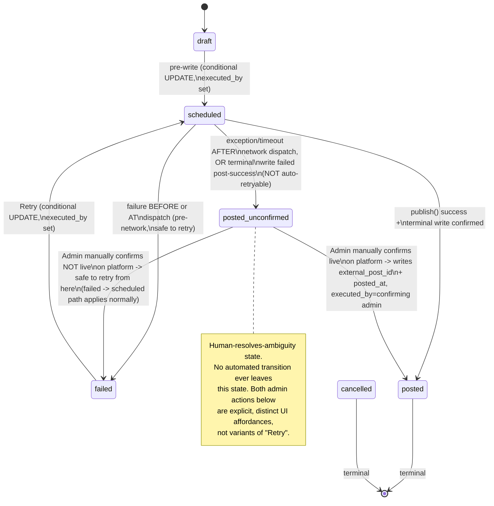

# Publish Orchestration — Design Addendum (Iteration 2)

**Status**: Patch to the Phase 2 Architecture Design Document, PublisherPort
section only. Responds to System Analyst finding **REL-002 (BLOCKING)** plus
two approved-with-condition items from the same review round (Item 3 —
TOCTOU on the pre-write; SEC-C — `executedBy` forensic coverage). Every other
section of the Phase 2 doc (CMS, ranking, wireframes) is unchanged and still
approved — this file stands alone as a scoped patch, not a re-issue.

## 1. What changed and why

The original sequence treated `publish()` (the outbound call to the platform
adapter) and the terminal DB write (`status = posted`) as if they succeeded
or failed together. They don't — they're two separate operations separated
by a network hop, and the interval between them is exactly where a partial
failure produces the worst outcome in the system: **a live post on the
platform with no local record of it**, indistinguishable in our data from
"never attempted." A `failed` status invites a retry; retrying here means a
second live post next to the orphaned one.

The fix is not "handle the error better" — it's recognizing this is a third
possible outcome, not a variant of failure, and modeling it as its own state
that blocks automation and requires a human to look at the actual platform
before the system does anything else with that row.

## 2. `PostStatus` enum — add `posted_unconfirmed`

```prisma
enum PostStatus {
  draft
  scheduled
  posted
  posted_unconfirmed   // NEW
  failed
  cancelled
}
```

**Naming rationale**: `posted_unconfirmed` (not `publish_error`,
`ambiguous`, or `unknown`) was chosen because it names the thing from the
system's point of view — *we dispatched the publish call and cannot confirm
locally whether it landed* — rather than naming the failure mechanism. This
keeps the semantics obvious to anyone reading a status column in the admin
UI or a support ticket without needing to read this doc: "posted, but we're
not sure" is the correct mental model, and it visually sorts next to
`posted` in an alphabetized status list, which is intentional — it *is* a
variant of posted-or-not, not a variant of failed.

Prisma enum values are additive-only per the existing house rule (see
`docs/security-decisions.md` §9) — this is a pure addition, no reordering,
so it's a safe migration.

```prisma
model Post {
  id             String     @id @default(uuid()) @db.Uuid
  contentId      String     @map("content_id") @db.Uuid
  platform       Platform
  priorityScore  Decimal?   @map("priority_score") @db.Decimal(10, 4)
  recommendedAt  DateTime?  @map("recommended_at")
  scheduledAt    DateTime?  @map("scheduled_at")
  postedAt       DateTime?  @map("posted_at")
  status         PostStatus @default(draft)
  executedBy     String?    @map("executed_by") @db.Uuid
  externalPostId String?    @map("external_post_id")
  version        Int        @default(0)              // NEW — Item 3
  createdAt      DateTime   @default(now()) @map("created_at")
  updatedAt      DateTime   @updatedAt @map("updated_at")

  content  Content   @relation(fields: [contentId], references: [id], onDelete: Restrict)
  executor User?     @relation("PostExecutedBy", fields: [executedBy], references: [id], onDelete: SetNull)
  metrics  Metric[]
  comments Comment[]

  @@index([contentId, status, scheduledAt])
  @@map("posts")
}
```

`version` increments on every status write from the orchestrator (pre-write,
success, failure, unconfirmed, and the two admin-resolution transitions in
§4). It is optimistic-concurrency insurance layered on top of the
conditional `WHERE status IN (...)` clause below — status-string equality
alone is enough to prevent two publishers racing, but `version` also catches
same-status races that a naive `WHERE status = 'draft'` wouldn't (e.g. a
retry racing a concurrent cancel that also targets `draft`/`failed`).

## 3. Sequence diagram — PublisherPort, revised

```mermaid
sequenceDiagram
    actor Admin
    participant API as PostsController
    participant Orch as PublishOrchestrator
    participant DB as Post (Postgres)
    participant CAS as ConnectedAccountsService
    participant Pub as Publisher (platform adapter)
    participant Log as AuditLogService

    Admin->>API: POST /posts/:id/publish
    API->>Log: log "publish_attempt_started" (postId, adminId)

    Note over Orch,DB: Pre-write is now a CONDITIONAL UPDATE (Item 3)
    Orch->>DB: UPDATE posts SET status='scheduled', executed_by=:adminId,<br/>version=version+1 WHERE id=:postId<br/>AND status IN ('draft','failed')<br/>AND version=:expectedVersion
    alt 0 rows affected (lost the race / stale version)
        DB-->>Orch: 0 rows
        Orch-->>API: 409 Conflict — another request already claimed this post
        API-->>Admin: 409, UI refreshes post state
    else 1 row affected — this request owns the publish attempt
        DB-->>Orch: 1 row (version now N+1)
        Orch->>CAS: getValidToken(accountId)
        alt token invalid/expired
            CAS-->>Orch: throw TokenInvalidError
            Note over Orch,DB: Failure BEFORE the network call was ever<br/>dispatched — no ambiguity, safe to mark retryable
            Orch->>DB: UPDATE posts SET status='failed', executed_by=:adminId,<br/>version=version+1 WHERE id=:postId AND version=:N+1
            Orch->>Log: log "publish_failed" reason=token_invalid (postId, adminId)
            Orch-->>API: 502 {retryable: true}
            API-->>Admin: Retry button shown
        else token valid
            Note over Orch,Pub: Everything from here on is the risk window.<br/>Boundary: BEFORE Pub.publish() is dispatched = safe/retryable.<br/>AFTER dispatch, regardless of what response (if any) comes back,<br/>an exception/timeout here is NOT safely retryable.
            Orch->>Pub: publish(content, {accountId, accessToken})
            activate Pub
            alt publish() throws BEFORE any network I/O (validation, serialization)
                Pub-->>Orch: throw ValidationError (pre-dispatch)
                Orch->>DB: UPDATE posts SET status='failed', executed_by=:adminId,<br/>version=version+1 WHERE id=:postId AND version=:N+1
                Orch->>Log: log "publish_failed" reason=validation (postId, adminId)
                Orch-->>API: 502 {retryable: true}
            else network call dispatched, clean success response
                Pub-->>Orch: {externalPostId, success: true}
                deactivate Pub
                Orch->>DB: UPDATE posts SET status='posted', external_post_id=:id,<br/>posted_at=now(), version=version+1<br/>WHERE id=:postId AND version=:N+1
                alt terminal write succeeds
                    DB-->>Orch: 1 row
                    Orch->>Log: log "publish_succeeded" (postId, externalPostId, adminId)
                    Orch-->>API: 200
                    API-->>Admin: shows Posted
                else terminal write fails/times out (DB drop, process crash, etc.)
                    Note over Orch,DB: Platform confirmed success but we<br/>could not durably record it — THIS is the<br/>orphaned-live-post case REL-002 flags.
                    Orch->>DB: best-effort UPDATE posts SET status='posted_unconfirmed',<br/>external_post_id=:id (if known), version=version+1<br/>WHERE id=:postId
                    Orch->>Log: log "publish_ambiguous" severity=ALERT<br/>reason=terminal_write_failed (postId, externalPostId, adminId)
                    Orch-->>API: 200 or 5xx depending on what layer failed<br/>(client may see either — see note below)
                end
            else network call dispatched, then exception/timeout<br/>(connection drop, read timeout, process killed mid-call)
                Pub-->>Orch: throw NetworkTimeoutError / connection reset
                deactivate Pub
                Note over Orch,DB: Outcome at the platform is UNKNOWN —<br/>could have posted, could not have. Do NOT write 'failed'.
                Orch->>DB: UPDATE posts SET status='posted_unconfirmed',<br/>version=version+1 WHERE id=:postId AND version=:N+1
                Orch->>Log: log "publish_ambiguous" severity=ALERT<br/>reason=network_timeout_post_dispatch (postId, adminId)
                Orch-->>API: 502 {retryable: false, requiresManualVerification: true}
                API-->>Admin: "Could not confirm this posted. Do not retry —<br/>check the platform directly." + link to manual-resolve UI
            end
        end
    end
```

**Note on the "terminal write fails after platform success" branch**: this
is the case REL-002 calls out explicitly and it deserves a callout on its
own, because it's the one place where even the orchestrator's own attempt to
write `posted_unconfirmed` can itself fail (the same DB unavailability that
broke the first write is likely still present). The orchestrator's write to
`posted_unconfirmed` is *best-effort* — if it also fails, the row is left at
`scheduled` with a stale `updated_at`, which is why DevOps/Rollout's
monitoring (flagged for the System Analyst / DevOps handoff, not designed
here) must alert on **"status=scheduled with executed_by set and
updated_at older than N minutes"** as a second, independent detection path
for this same class of failure — the design should not rely solely on the
orchestrator successfully self-reporting its own uncertainty.

## 4. State machine — revised



### Admin actions from `posted_unconfirmed`

Two distinct, explicitly-labeled actions in the admin UI — not a single
generic "Resolve" button, because the two outcomes have opposite
consequences if the admin picks wrong:

1. **"Confirmed posted on \[Platform] — mark as Posted"**
   Admin has checked the Page/channel directly, found the live post, and
   pastes/confirms its URL or ID. Writes:
   `status='posted', external_post_id=:manuallyEnteredId, posted_at=:manuallyConfirmedOrNowTimestamp, executed_by=:confirmingAdminId, version=version+1`.
   Requires `externalPostId` as a mandatory field in this action's request
   body — the UI must not allow marking `posted` without it, since
   `externalPostId` is what makes a `posted` row auditable/linkable later.

2. **"Confirmed NOT posted on \[Platform] — allow retry"**
   Admin has checked and found nothing live. Writes:
   `status='failed', executed_by=:confirmingAdminId, version=version+1`.
   This re-enters the existing `failed -> scheduled` retry path unchanged —
   no new transition logic needed here, `posted_unconfirmed -> failed` just
   feeds the existing edge.

Both actions are logged via `AuditLogService` as
`publish_ambiguity_resolved` with the resolving admin id, the chosen
direction, and (for direction 1) the manually-entered `externalPostId` —
this is a human override of a system-uncertain state and needs its own
forensic trail distinct from the automated `publish_succeeded` /
`publish_failed` log events.

`InvalidPostStateTransitionError` still applies: any transition attempted
out of `posted` or `cancelled` throws, unchanged from the original design.
`posted_unconfirmed` is deliberately *not* added to that terminal set — it
has exactly the two admin-driven exits above, enforced at the service layer
(only those two `(from: posted_unconfirmed, to: X)` pairs are permitted;
every other attempted transition out of `posted_unconfirmed`, including a
second automated publish attempt, throws the same
`InvalidPostStateTransitionError`).

## 5. `executedBy` on pre-write and failed states (SEC-C)

Folded into §3 above — every `UPDATE posts SET status=...` in the revised
sequence now sets `executed_by` (pre-write/`scheduled`, `failed`,
`posted_unconfirmed`, and `posted`), not only the final success write. This
means the forensic trail for "who attempted this" survives even if the
attempt never reaches the platform call (e.g. dies at the token-validation
step) — previously that information was only captured on success.

## 6. Summary of what's new vs. the approved doc

| Item | Change |
|---|---|
| `PostStatus` enum | + `posted_unconfirmed` |
| `Post` model | + `version Int @default(0)` |
| Pre-write step | Now a conditional `UPDATE ... WHERE status IN ('draft','failed') AND version=:expected`, not an unconditional upsert |
| `executedBy` | Now written on `scheduled`, `failed`, and `posted_unconfirmed`, not only `posted` |
| New state | `posted_unconfirmed` — reachable only from `scheduled` via post-dispatch exception/timeout or a post-success terminal-write failure; exits only via two explicit admin actions |
| Retry semantics | `failed` still means "safe to auto-retry, pre-dispatch failure." `posted_unconfirmed` is never auto-retried; admin must resolve first |
| Monitoring (flagged for DevOps handoff) | Alert on `status=scheduled, executed_by IS NOT NULL, updated_at < now() - N minutes` as a second detection path independent of the orchestrator's own best-effort `posted_unconfirmed` write |

Everything else in the Phase 2 Architecture Design Document — CMS section,
ranking section, wireframes, and the rest of the original PublisherPort
sequence not touched above — is unchanged from the version already
approved/approved-with-condition.
